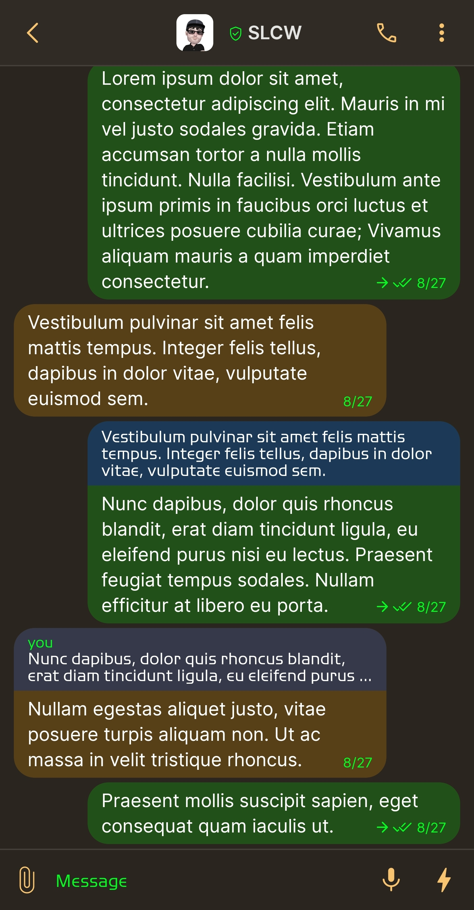
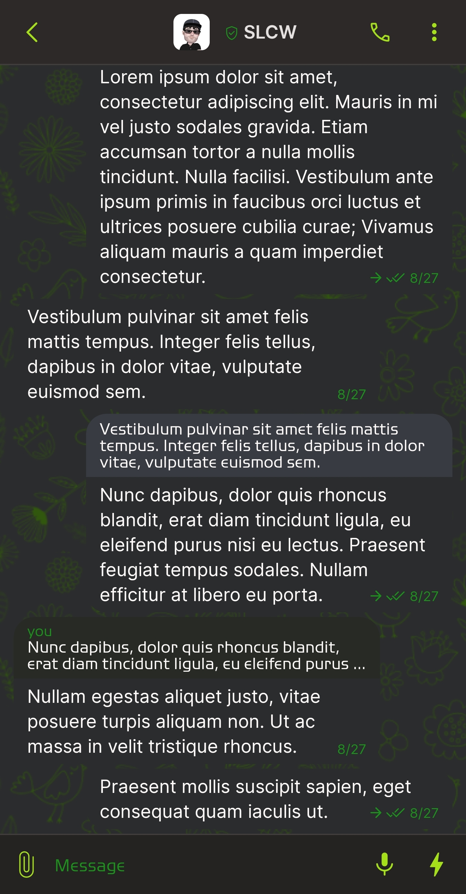
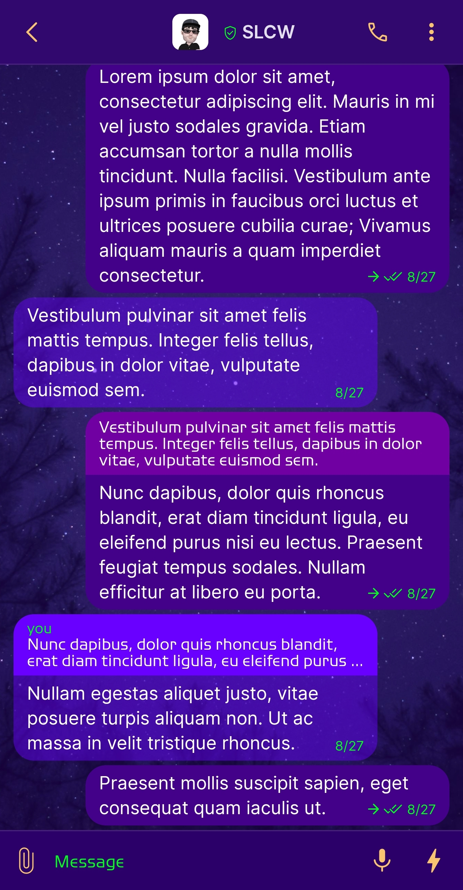
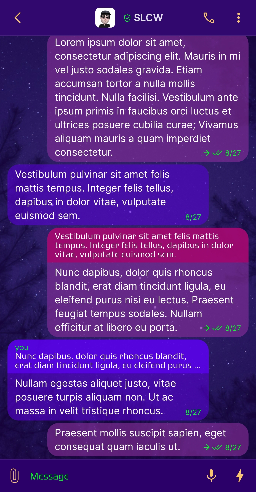
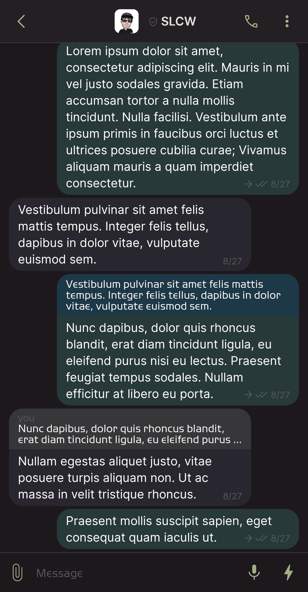

_The SimpleX Theme Archive is an independent, community project not affiliated with [SimpleX Chat](https://simplex.chat)_

You can submit your themes to the repository by joining the [SimpleX Themes group](https://simplex.chat/contact#/?v=2-7&smp=smp%3A%2F%2Fhpq7_4gGJiilmz5Rf-CswuU5kZGkm_zOIooSw6yALRg%3D%40smp5.simplex.im%2FjwFqICow91mcVNxBF2GXXF5Uq4H27goC%23%2F%3Fv%3D1-3%26dh%3DMCowBQYDK2VuAyEAOYs_RwIB67iDC_ORPmBpp-oED4Ric3oYkID4kdkMdGs%253D%26srv%3Djjbyvoemxysm7qxap7m5d5m35jzv5qq6gnlv7s4rsn7tdwwmuqciwpid.onion&data=%7B%22type%22%3A%22group%22%2C%22groupLinkId%22%3A%22jpatHRdLkjwNmbWBc-VWcg%3D%3D%22%7D) and uploading your theme file. 

## How to contribute a theme

1. Create your theme in the SimpleX Chat app. 
2. Export your theme to file and give it a descriptive name in the following format – e.g., `SxC_themeName.theme`. If your theme name has a space, use an underscore (_) — e.g., `SxC_theme_name.theme`
3. Join the [SimpleX Themes group](https://simplex.chat/contact#/?v=2-7&smp=smp%3A%2F%2Fhpq7_4gGJiilmz5Rf-CswuU5kZGkm_zOIooSw6yALR%40smp5.simplex.im%2FjwFqICow91mcVNxBF2GXXF5Uq4H27goC%23%2F%3Fv%3D1-3%26dh%3DMCowBQYDK2VuAyEAOYs_RwIB67iDC_ORPmBpp-oED4Ric3oYkID4kdkMdGs%253D%26srv%3Djjbyvoemxysm7qxap7m5d5m35jzv5qq6gnlv7s4rsn7tdwwmuqciwpid.onion&data=%7B%22type%22%3A%22group%22%2C%22groupLinkId%22%3A%22jpatHRdLkjwNmbWBc-VWcg%3D%3D%22%7D)
4. Upload your theme file to the group.

Your theme file will be transferred to the Theme Archive and made available for download. 

## Download Themes

Click a theme name to view screenshots and download:

|                                                                                                                                                           |                                                                                                                                         |                                                                                                                                                                 |
|:---------------------------------------------------------------------------------------------------------------------------------------------------------:|:---------------------------------------------------------------------------------------------------------------------------------------:|:---------------------------------------------------------------------------------------------------------------------------------------------------------------:|
|  [AMOLED Black v1](./resources/SxC_AMOLEDblack-v101_index.md)                             |  [AMOLED Black v2](./resources/SxC_AMOLEDblackV2_index.md)               |  [Binary](./resources/SxC_binary_index.md)                                                              |
|  [Black Green](./resources/SxC_blackGreen_index.md)                                           |  [Blue](./resources/SxC_blue_index.md)                                            |  [Camo Cobalt](./resources/SxC_camoCobalt_index.md)                                                 |
|  [Camo Green v1](./resources/SxC_camoGreen-v1_index.md)                                     |  [Camo Green v1.5](./resources/SxC_camoGreen-v1_5_index.md)             |  [Camo Green v2](./resources/SxC_camoGreen-v2_index.md)                                           |
|  [Camo Urban](./resources/SxC_camoUrban_index.md)                                              |  [Cassini Midnight](./resources/SxC_cassiniMidnight_index.md.)         |  [Cat](./resources/SxC_cat_index.md)                                                                       |
|  [Catppuccin Frappe](./resources/SxC_catppuccinFrappe_index.md)                         |  [Catppuccin Latte](./resources/SxC_catppuccinLatte_index.md)          |  [Catppuccin Macchiato](./resources/SxC_catppuccinMacchiato_index.md)                      |
|  [Catppuccin Mocha v1](./resources/SxC_catppuccinMocha-v1_index.md)                   |  [Catppuccin Mocha v2](./resources/SxC_catppuccinMocha-v2_index.md) |  [CPN Hacking v1](./resources/SxC_CPN_Hacking-v1_index.md)                                      |
|  [CPN Hacking v2](./resources/SxC_CPN_Hacking-v2_index.md)                                |  [CPN iMessage v1](./resources/SxC_iMessage-v1_index.md)               |  [CPN iMessage v2](./resources/SxC_iMessage-v2_index.md)                                       |
|  [CPN Synthwave v1](./resources/SxC_CPN_synthwave_index.md)                                |  [CPN Vaporwave ](./resources/SxC_CPN_vaporwave_index.md)                |  [Cyan](./resources/SxC_cyan_index.md)                                                                    |
|  [Dark](./resources/SxC_dark_index.md)                                                              |  [Dark Green](./resources/SxC_darkGreen_index.md)                            |  [Dracula](./resources/SxC_dracula_index.md)                                                           |
|  [Electric Blue](./resources/SxC_electricBlue_index.md)                                     |  [Girly](./resources/SxC_girly_index.md)                                         |  [Good SimpleX](./resources/SxC_goodSimplex_index.md)                                              |
|  [Green Night v1](./resources/SxC_greenNight-v1_index.md)                                  |  [Green Plus v1](./resources/SxC_CPN_greenPlus-v1_index.md)               |  [Green Plus v1.5](./resources/SxC_CPN_greenPlus-v1_5_index.md)                                 |
|  [Green v1](./resources/SxC_green-v1_index.md)                                                  |  [Green v2](./resources/SxC_green-v2_index.md)                                |  [Greymatters](./resources/SxC_greymatters_index.md)                                               |
|  [Hot Dog](./resources/SxC_hotdog_index.md)                                                       |  [IT Slate](./resources/SxC_IT_Slate_index.md)                                |  [Japane Sea](./resources/SxC_japaneSea_index.md)                                                    |
|  [Joker](./resources/SxC_joker_index.md)                                                           |  [Lazy Sunday](./resources/SxC_lazySunday_index.md)                         |  [Leaves](./resources/SxC_leaves_index.md)                                                              |
|  [Light](./resources/SxC_light_index.md)                                                           |  [Lobster](./resources/SxC_Lobster_index.md)                                   |  [Mocca](./resources/SxC_mocca_index.md)                                                                 |
|  [Mona Lisa](./resources/SxC_monaLisa_index.md)                                                 |  [Moss Noir](./resources/SxC_mossNoir_index.md)                               |  [Nightshade Transparent v1.5](./resources/SxC_NightshadeTransparent-v1_5_index.md) |
|  [Nightshade Transparent v2](./resources/SxC_NightshadeTransparent-v2_index.md) |  [Nightshade v1](./resources/SxC_Nightshade_index.md)                       |  [Nightshade v1.5](./resources/SxC_Nightshade-v1_5_index.md)                                   |
|  [Nightshade v2](./resources/SxC_Nightshade-v2_index.md)                                   |  [Nightshade v2.1](./resources/SxC_Nightshade-v2_1_index.md)           |  [Nightshade v2.2](./resources/SxC_Nightshade-v2_2_index.md)                                   |
|  [Nightshade v2.3](./resources/SxC_Nightshade-v2_3_index.md)                             |  [Nightswatch v2](./resources/SxC_nightswatch-v2_index.md)              |  [Nightswatch v3](./resources/SxC_nightswatch-v3_index.md)                                      |
|  [Polarized Darkish](./resources/SxC_polarizedDarkish_index.md)                         |  [Purple](./resources/SxC_purple_index.md)                                      |  [Random](./resources/SxC_random_index.md)                                                              |
|  [Red](./resources/SxC_red_index.md)                                                                 |  [Session Dark](./resources/SxC_SessionDark_index.md)                      |  [SimpleX Default](./resources/SxC_simplexDefault_index.md)                                     |
|  [The Shining v1](./resources/SxC_The_Shining-v1_index.md)                                |  [The Shining v2](./resources/SxC_The_Shining-v2_index.md)              |  [WhatsApp Dark](./resources/SxC_whatsappDark_index.md)                                           |
|  [Yellow](./resources/SxC_yellow_index.md)                                                        |                                                                                                                                         |                                                                                                                                                                 |