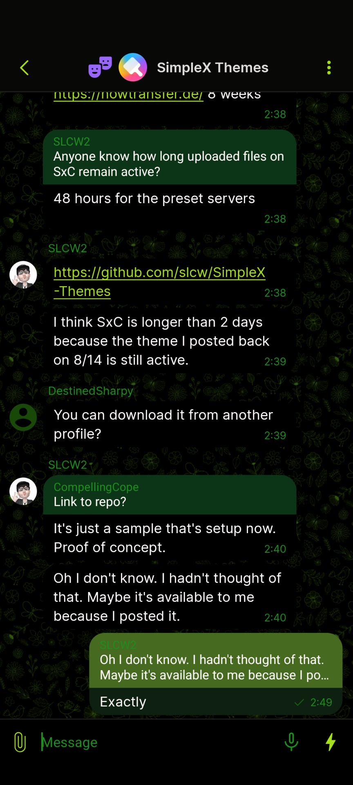
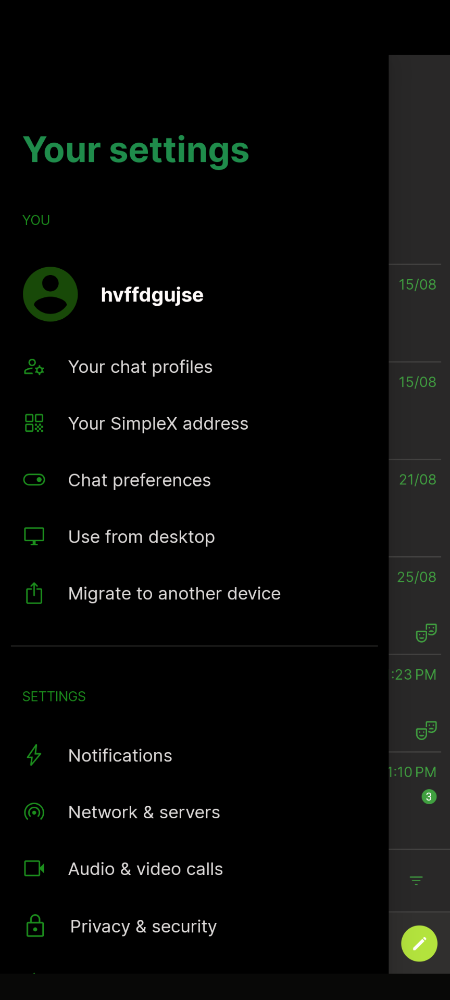
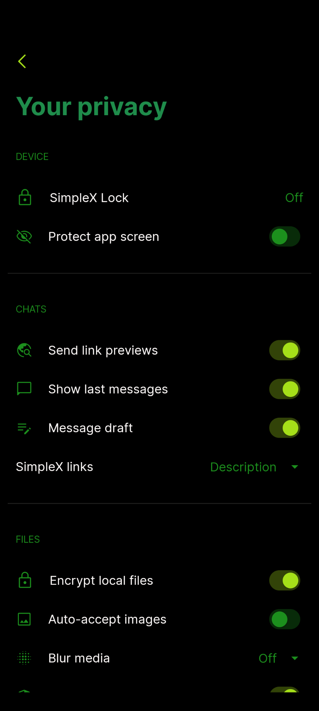
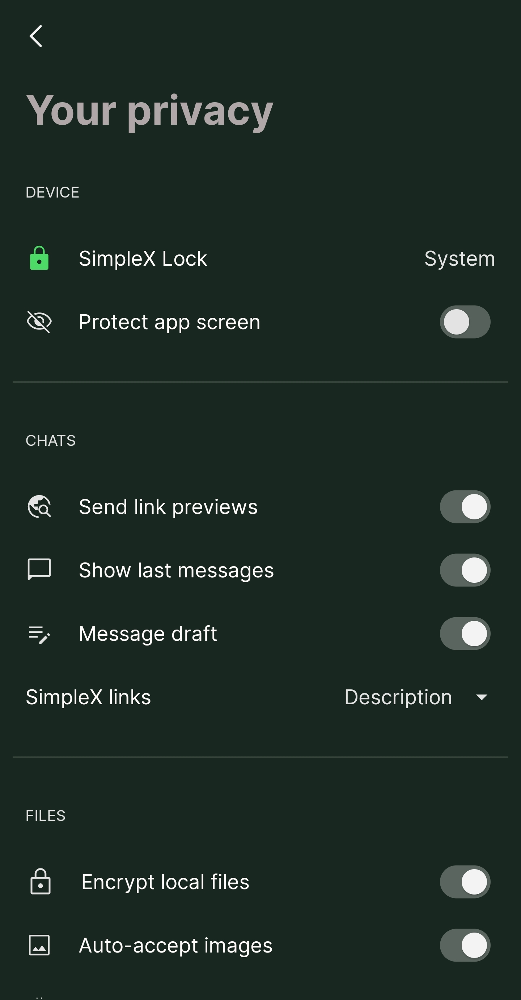
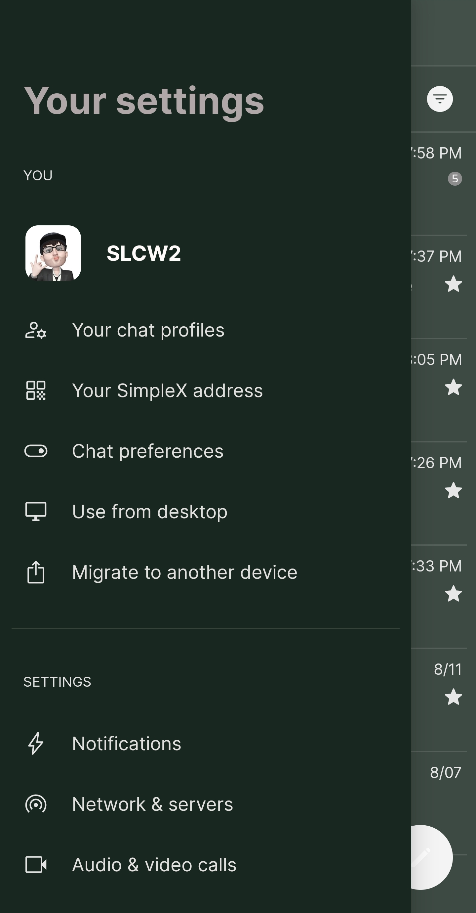

# Theme Archive

_The SimpleX Themes archive is an independent, community project not affiliated with [SimpleX](https://simplex.chat)_

You can contribute your themes to the repository by joining the [SimpleX Themes user group](https://simplex.chat/contact#/?v=1-4&smp=smp%3A%2F%2Fhpq7_4gGJiilmz5Rf-CswuU5kZGkm_zOIooSw6yALRg%3D%40smp5.simplex.im%2F04eqwRF_Vc9Oro_F2Qdvkfr0q6UnUUno%23%2F%3Fv%3D1-2%26dh%3DMCowBQYDK2VuAyEAdPWniExJ8QNQcs1nxfkJkUnDZvkZb-XqUHHmnKPVwRY%253D%26srv%3Djjbyvoemxysm7qxap7m5d5m35jzv5qq6gnlv7s4rsn7tdwwmuqciwpid.onion&data=%7B%22type%22%3A%22group%22%2C%22groupLinkId%22%3A%22G5jkKnmuXucgF7ABU0dq_w%3D%3D%22%7D) and uploading your theme file. 

## How to contribute a theme

1. Create your theme in the SimpleX Chat app. 
2. Export your theme to a file and give it a descriptive name in the following format – e.g., `SxC_themeName.theme`. If your theme name has a space, use an underscore (_) — e.g., `SxC_theme_name.theme`
3. Join the [SimpleX Themes group](https://simplex.chat/contact#/?v=1-4&smp=smp%3A%2F%2Fhpq7_4gGJiilmz5Rf-CswuU5kZGkm_zOIooSw6yALRg%3D%40smp5.simplex.im%2F04eqwRF_Vc9Oro_F2Qdvkfr0q6UnUUno%23%2F%3Fv%3D1-2%26dh%3DMCowBQYDK2VuAyEAdPWniExJ8QNQcs1nxfkJkUnDZvkZb-XqUHHmnKPVwRY%253D%26srv%3Djjbyvoemxysm7qxap7m5d5m35jzv5qq6gnlv7s4rsn7tdwwmuqciwpid.onion&data=%7B%22type%22%3A%22group%22%2C%22groupLinkId%22%3A%22G5jkKnmuXucgF7ABU0dq_w%3D%3D%22%7D)
4. Upload your theme file to the group.

Your theme file will be transferred to the Themes Archive and made available for download. 

## Download Themes

<!-- Copy the following block for your theme, customize it, append it to the bottom of the file, and remove the comment tags to make it live. Do NOT edit this block. MAKE A COPY. 
    ### Your theme name
    Download [Your theme](./themes/example.theme)
     &nbsp;&nbsp;  &nbsp;&nbsp;  &nbsp;&nbsp;
-->

<!--
### Dark Blue theme (included)
* Download [Dark Blue theme](./themes/example.theme)

 &nbsp;&nbsp;  &nbsp;&nbsp; 
-->

 ### Electric Blue
* Download [Electric Blue](./themes/SxC_electricBlue.theme)
 
  &nbsp;&nbsp;  &nbsp;&nbsp;  &nbsp;&nbsp; &nbsp;&nbsp;

### Dark Green
* Download [Dark Green](./themes/SxC_darkGreen.theme)

  &nbsp;&nbsp;  &nbsp;&nbsp;  &nbsp;&nbsp; &nbsp;&nbsp;
 
 ### Nightshade
* Download [Nightshade](./themes/SxC_Nightshade.theme)

  &nbsp;&nbsp;  &nbsp;&nbsp;  &nbsp;&nbsp; &nbsp;&nbsp;

### Camo Urban
* Download [Camo Urban](./themes/SxC_camoUrban.theme)

  &nbsp;&nbsp;  &nbsp;&nbsp;  &nbsp;&nbsp; &nbsp;&nbsp;

### Camo Green
* Download [Camo Green](./themes/SxC_camoGreen.theme)

  &nbsp;&nbsp;  &nbsp;&nbsp;  &nbsp;&nbsp; &nbsp;&nbsp;
