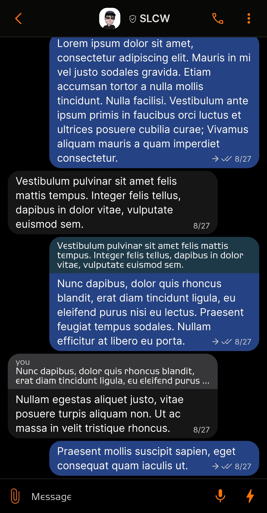
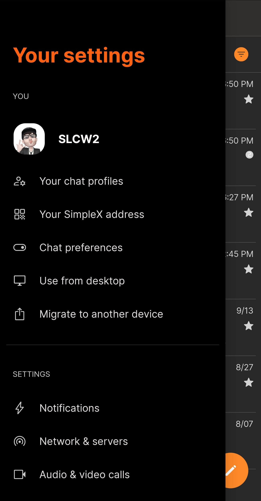
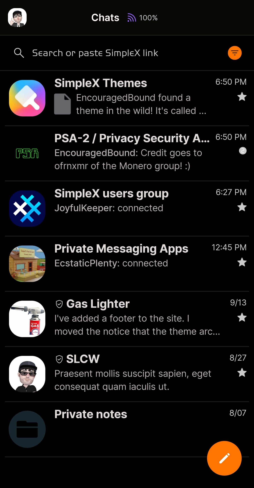
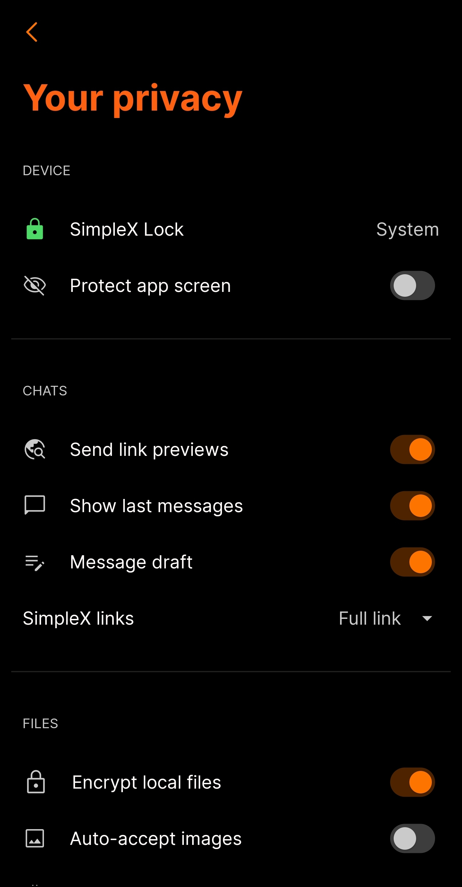

# 2024 XMR SimpleX

* Download [2024 XMR SimpleX](../themes/SxC_2024XMRSimpleX.theme)

<a href="../screenshots/SxC_2024XMRSimpleX01.jpg" target="_blank">
		
</a>&nbsp;&nbsp;&nbsp;
<a href="../screenshots/SxC_2024XMRSimpleX02.jpg" target="_blank">
		
</a>
<br>
<a href="../screenshots/SxC_2024XMRSimpleX03.jpg" target="_blank">
		
</a>&nbsp;&nbsp;&nbsp;
<a href="../screenshots/SxC_2024XMRSimpleX04.jpg" target="_blank">
		
</a>

----
### Theme Properties
```
base: "DARK"
colors:
  accent: "#feff7400"
  accentVariant: "#fff27e00"
  secondary: "#ffcacaca"
  secondaryVariant: "#ff5d5e5f"
  background: "#ff000000"
  menus: "#fe171615"
  title: "#ffff6113"
  accentVariant2: "#ff18262e"
  sentMessage: "#be315ab1"
  sentReply: "#ff1d3847"
  receivedMessage: "#20b1b0b5"
  receivedReply: "#ff373739"
```

* [Return Home](../)