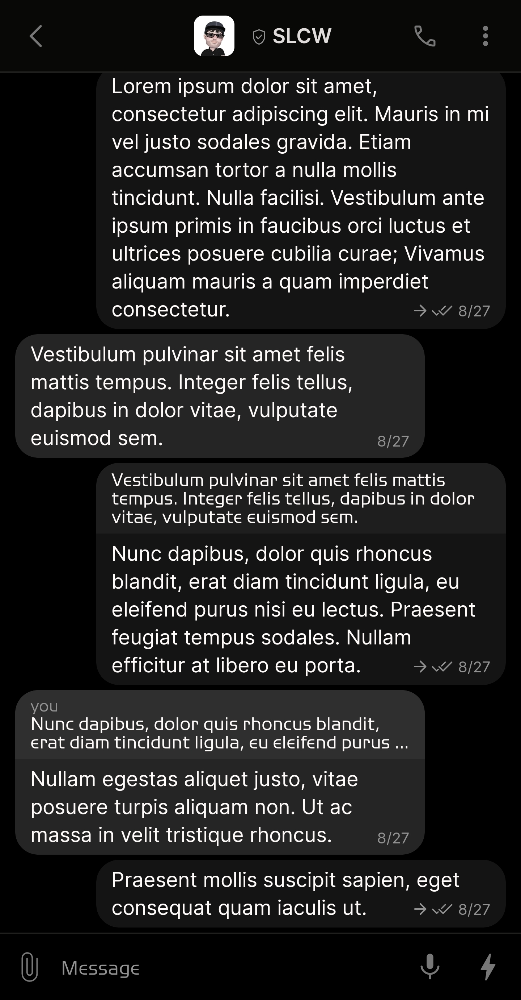
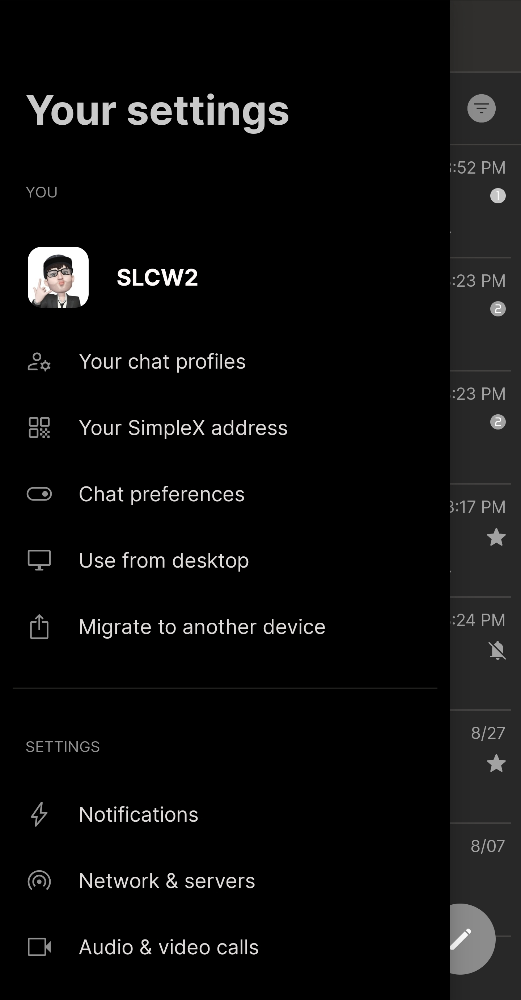
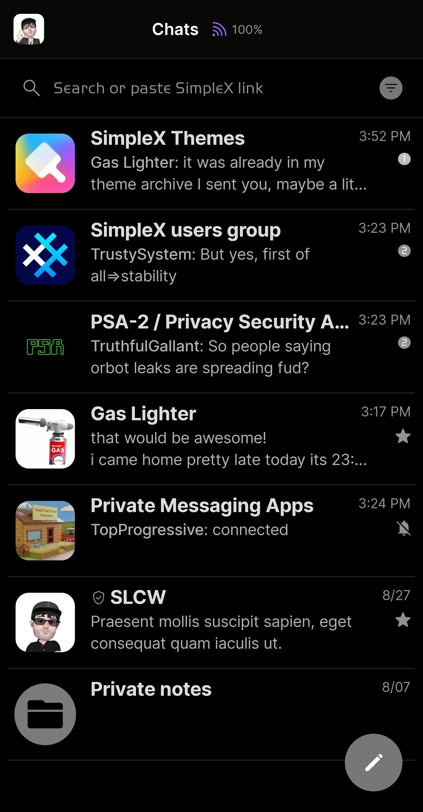

# AMOLED Black v1

* Download [AMOLED Black v1](../themes/SxC_AMOLEDblack-v1.theme)

<a href="../screenshots/SxC_AMOLEDblack-v101.jpg" target="_blank">
	
</a>&nbsp;&nbsp;&nbsp;
<a href="../screenshots/SxC_AMOLEDblack-v102.jpg" target="_blank">
	
</a>
<br>
<a href="../screenshots/SxC_AMOLEDblack-v103.jpg" target="_blank">
	
</a>&nbsp;&nbsp;&nbsp;
<a href="../screenshots/SxC_AMOLEDblack-v104.jpg" target="_blank">
	
</a>

----
### Theme Properties
```
base: "BLACK"
colors:
  accent: "#ff777777"
  accentVariant: "#ffbcbcbc"
  secondary: "#ff919191"
  secondaryVariant: "#ff303030"
  background: "#ff000000"
  menus: "#ff141414"
  title: "#ffc9c9c9"
  accentVariant2: "#ff7c7b7b"
  sentMessage: "#ff141414"
  sentReply: "#ff1e1e1e"
  receivedMessage: "#ff252525"
  receivedReply: "#ff2f2f2f"
wallpaper:
  scale: 1.0
  scaleType: "fill"
  background: "#ff000000"
  tint: "#00ffffff"
  ```

* [Return Home](../)