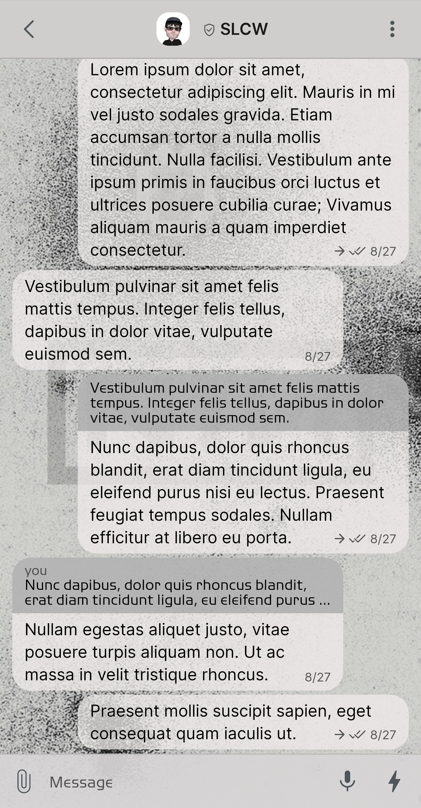
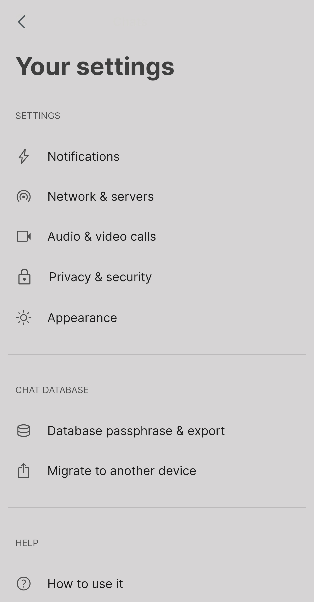
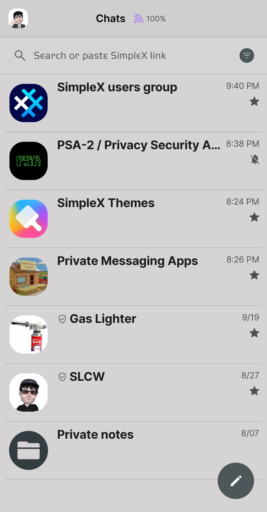
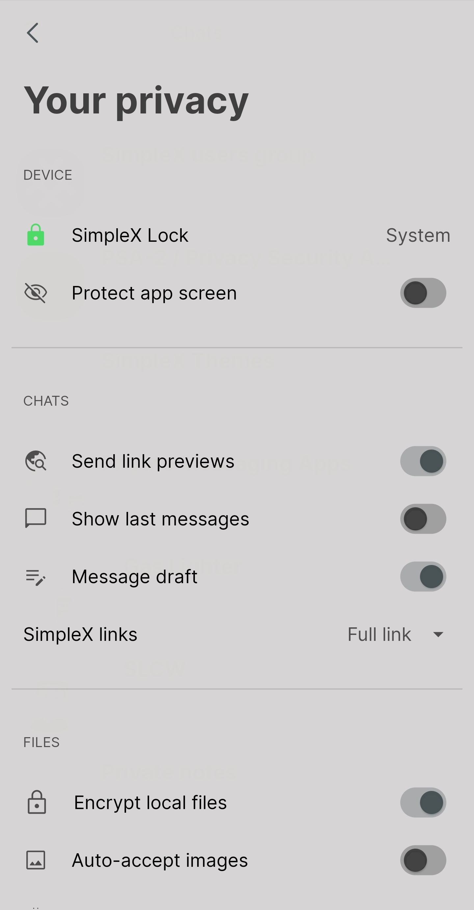

# Bad Witch Lite

* Download [Bad Witch Lite](../themes/SxC_BadWitchLite.theme)

<a href="../screenshots/SxC_BadWitchLite01.jpg" target="_blank">
		
</a>&nbsp;&nbsp;&nbsp;
<a href="../screenshots/SxC_BadWitchLite02.jpg" target="_blank">
		
</a>
<br>
<a href="../screenshots/SxC_BadWitchLite03.jpg" target="_blank">
		
</a>&nbsp;&nbsp;&nbsp;
<a href="../screenshots/SxC_BadWitchLite04.jpg" target="_blank">
		
</a>

----
### Theme Properties
```
base: "LIGHT"
colors:
  accent: "#ed434d51"
  accentVariant: "#ff8b8b8b"
  secondary: "#c829292a"
  secondaryVariant: "#ffa9a6a6"
  background: "#eed6d4d4"
  menus: "#f2d6d4d4"
  title: "#b3000000"
  accentVariant2: "#ff323c41"
  sentMessage: "#c1eeeaea"
  sentReply: "#9c97989a"
  receivedMessage: "#c1eeeaea"
  receivedReply: "#9c97989a"
wallpaper:
  scale: 1.0
  scaleType: "fill"
  background: "#ffffffff"
  tint: "#24000000"
```
----
### Credits
Wallpaper Source — _@ninwallpaper (Tumblr)_
* [Return Home](../)