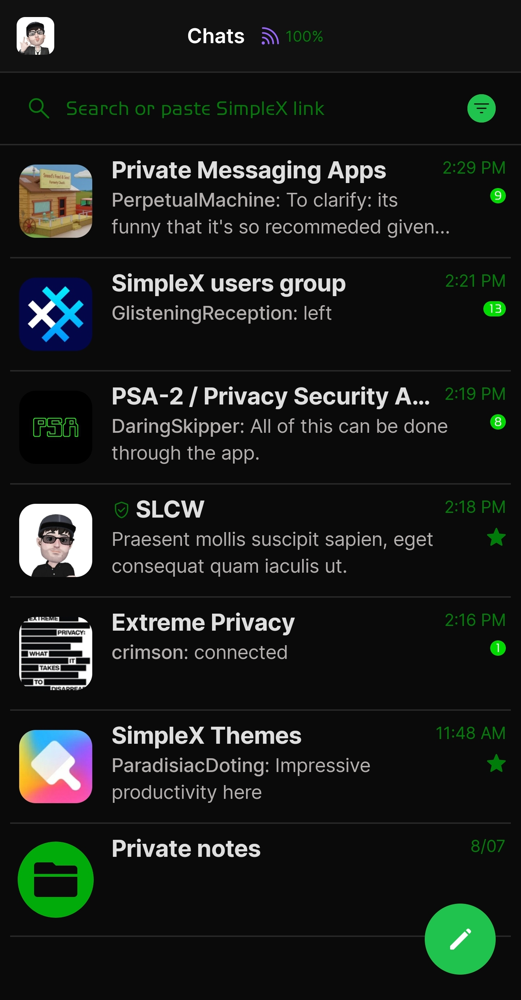

# CPN Hacking v2

* Download [CPN Hacking v1](../themes/SxC_CPN_Hacking-v2.theme)

<a href="../screenshots/SxC_CPN_Hacking-v201.jpg" target="_blank">
	
</a>&nbsp;&nbsp;&nbsp;
<a href="../screenshots/SxC_CPN_Hacking-v202.jpg" target="_blank">
	
</a>
<br>
<a href="../screenshots/SxC_CPN_Hacking-v203.jpg" target="_blank">
	
</a>&nbsp;&nbsp;&nbsp;
<a href="../screenshots/SxC_CPN_Hacking-v204.jpg" target="_blank">
	
</a>

----
### Theme Properties
```
base: "SIMPLEX"
colors:
  accent: "#ff20c34d"
  accentVariant: "#ff00da01"
  secondary: "#ff007c0b"
  secondaryVariant: "#ff116819"
  background: "#ff0a0a0a"
  menus: "#ff031303"
  title: "#ff4cf453"
  accentVariant2: "#ff00ab0a"
  sentMessage: "#1e00d124"
  sentReply: "#ff00350c"
  receivedMessage: "#20313030"
  receivedReply: "#ff141514"
```

* [Return Home](../)