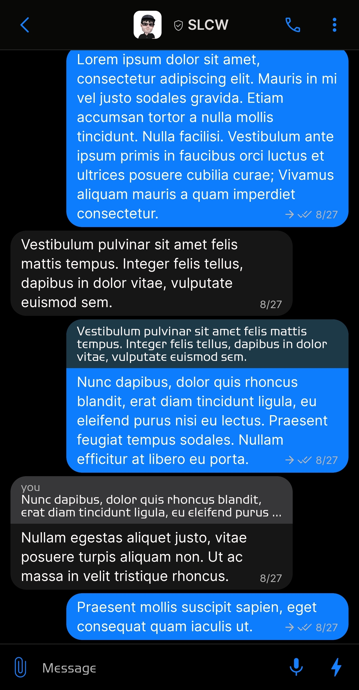
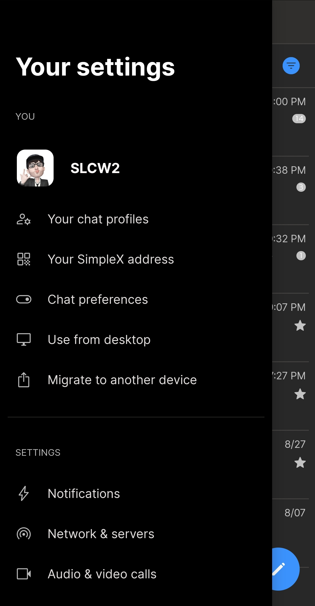
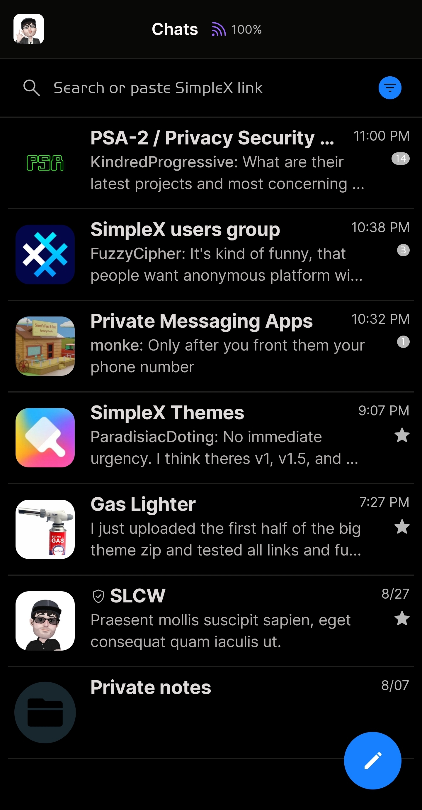
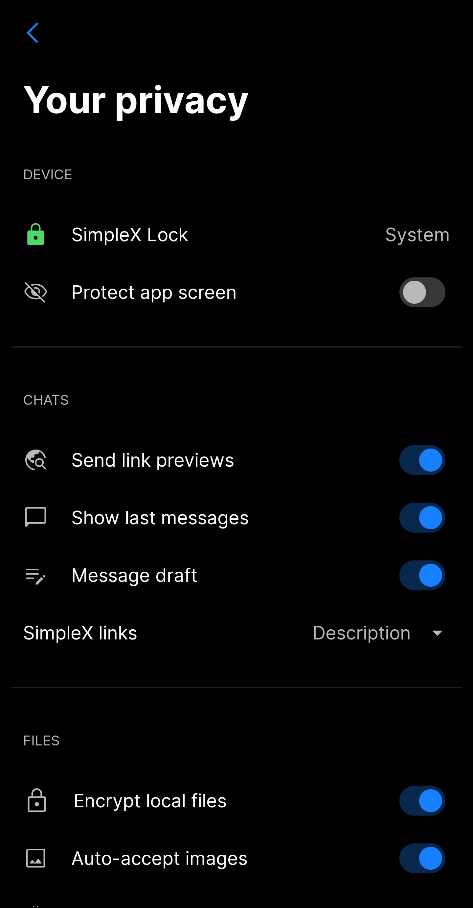

# CPN iMessage v1

* Download [CPN iMessage v1](../themes/SxC_CPN_iMessage-v1.theme)

<a href="../screenshots/SxC_CPN_iMessage-v101.jpg" target="_blank">
	
</a>&nbsp;&nbsp;&nbsp;
<a href="../screenshots/SxC_CPN_iMessage-v102.jpg" target="_blank">
	
</a>
<br>
<a href="../screenshots/SxC_CPN_iMessage-v103.jpg" target="_blank">
	
</a>&nbsp;&nbsp;&nbsp;
<a href="../screenshots/SxC_CPN_iMessage-v104.jpg" target="_blank">
	
</a>

----
### Theme Properties
```
base: "DARK"
colors:
  accent: "#ff1780ff"
  accentVariant: "#ff1d71ff"
  secondary: "#ffb9b9b9"
  secondaryVariant: "#ff404144"
  background: "#ff000000"
  menus: "#ff222222"
  title: "#ffffffff"
  sentMessage: "#fe0d7dff"
  receivedMessage: "#20b1b0b5"
```

* [Return Home](../)