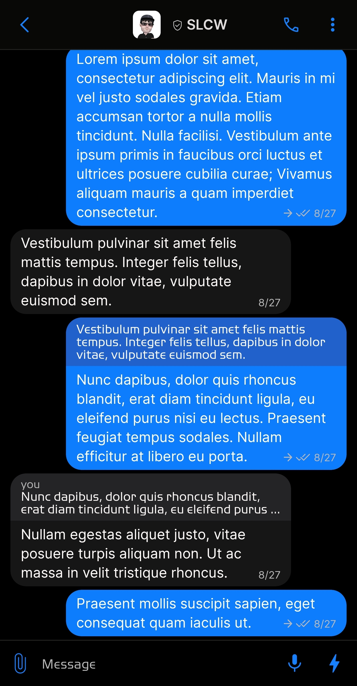
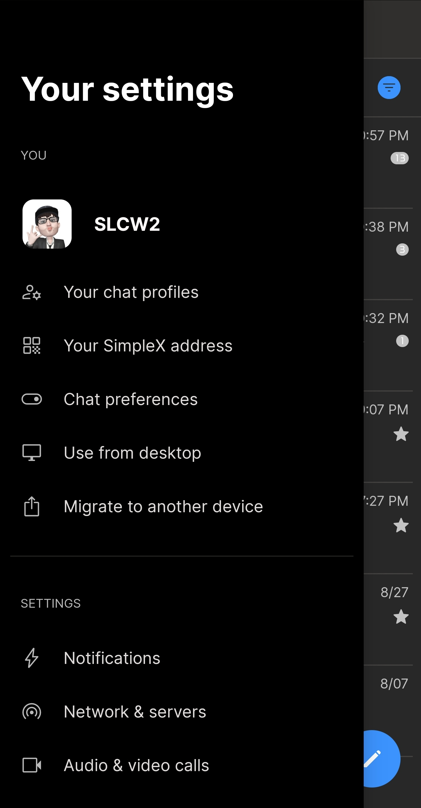
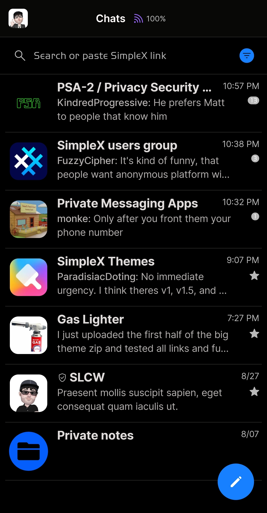
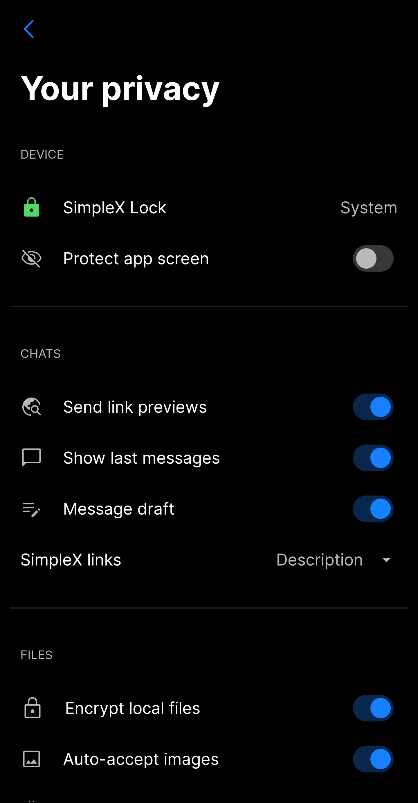

# CPN iMessage v2

* Download [CPN iMessage v2](../themes/SxC_CPN_iMessage-v2.theme)

<a href="../screenshots/SxC_CPN_iMessage-v201.jpg" target="_blank">
	
</a>&nbsp;&nbsp;&nbsp;
<a href="../screenshots/SxC_CPN_iMessage-v202.jpg" target="_blank">
	
</a>
<br>
<a href="../screenshots/SxC_CPN_iMessage-v203.jpg" target="_blank">
	
</a>&nbsp;&nbsp;&nbsp;
<a href="../screenshots/SxC_CPN_iMessage-v204.jpg" target="_blank">
	
</a>

----
### Theme Properties
```
base: "DARK"
colors:
  accent: "#ff1780ff"
  accentVariant: "#ff1d71ff"
  secondary: "#ffb9b9b9"
  secondaryVariant: "#ff404144"
  background: "#ff000000"
  menus: "#ff313244"
  title: "#ffffffff"
  accentVariant2: "#ff035efc"
  sentMessage: "#fe0d7dff"
  sentReply: "#ff2061cc"
  receivedMessage: "#20b1b0b5"
  receivedReply: "#2086848d"
```

* [Return Home](../)