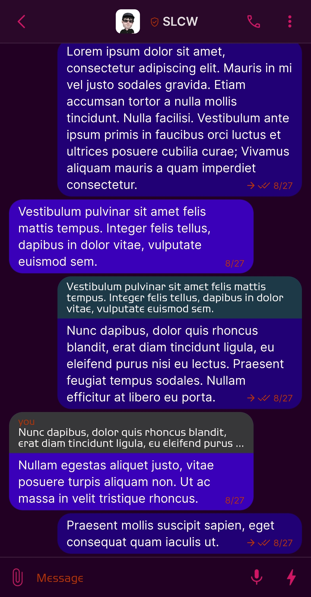
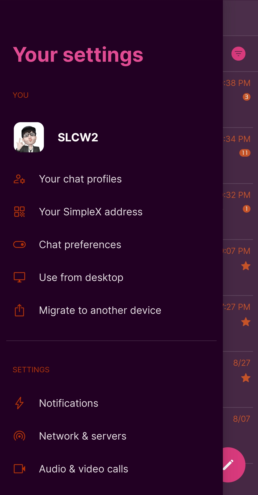
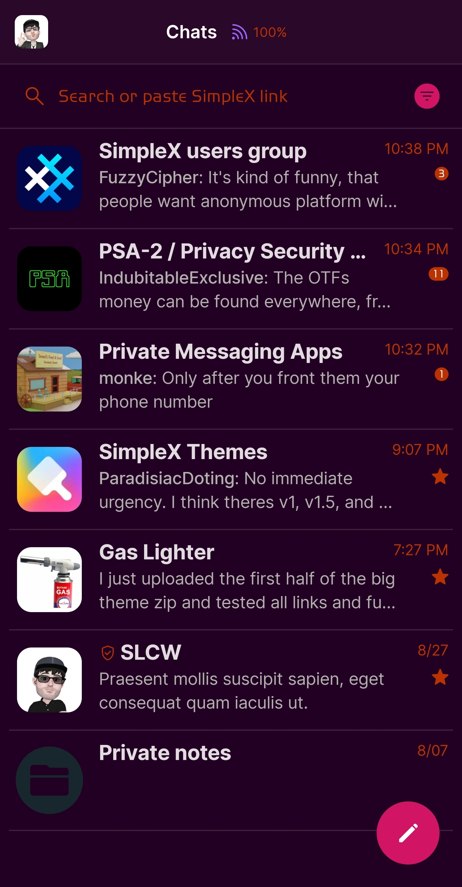
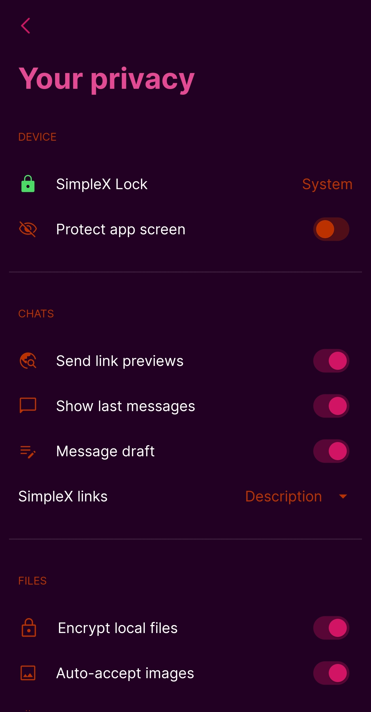

# CPN Synthwave

* Download [CPN Synthwave](../themes/SxC_CPN_synthwave.theme)

<a href="../screenshots/SxC_CPN_synthwave01.jpg" target="_blank">
	
</a>&nbsp;&nbsp;&nbsp;
<a href="../screenshots/SxC_CPN_synthwave02.jpg" target="_blank">
	
</a>
<br>
<a href="../screenshots/SxC_CPN_synthwave03.jpg" target="_blank">
	
</a>&nbsp;&nbsp;&nbsp;
<a href="../screenshots/SxC_CPN_synthwave04.jpg" target="_blank">
	
</a>

----
### Theme Properties
```
base: "DARK"
colors:
  accent: "#ffd11564"
  accentVariant: "#ffd96e00"
  secondary: "#ffbb3200"
  secondaryVariant: "#fffa2e88"
  background: "#ff220023"
  menus: "#ff480037"
  title: "#ffe24a94"
  sentMessage: "#ff210076"
  receivedMessage: "#ff3a00b9"
```

* [Return Home](../)