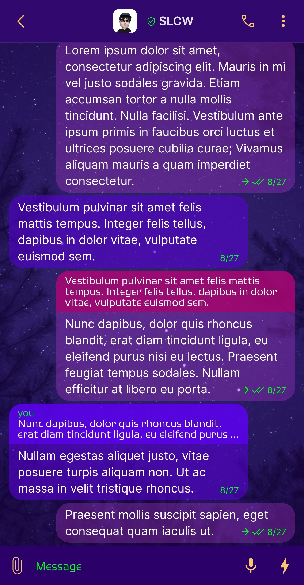
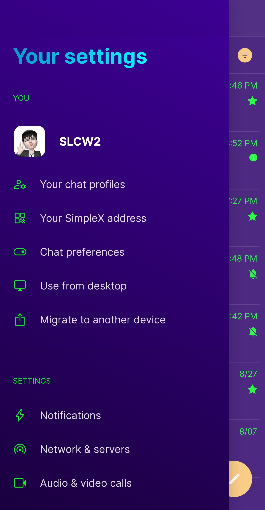
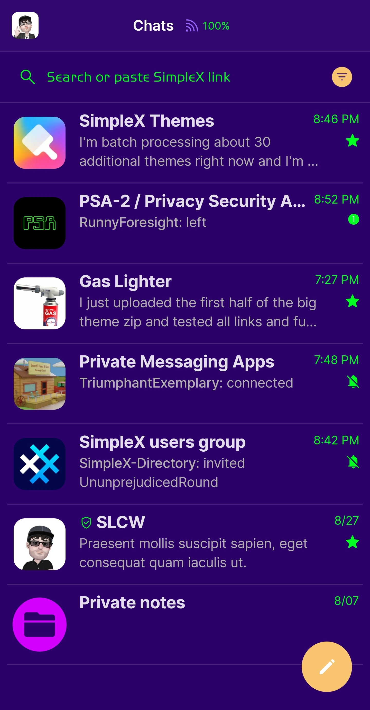
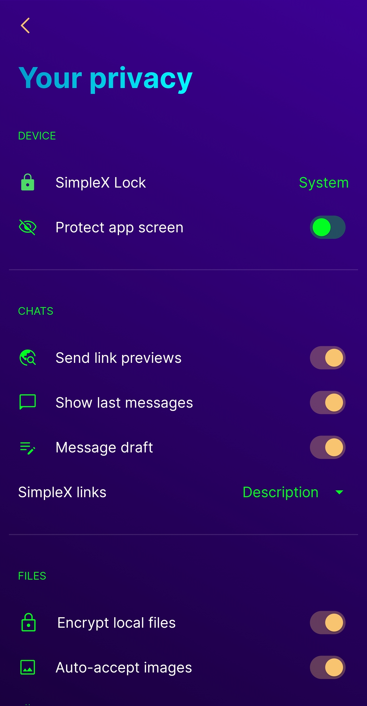

# Nightshade v2.3

* Download [Nightshade v2.3](../themes/SxC_Nightshade-v2_3.theme)

<a href="../screenshots/SxC_Nightshade-v2_301.jpg" target="_blank">
	
</a>&nbsp;&nbsp;&nbsp;
<a href="../screenshots/SxC_Nightshade-v2_302.jpg" target="_blank">
	
</a>
<br>
<a href="../screenshots/SxC_Nightshade-v2_303.jpg" target="_blank">
	
</a>&nbsp;&nbsp;&nbsp;
<a href="../screenshots/SxC_Nightshade-v2_304.jpg" target="_blank">
	
</a>

----
### Theme Properties
```
base: "SIMPLEX"
colors:
  accent: "#fff9c470"
  accentVariant: "#ffff7700"
  secondary: "#ff00ff21"
  secondaryVariant: "#ff5f00ff"
  background: "#ff2b0069"
  menus: "#ff4b00b5"
  title: "#ff00c2ff"
  accentVariant2: "#ffd300ff"
  sentMessage: "#4cc13de2"
  sentReply: "#beaf0069"
  receivedMessage: "#955700d5"
  receivedReply: "#a05f00ff"
wallpaper:
  scale: 1.0
  scaleType: "fill"
  background: "#ff2b0069"
  tint: "#3b5f00ff"
```

* [Return Home](../)