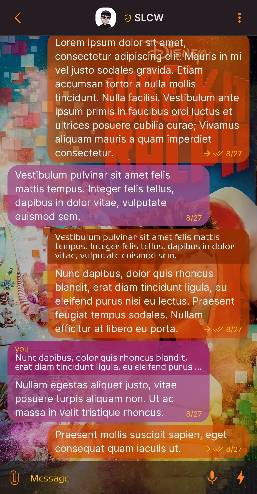
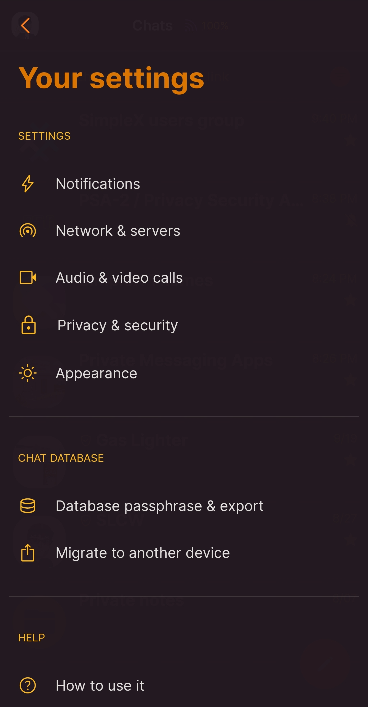
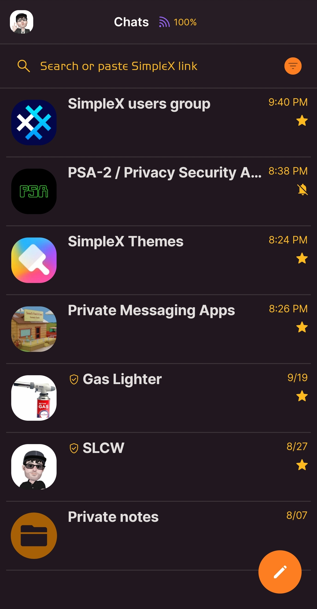
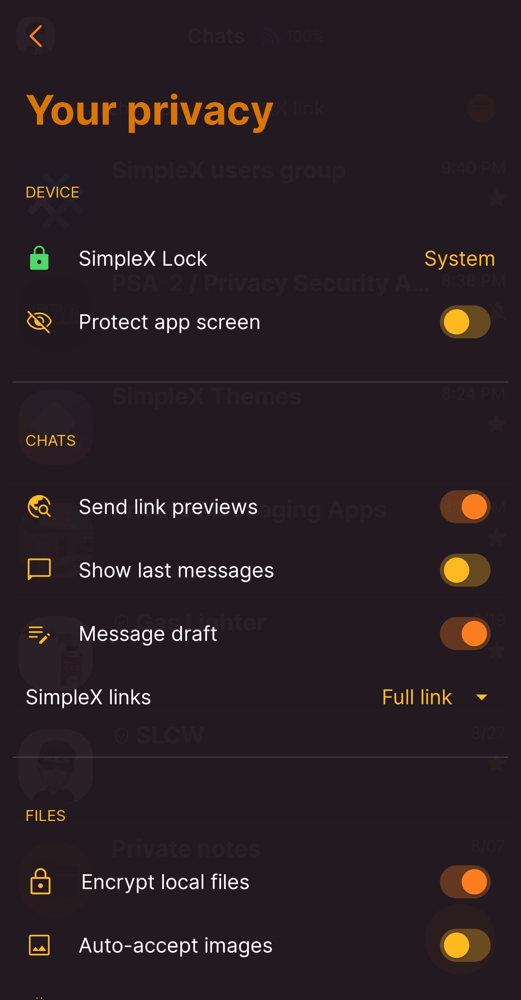

# Ralph Wrecks SimpleX 

* Download [Ralph Wrecks SimpleX](../themes/SxC_RalphWrecksSimpleX.theme)

<a href="../screenshots/SxC_RalphWrecksSimpleX01.jpg" target="_blank">
		
</a>&nbsp;&nbsp;&nbsp;
<a href="../screenshots/SxC_RalphWrecksSimpleX02.jpg" target="_blank">
		
</a>
<br>
<a href="../screenshots/SxC_RalphWrecksSimpleX03.jpg" target="_blank">
		
</a>&nbsp;&nbsp;&nbsp;
<a href="../screenshots/SxC_RalphWrecksSimpleX04.jpg" target="_blank">
		
</a>

----
### Theme Properties
```
base: "BLACK"
colors:
  accent: "#fffd7e20"
  accentVariant: "#ffd38119"
  secondary: "#ffffba20"
  secondaryVariant: "#d9ad5400"
  background: "#a4231920"
  menus: "#e8231920"
  title: "#ffda7600"
  accentVariant2: "#d0c67100"
  sentMessage: "#a4d74a01"
  sentReply: "#a0792300"
  receivedMessage: "#caa44e89"
  receivedReply: "#73900150"
wallpaper:
  scale: 1.0
  scaleType: "fill"
  background: "#ff000000"
  tint: "#37000000"
```

* [Return Home](../)