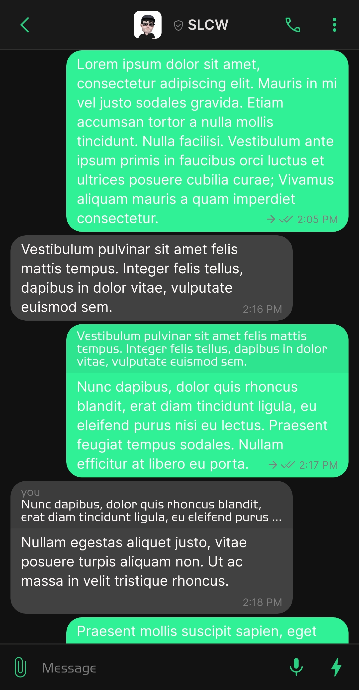
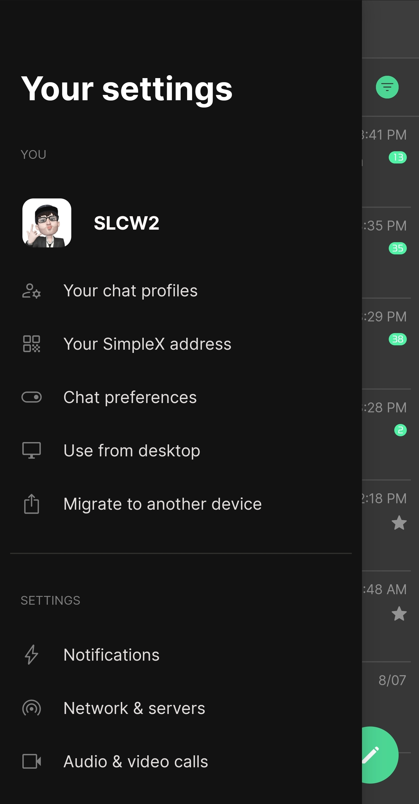
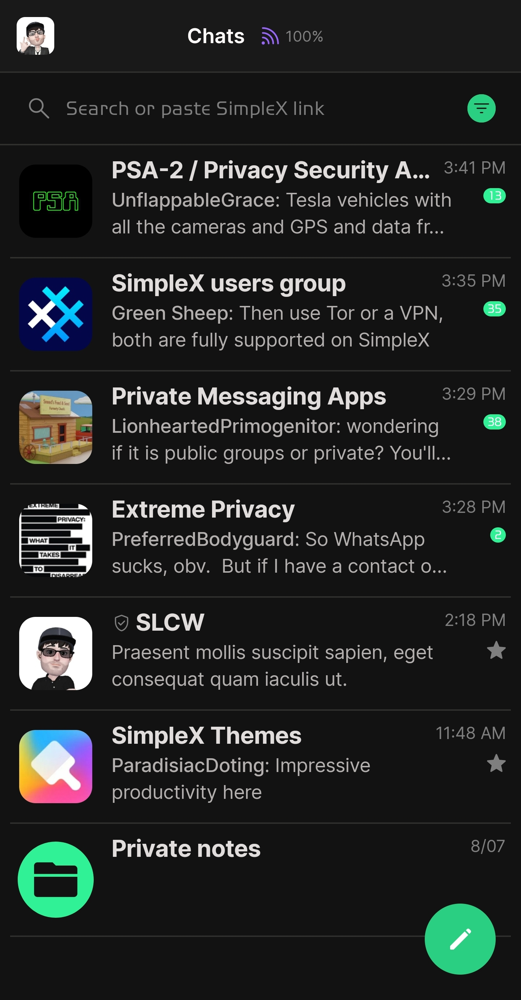
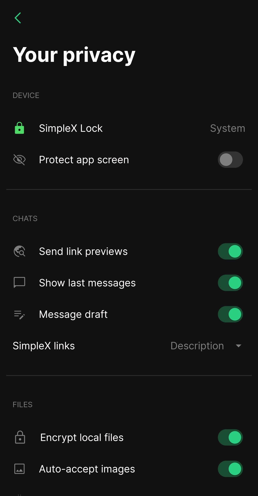

# Session (dark) 

* Download [Session (dark)](../themes/SxC_SessionDark.theme)

<a href="../screenshots/SxC_SessionDark01.jpg" target="_blank">
	
</a>&nbsp;&nbsp;&nbsp;
<a href="../screenshots/SxC_SessionDark02.jpg" target="_blank">
	
</a>
<br>
<a href="../screenshots/SxC_SessionDark03.jpg" target="_blank">
	
</a>&nbsp;&nbsp;&nbsp;
<a href="../screenshots/SxC_SessionDark04.jpg" target="_blank">
	
</a>

----
### Theme Properties
```
base: "DARK"
colors:
  accent: "#ff2acf81"
  accentVariant: "#ff31f196"
  secondary: "#ff7f7f7f"
  secondaryVariant: "#ff2b2c2e"
  background: "#ff121212"
  menus: "#e6222222"
  title: "#ffffffff"
  accentVariant2: "#ff31f196"
  sentMessage: "#ff31f196"
  sentReply: "#e000000"
  receivedMessage: "#ff414141"
  receivedReply: "#14000000"
wallpaper:
  scale: 1.0
  scaleType: "fill"
  background: "#ff000000"
  tint: "#ff111111"
```

* [Return Home](../)
