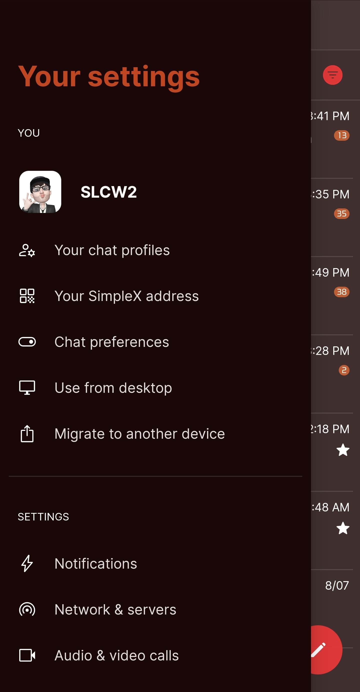
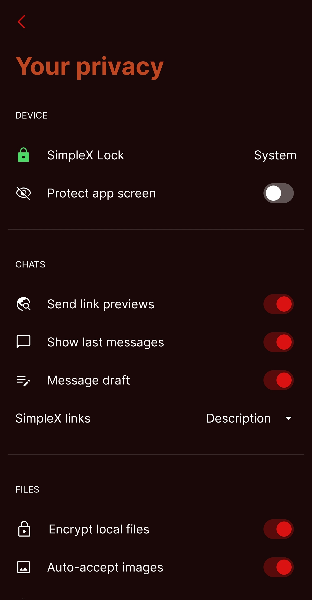

# The Shining v1

* Download [The Shining v1](../themes/SxC_The_Shining-v1.theme)

<a href="../screenshots/SxC_The_Shining-v101.jpg" target="_blank">
	
</a>&nbsp;&nbsp;&nbsp;
<a href="../screenshots/SxC_The_Shining-v102.jpg" target="_blank">
	
</a>
<br>
<a href="../screenshots/SxC_The_Shining-v103.jpg" target="_blank">
	
</a>&nbsp;&nbsp;&nbsp;
<a href="../screenshots/SxC_The_Shining-v104.jpg" target="_blank">
	
</a>

----
### Theme Properties
```
Base: "BLACK"
colors:
  accent: "#ede41212"
  accentVariant: "#ffb04010"
  secondary: "#ffffffff"
  secondaryVariant: "#ff8c0e1c"
  background: "#ff1a0808"
  menus: "#ff202828"
  title: "#ffbe4620"
  accentVariant2: "#ffa2b600"
  sentMessage: "#cc82111e"
  sentReply: "#ff311f16"
  receivedMessage: "#d8882c12"
  receivedReply: "#ff1d120e"
wallpaper:
  scale: 1.0
  scaleType: "fill"
  background: "#ff070707"
  tint: "#2c00000
```

* [Return Home](../)