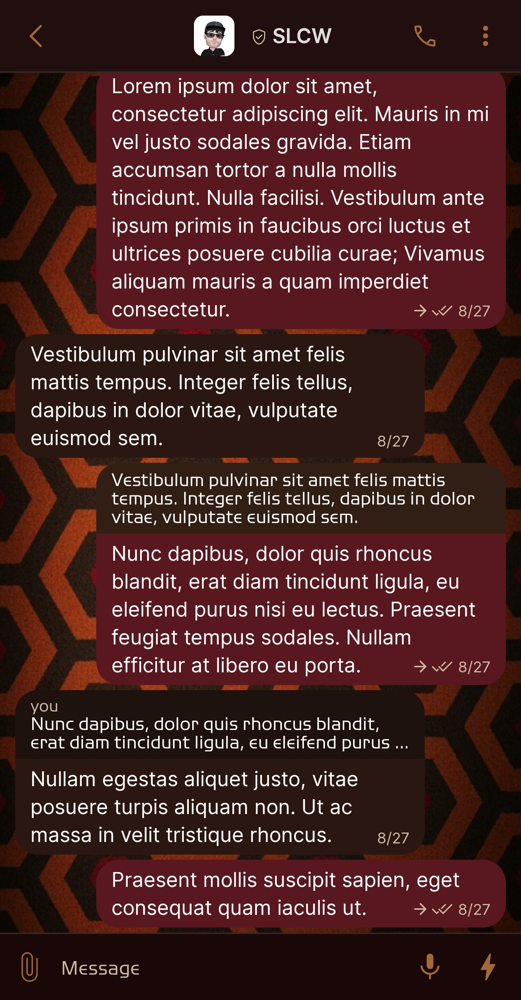
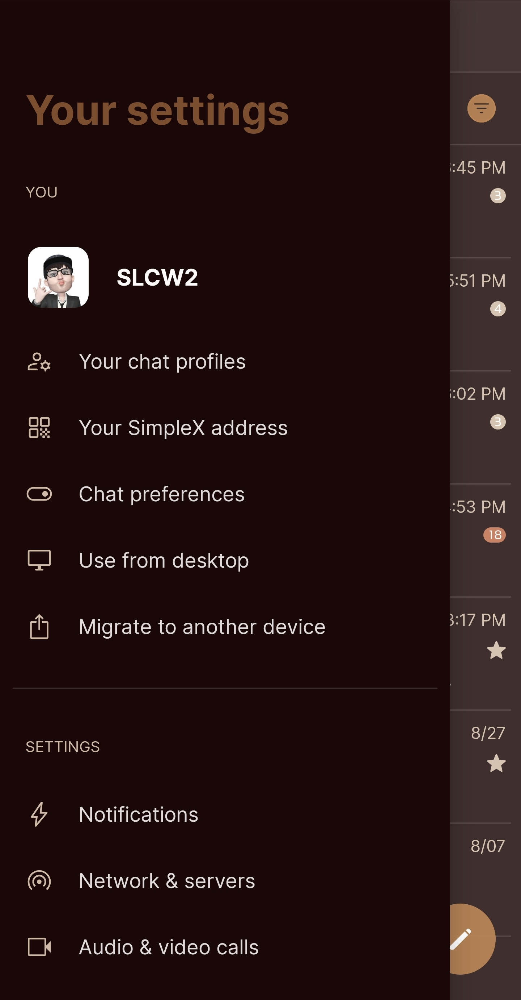
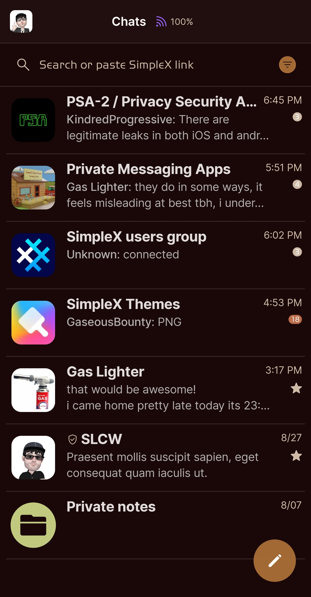
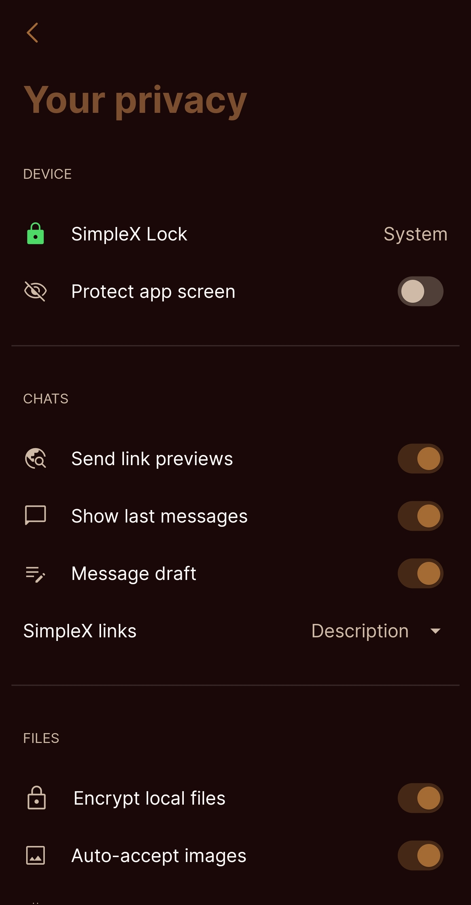

# The Shining v2

* Download [The Shining v2](../themes/SxC_The_Shining-v2.theme)

<a href="../screenshots/SxC_The_Shining-v201.jpg" target="_blank">
	
</a>&nbsp;&nbsp;&nbsp;
<a href="../screenshots/SxC_The_Shining-v202.jpg" target="_blank">
	
</a>
<br>
<a href="../screenshots/SxC_The_Shining-v203.jpg" target="_blank">
	
</a>&nbsp;&nbsp;&nbsp;
<a href="../screenshots/SxC_The_Shining-v204.jpg" target="_blank">
	
</a>

----
### Theme Properties
```
base: "BLACK"
colors:
  accent: "#edac7037"
  accentVariant: "#ffbd6d4a"
  secondary: "#ffcebaa6"
  secondaryVariant: "#ff8c0e1c"
  background: "#ff1a0808"
  menus: "#ff1a0505"
  title: "#ff7c4e30"
  accentVariant2: "#ffc1c97e"
  sentMessage: "#ff59181f"
  sentReply: "#ff311f16"
  receivedMessage: "#ff2b1711"
  receivedReply: "#ff1d120e"
wallpaper:
  scale: 1.0
  scaleType: "fill"
  background: "#ff190909"
  tint: "#2c000000"
```

* [Return Home](../)