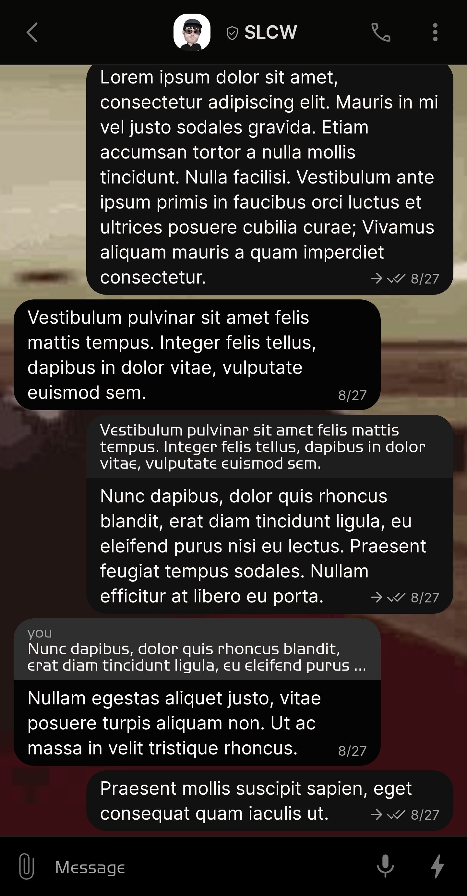
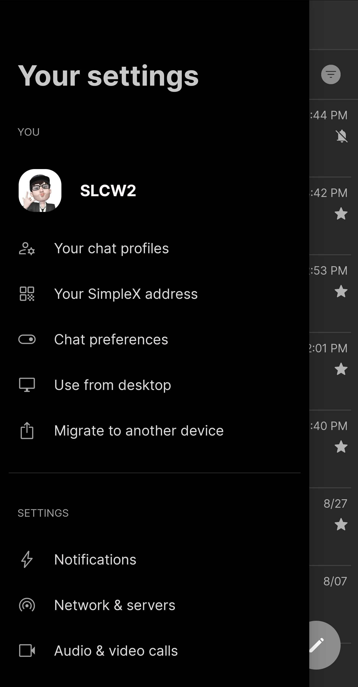
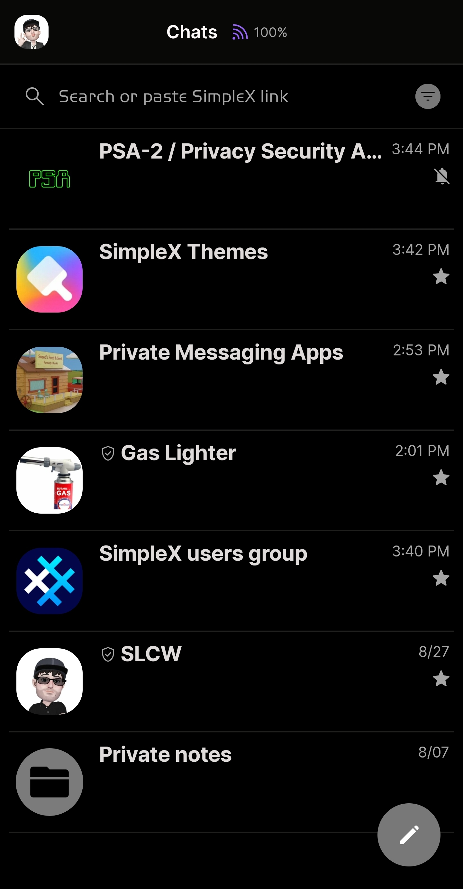
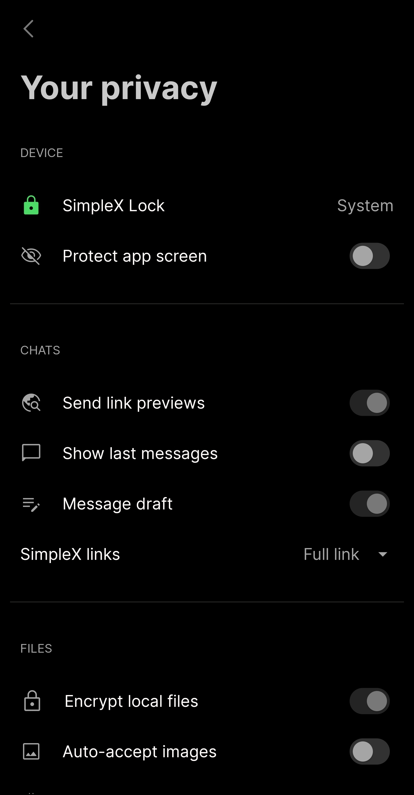

# W I D E 

* Download [W I D E](../themes/SxC_W_I_D_E.theme)

<a href="../screenshots/SxC_W_I_D_E01.jpg" target="_blank">
		
</a>&nbsp;&nbsp;&nbsp;
<a href="../screenshots/SxC_W_I_D_E02.jpg" target="_blank">
		
</a>
<br>
<a href="../screenshots/SxC_W_I_D_E03.jpg" target="_blank">
		
</a>&nbsp;&nbsp;&nbsp;
<a href="../screenshots/SxC_W_I_D_E04.jpg" target="_blank">
		
</a>

----
### Theme Properties
```
base: "BLACK"
colors:
  accent: "#ff787878"
  accentVariant: "#ef151414"
  secondary: "#ffa6a5a5"
  secondaryVariant: "#ff4b4a4a"
  background: "#ff000000"
  menus: "#ff141414"
  title: "#ffc9c9c9"
  accentVariant2: "#ff7c7b7b"
  sentMessage: "#ff111111"
  sentReply: "#ff1e1e1e"
  receivedMessage: "#ff040404"
  receivedReply: "#ff2f2f2f"
wallpaper:
  scale: 1.0
  scaleType: "fill"
  background: "#ff000000"
  tint: "#00ffffff"
```

* [Return Home](../)