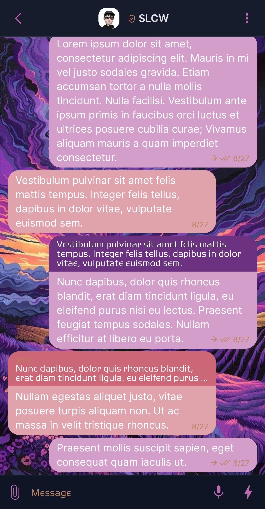
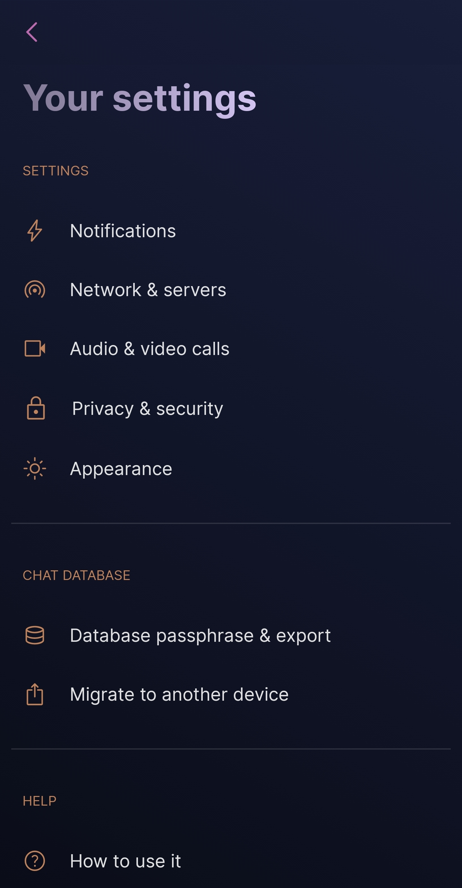
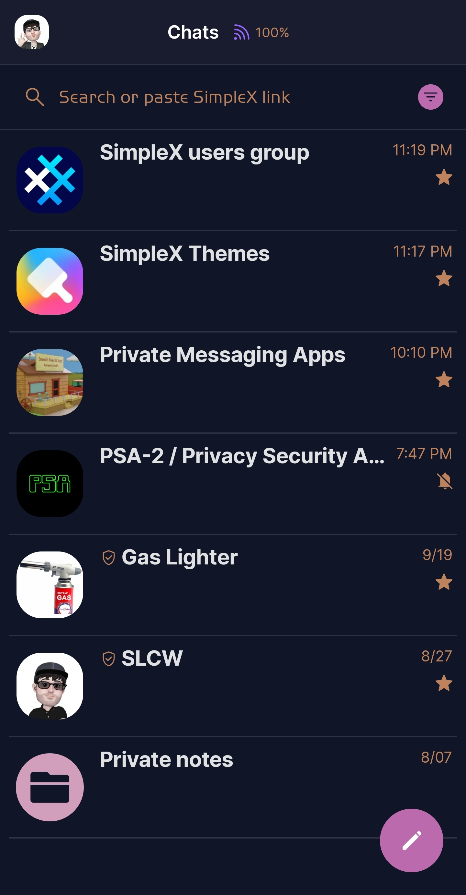

# Aurora Sunset 

* Download [Aurora Sunset](../themes/SxC_auroraSunset.theme)

<a href="../screenshots/SxC_auroraSunset01.jpg" target="_blank">
		
</a>&nbsp;&nbsp;&nbsp;
<a href="../screenshots/SxC_auroraSunset02.jpg" target="_blank">
		
</a>
<br>
<a href="../screenshots/SxC_auroraSunset03.jpg" target="_blank">
		
</a>&nbsp;&nbsp;&nbsp;
<a href="../screenshots/SxC_auroraSunset04.jpg" target="_blank">
		
</a>

----
### Theme Properties
```
base: "SIMPLEX"
colors:
  accent: "#ffbb6bad"
  accentVariant: "#ff7a44a0"
  secondary: "#ffbe835d"
  secondaryVariant: "#ffeea475"
  background: "#ff111528"
  menus: "#ff7a44a0"
  title: "#ff9e93b5"
  accentVariant2: "#ffd19fbc"
  sentMessage: "#ffd39fca"
  sentReply: "#ff693180"
  receivedMessage: "#ffe0a3ad"
  receivedReply: "#ffcc6777"
wallpaper:
  scale: 1.0
  scaleType: "fill"
  background: "#ff111528"
  tint: "#00ffffff"
```

* [Return Home](../)