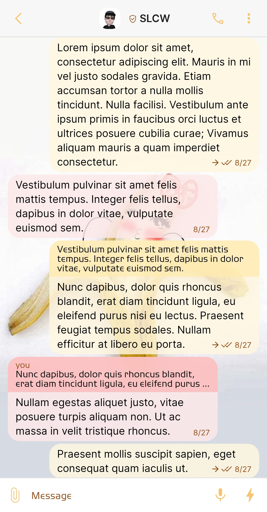
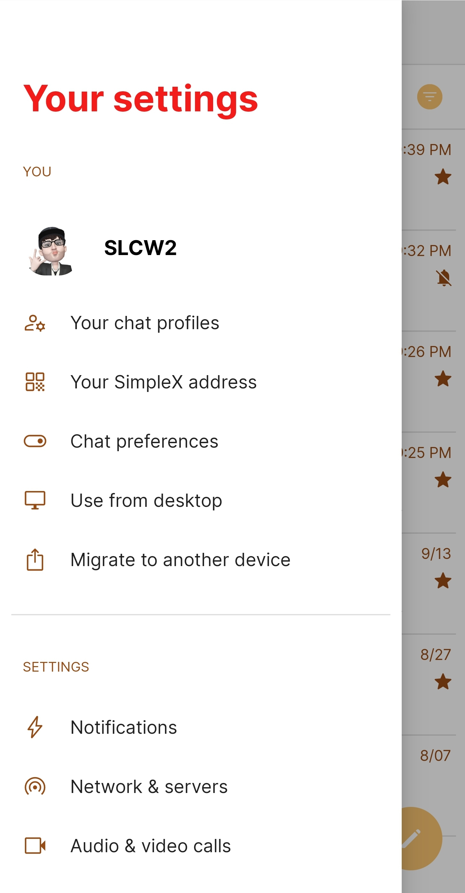
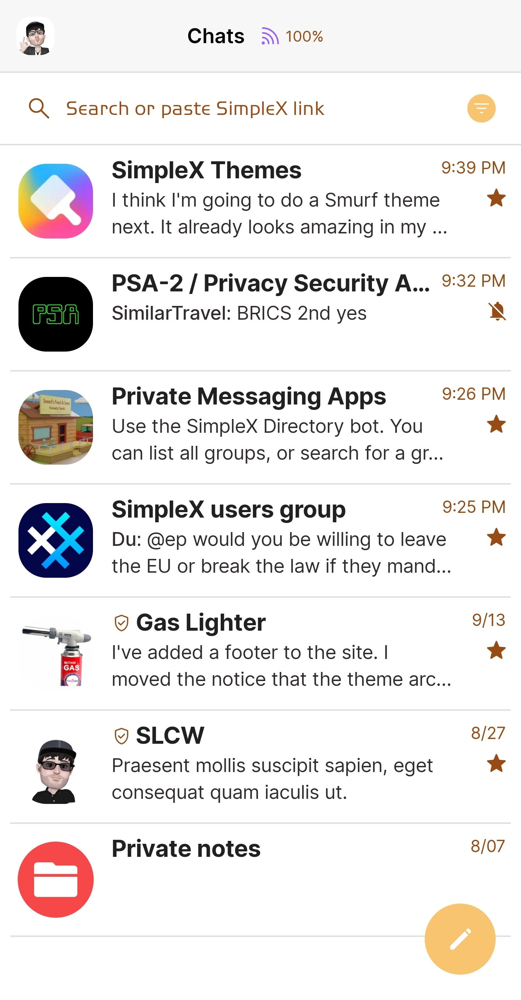
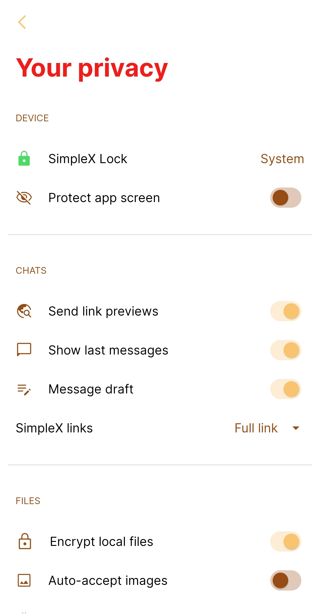

# Banana Split

* Download [Banana Split](../themes/SxC_bananaSplit.theme)

<a href="../screenshots/SxC_bananaSplit01.jpg" target="_blank">
		
</a>&nbsp;&nbsp;&nbsp;
<a href="../screenshots/SxC_bananaSplit02.jpg" target="_blank">
		
</a>
<br>
<a href="../screenshots/SxC_bananaSplit03.jpg" target="_blank">
		
</a>&nbsp;&nbsp;&nbsp;
<a href="../screenshots/SxC_bananaSplit04.jpg" target="_blank">
		
</a>

----
### Theme Properties
```
base: "LIGHT"
colors:
  accent: "#fff9c470"
  accentVariant: "#fff41b1b"
  secondary: "#ff974b15"
  secondaryVariant: "#ffdb1818"
  background: "#ffffffff"
  menus: "#fff41b1b"
  title: "#fff41b1b"
  accentVariant2: "#fff64848"
  sentMessage: "#d5fff7e0"
  sentReply: "#bbffeaad"
  receivedMessage: "#d5fde8e8"
  receivedReply: "#cffbbaba"
wallpaper:
  scale: 1.0
  scaleType: "fill"
  background: "#ffffffff"
  tint: "#00ffffff"
```

* [Return Home](../)