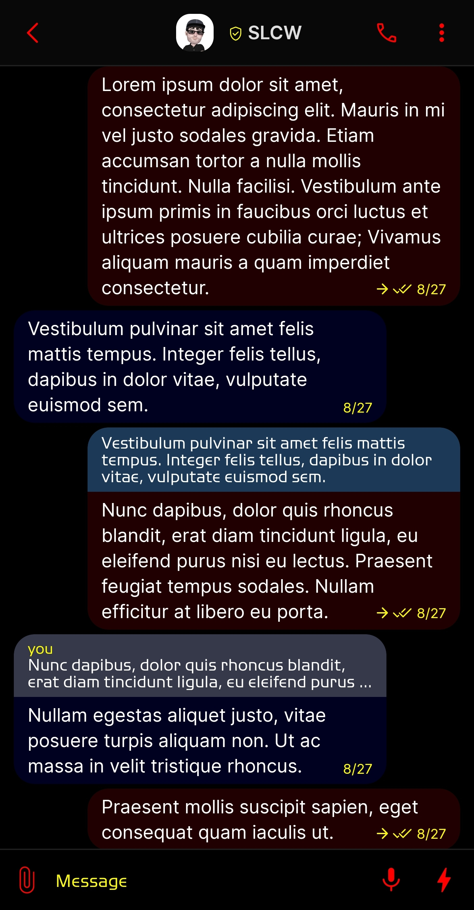
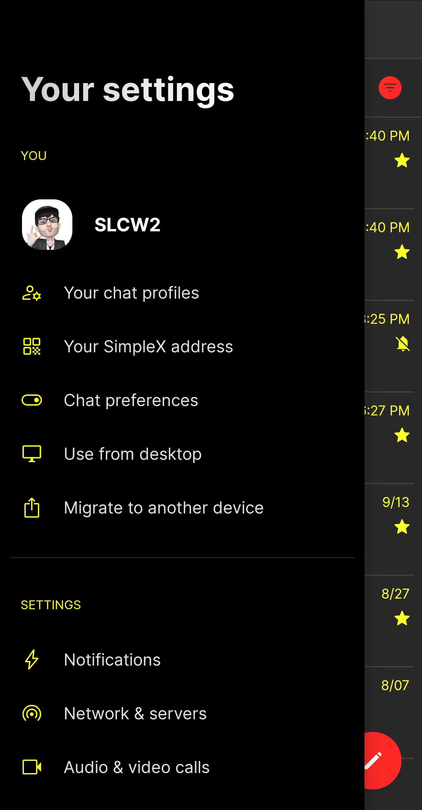
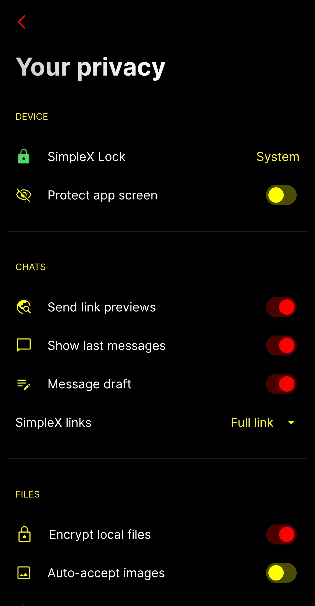
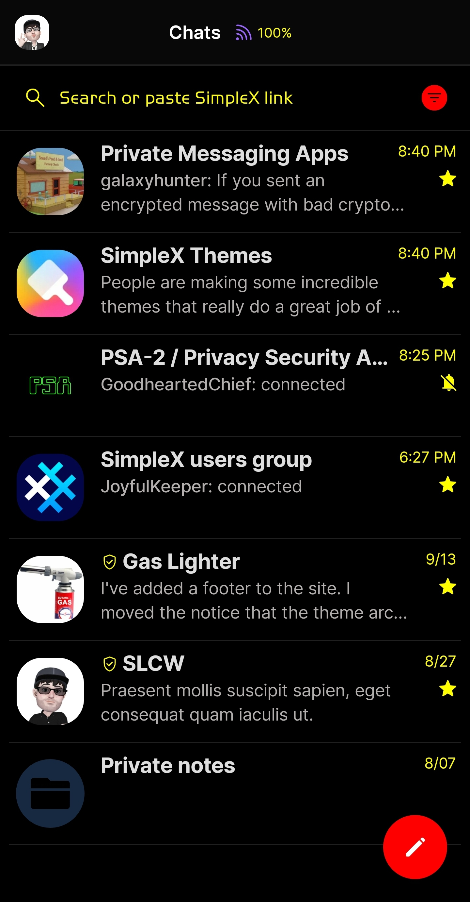

# Bat Phone 

* Download [Bat Phone](../themes/SxC_batPhone.theme)

<a href="../screenshots/SxC_batPhone01.jpg" target="_blank">
		
</a>&nbsp;&nbsp;&nbsp;
<a href="../screenshots/SxC_batPhone02.jpg" target="_blank">
		
</a>
<br>
<a href="../screenshots/SxC_batPhone03.jpg" target="_blank">
		
</a>&nbsp;&nbsp;&nbsp;
<a href="../screenshots/SxC_batPhone04.jpg" target="_blank">
		
</a>

----
### Theme Properties
```
base: "SIMPLEX"
colors:
  accent: "#ffff0000"
  accentVariant: "#ff004000"
  secondary: "#ffffff00"
  secondaryVariant: "#ff00ffff"
  background: "#ff000000"
  menus: "#ff000040"
  title: "#ffffffff"
  sentMessage: "#ff200000"
  receivedMessage: "#ff000020"
```

* [Return Home](../)