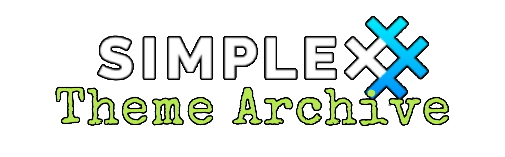

# berserk 1.0

* Download [berserk 1.0](../themes/SxC_berserk_1.0.theme)

<a href="../screenshots/SxC_berserk_1.001.jpg" target="_blank">
        
</a>&nbsp;&nbsp;&nbsp;
<a href="../screenshots/SxC_berserk_1.002.jpg" target="_blank">
        
</a>
<br>
<a href="../screenshots/SxC_berserk_1.003.jpg" target="_blank">
        
</a>&nbsp;&nbsp;&nbsp;
<a href="../screenshots/SxC_berserk_1.004.jpg" target="_blank">
        
</a>

----
### Theme Properties

```
base: "BLACK"
colors:
  accent: "#ffb5b3b3"
  accentVariant: "#ff9f2323"
  secondary: "#ff9f2323"
  secondaryVariant: "#ffb5b3b3"
  background: "#ff000000"
  menus: "#ff000000"
  title: "#ffb5b3b3"
  accentVariant2: "#ff9f2323"
  sentMessage: "#ff000000"
  sentReply: "#ff9f2323"
  receivedMessage: "#ff454545"
  receivedReply: "#ff9f2323"
wallpaper:
  scale: "1.0"
  scaleType: "fill"
  background: "#ff000000"
  tint: "#00ffffff"
```

* [Return Home](../)
