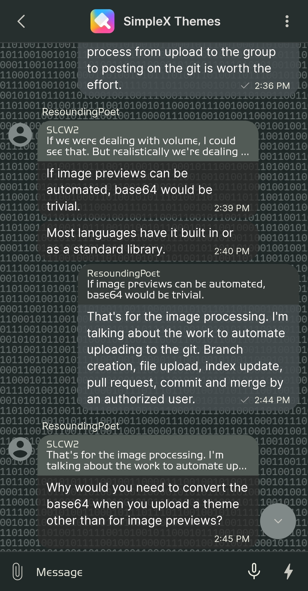
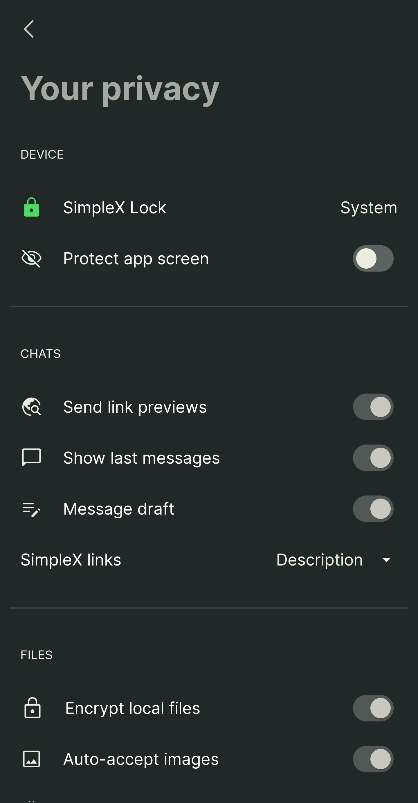
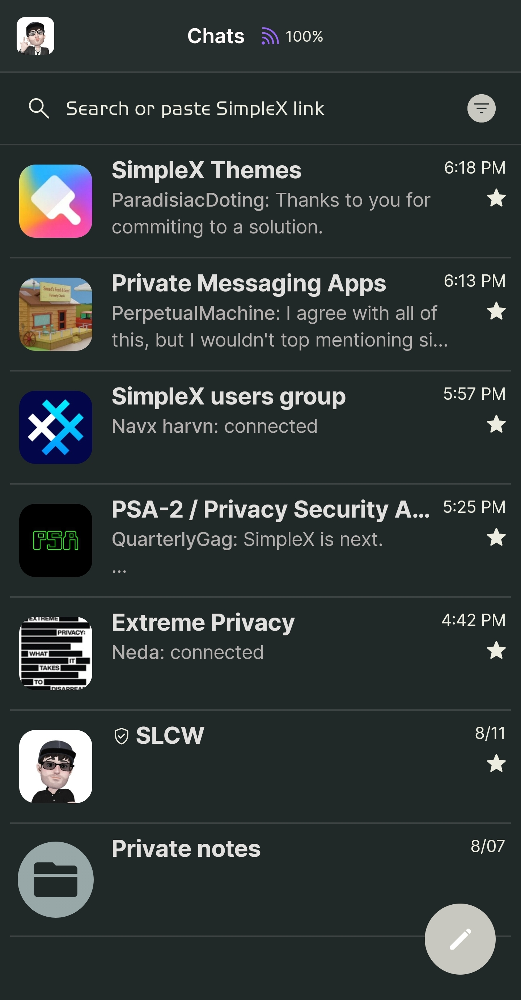
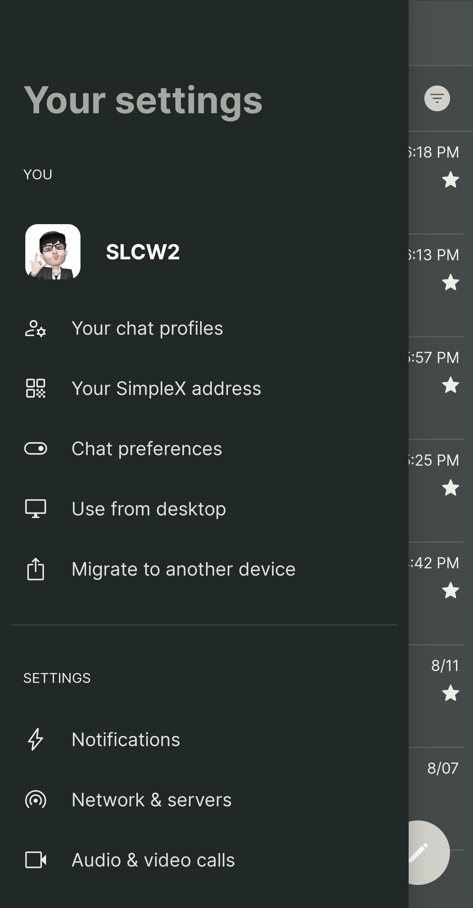

# Binary

* Download [Binary](../themes/SxC_binary.theme)

<a href="../screenshots/SxC_binary01.jpg" target="_blank">
	
</a>&nbsp;&nbsp;&nbsp;
<a href="../screenshots/SxC_binary02.jpg" target="_blank">
	
</a>
<br>
<a href="../screenshots/SxC_binary03.jpg" target="_blank">
	
</a>&nbsp;&nbsp;&nbsp;
<a href="../screenshots/SxC_binary04.jpg" target="_blank">
	
</a>

----
### Theme Properties
```
base: "BLACK"
colors:
  accent: "#ffc8c8c0"
  accentVariant: "#ff808888"
  secondary: "#ffecece1"
  secondaryVariant: "#ff808888"
  background: "#ff202828"
  menus: "#ff202828"
  title: "#ffa7a7a1"
  accentVariant2: "#ff98a8a8"
  sentMessage: "#e0454d4e"
  sentReply: "#ff343b38"
  receivedMessage: "#c82c2c2c"
  receivedReply: "#ff535b57"
wallpaper:
  scale: 1.0
  scaleType: "fill"
  background: "#ff070707"
  tint: "#9e202828"
```

* [Return Home](../)
