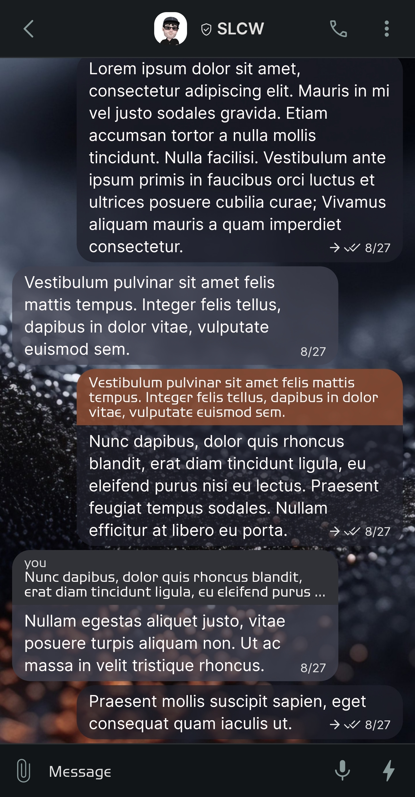
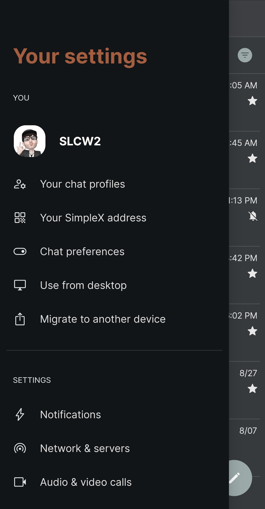
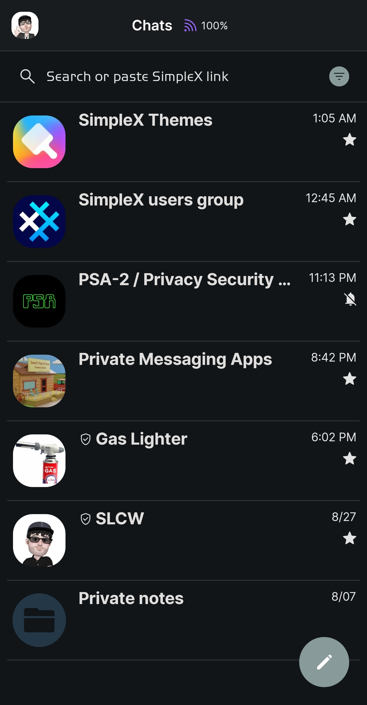
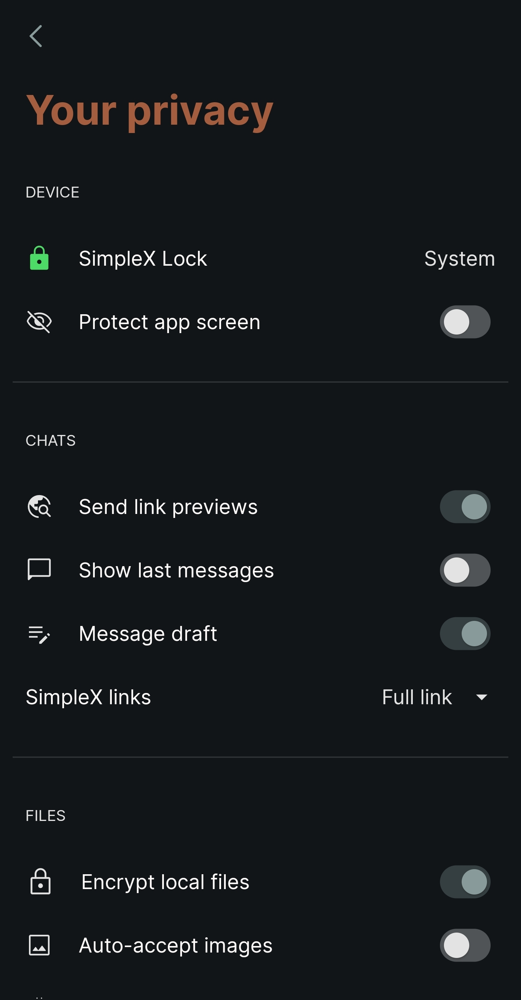

# Black Sand 

* Download [Black Sand](../themes/SxC_blackSand.theme)

<a href="../screenshots/SxC_blackSand01.jpg" target="_blank">
		
</a>&nbsp;&nbsp;&nbsp;
<a href="../screenshots/SxC_blackSand02.jpg" target="_blank">
		
</a>
<br>
<a href="../screenshots/SxC_blackSand03.jpg" target="_blank">
		
</a>&nbsp;&nbsp;&nbsp;
<a href="../screenshots/SxC_blackSand04.jpg" target="_blank">
		
</a>

----
### Theme Properties
```
base: "BLACK"
colors:
  accent: "#ff889a9a"
  accentVariant: "#ff495e5e"
  secondary: "#ffe3e3e3"
  secondaryVariant: "#ff2b2c2e"
  background: "#ff111518"
  menus: "#ff161617"
  title: "#ffa45d3e"
  accentVariant2: "#ff243747"
  sentMessage: "#bb1e202a"
  sentReply: "#cf914f32"
  receivedMessage: "#c5424351"
  receivedReply: "#ff313237"
wallpaper:
  scale: 1.0
  scaleType: "fill"
  background: "#ff070707"
  tint: "#00ffffff
```

* [Return Home](../)