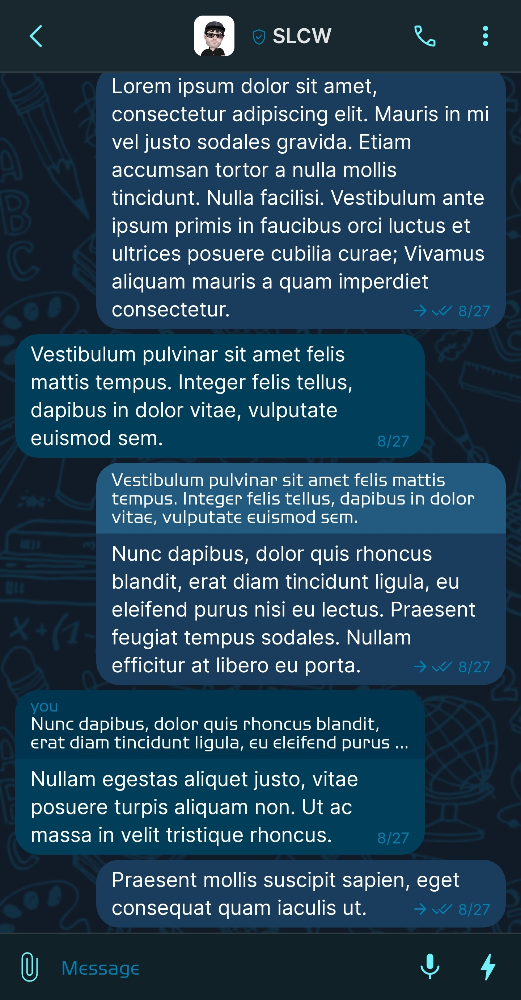
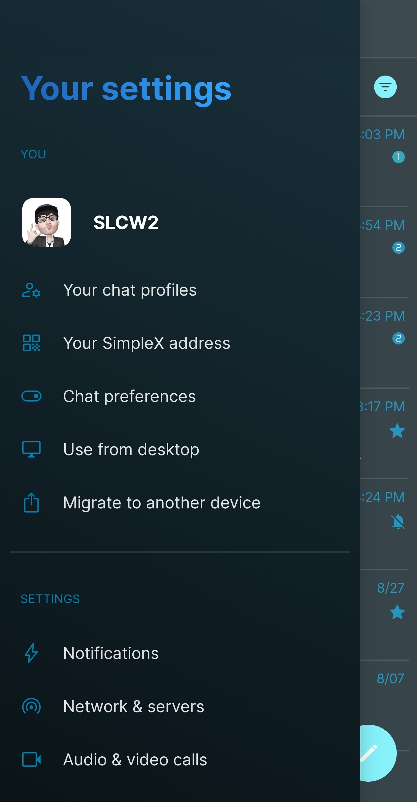
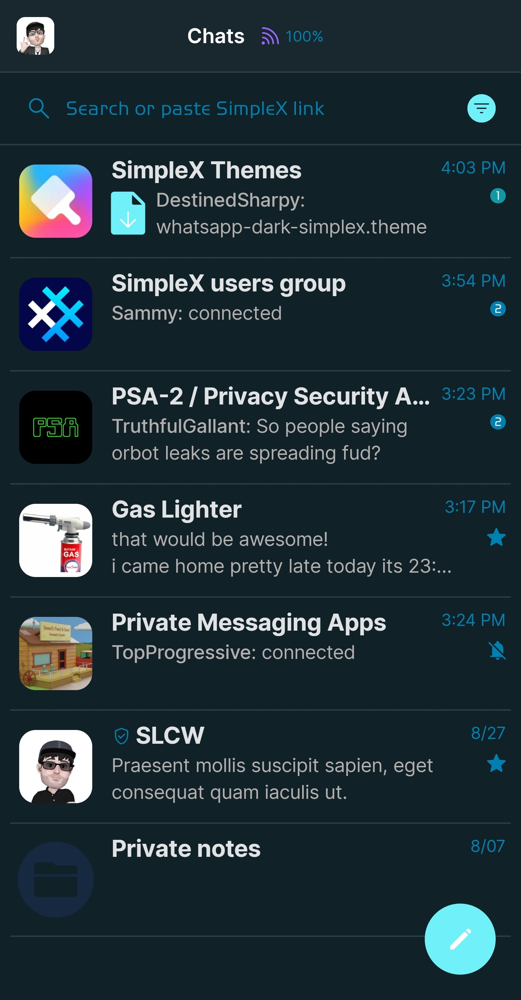
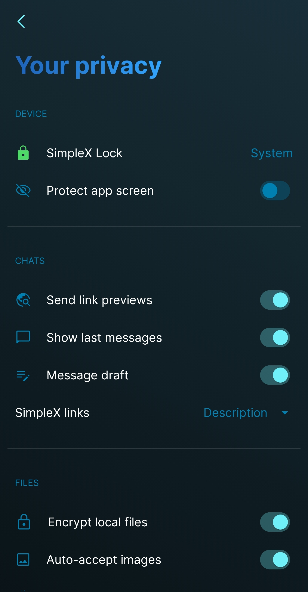

# Blue

* Download [Blue](../themes/SxC_blue.theme)

<a href="../screenshots/SxC_blue01.jpg" target="_blank">
	
</a>&nbsp;&nbsp;&nbsp;
<a href="../screenshots/SxC_blue02.jpg" target="_blank">
	
</a>
<br>
<a href="../screenshots/SxC_blue03.jpg" target="_blank">
	
</a>&nbsp;&nbsp;&nbsp;
<a href="../screenshots/SxC_blue04.jpg" target="_blank">
	
</a>

----
### Theme Properties
```
base: "SIMPLEX"
colors:
  accent: "#ff70f0f9"
  accentVariant: "#ff1298a5"
  secondary: "#ff0080b0"
  secondaryVariant: "#ff2c414d"
  background: "#ff112128"
  menus: "#ff122437"
  title: "#ff267be5"
  accentVariant2: "#ff172941"
  sentMessage: "#ff1a3c5d"
  sentReply: "#ff235b80"
  receivedMessage: "#ff003e5a"
  receivedReply: "#ff00354f"
wallpaper:
  preset: "school"
  scale: 2.0
  background: "#ff111b28"
  tint: "#ff113043"
```
* [Return Home](../)
