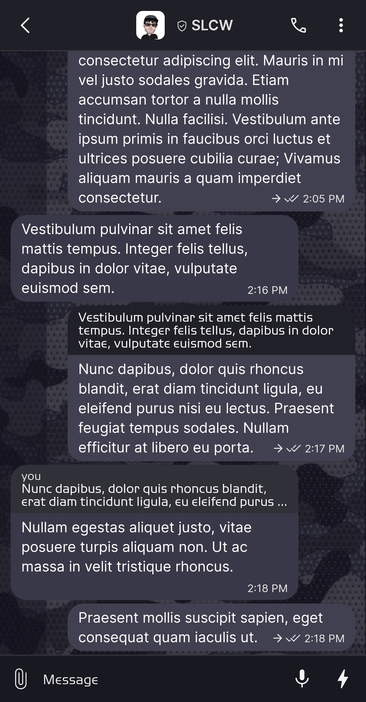
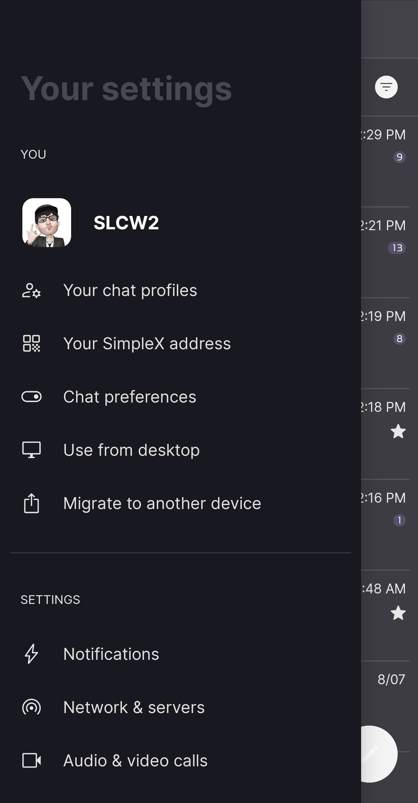
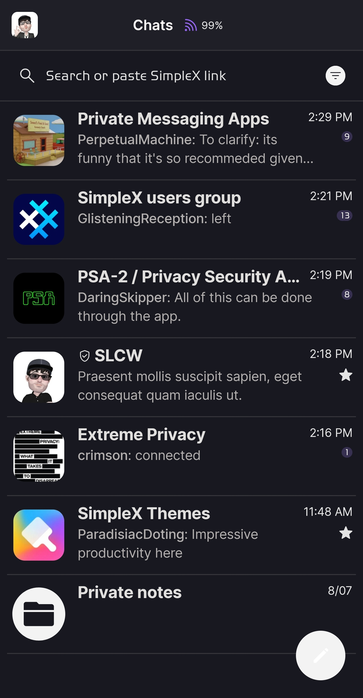
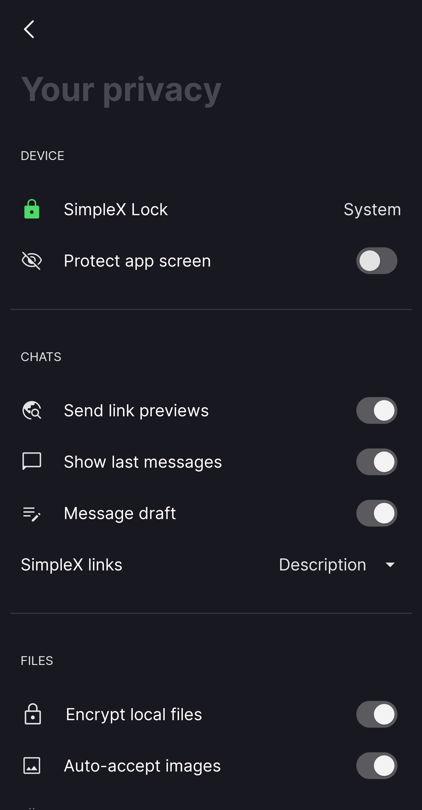

# Camo Cobalt

* Download [Camo Cobalt](../themes/SxC_camoCobalt.theme)

<a href="../screenshots/SxC_camoCobalt01.jpg" target="_blank">
	
</a>&nbsp;&nbsp;&nbsp;
<a href="../screenshots/SxC_camoCobalt02.jpg" target="_blank">

</a>
<br>
<a href="../screenshots/SxC_camoCobalt03.jpg" target="_blank">
	
</a>&nbsp;&nbsp;&nbsp;
<a href="../screenshots/SxC_camoCobalt04.jpg" target="_blank">

</a>

----
### Theme Properties
```
base: "BLACK"
colors:
  accent: "#fff3f3f3"
  accentVariant: "#ff383050"
  secondary: "#ffe3e3e3"
  secondaryVariant: "#ff2b2c2e"
  background: "#ff181820"
  menus: "#ff101818"
  title: "#ff484850"
  accentVariant2: "#fff3f3f3"
  sentMessage: "#ff404050"
  sentReply: "#ff202028"
  receivedMessage: "#ff383848"
  receivedReply: "#ff303038"
wallpaper:
  scale: 1.0
  scaleType: "fill"
  background: "#ff070707"
  tint: "#86242339"
```

* [Return Home](../)