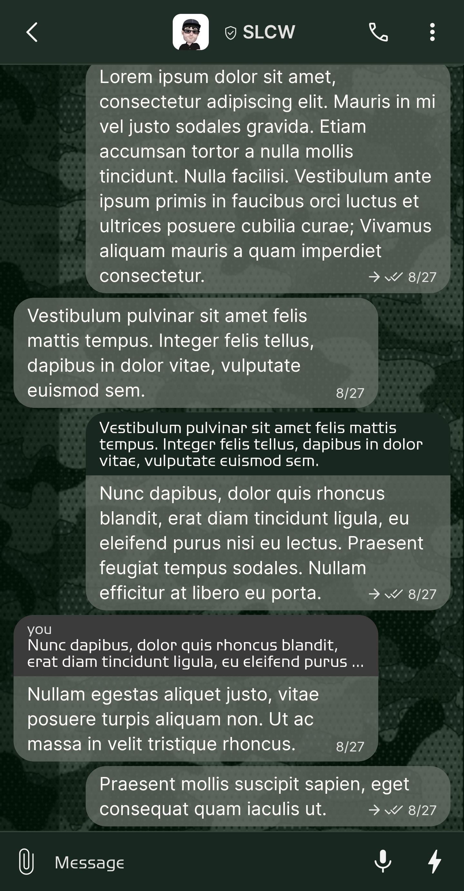
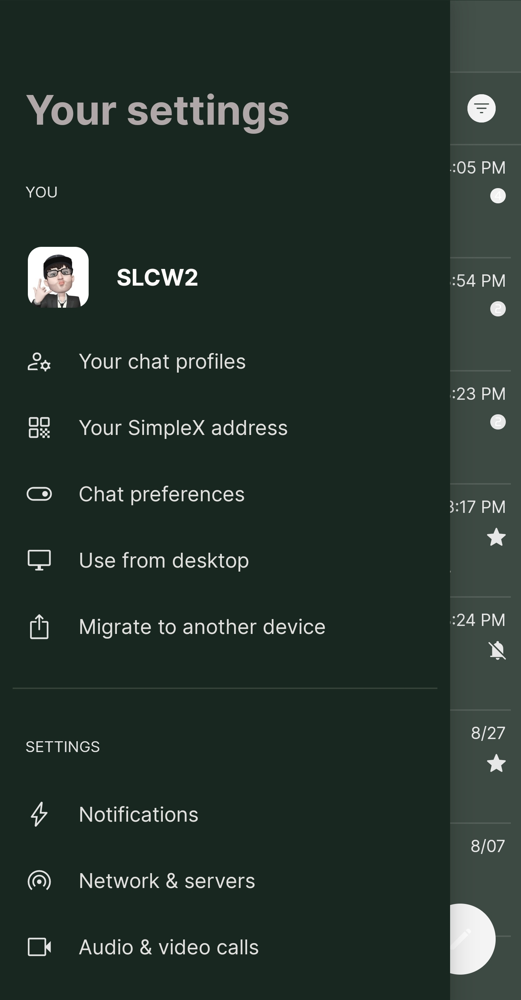
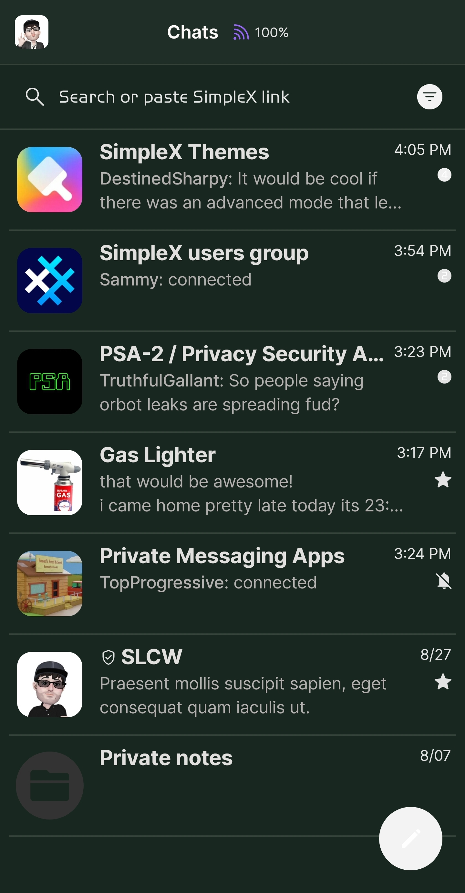
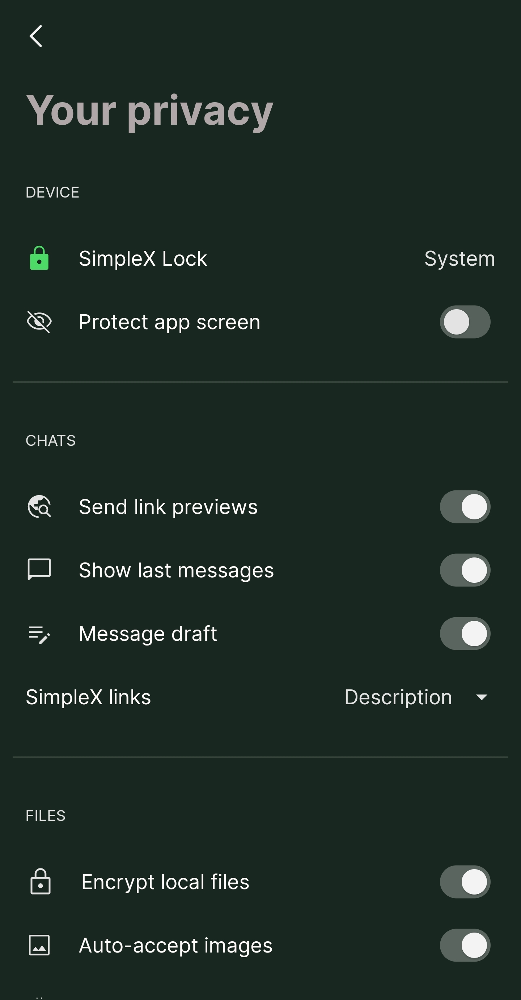

# Camo Green v1.5

* Download [Camo Green v1.5](../themes/SxC_camoGreen-v1_5.theme)

<a href="../screenshots/SxC_camoGreen-v1_501.jpg" target="_blank">
	
</a>&nbsp;&nbsp;&nbsp;
<a href="../screenshots/SxC_camoGreen-v1_502.jpg" target="_blank">
	
</a>
<br>
<a href="../screenshots/SxC_camoGreen-v1_503.jpg" target="_blank">
	
</a>&nbsp;&nbsp;&nbsp;
<a href="../screenshots/SxC_camoGreen-v1_504.jpg" target="_blank">
	
</a>

----
### Theme Properties
```
base: "BLACK"
colors:
  accent: "#fff3f3f3"
  accentVariant: "#fff0f0f0"
  secondary: "#ffe3e3e3"
  secondaryVariant: "#ff2b2c2e"
  background: "#ff182820"
  menus: "#ff191919"
  title: "#ffb0a8a8"
  accentVariant2: "#ff333333"
  sentMessage: "#be687068"
  sentReply: "#ff182820"
  receivedMessage: "#be687068"
  receivedReply: "#ff3b3b3b"
wallpaper:
  scale: 1.0
  scaleType: "fill"
  background: "#ff070707"
  tint: "#67032710"
```

* [Return Home](../)
