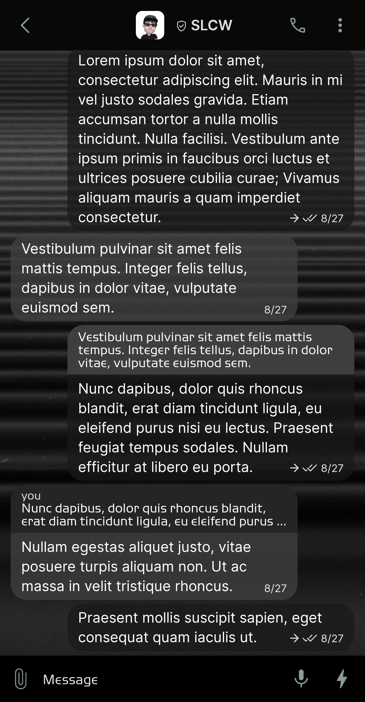
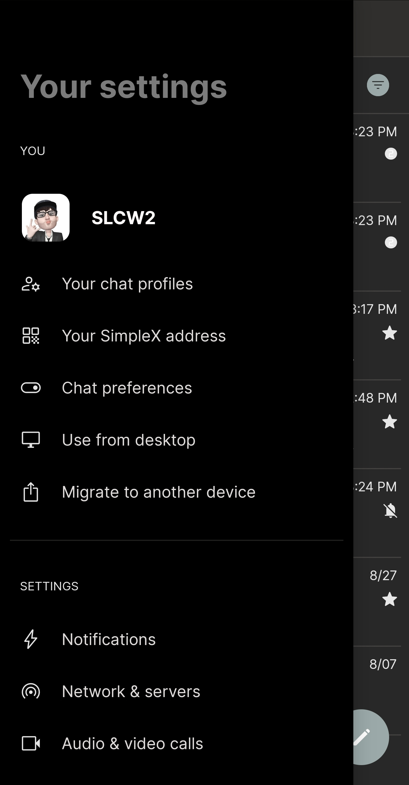
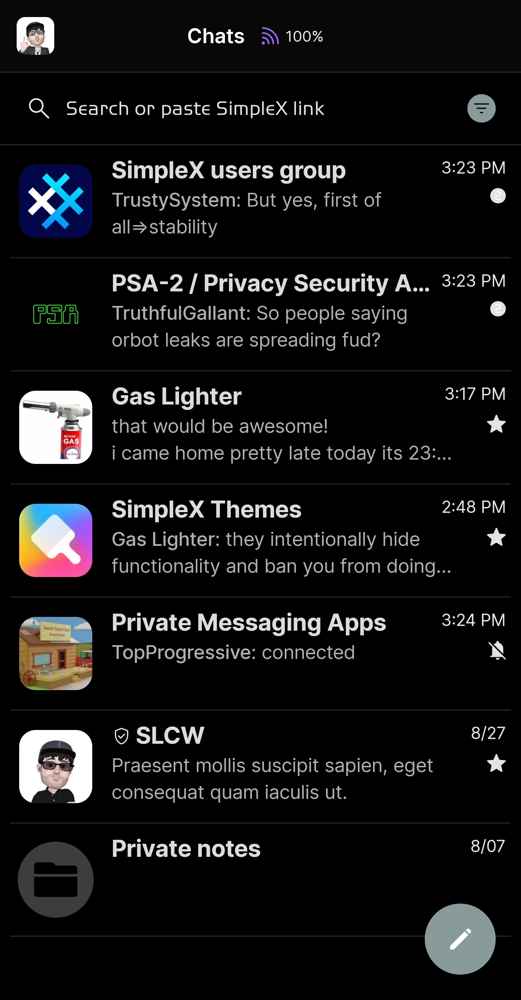
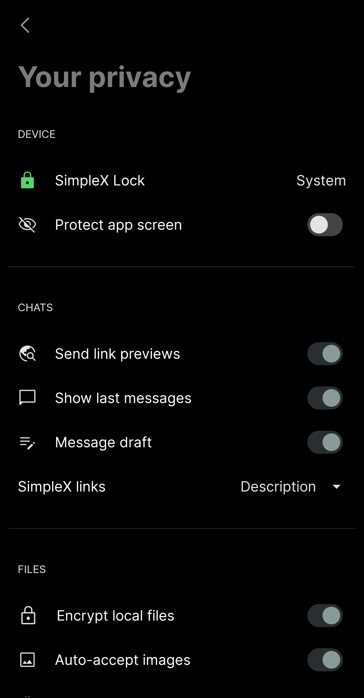

# Cassini Midnight

* Download [Cassini Midnight](../themes/SxC_cassiniMidnight.theme)

<a href="../screenshots/SxC_cassiniMidnight01.jpg" target="_blank">
	
</a>&nbsp;&nbsp;&nbsp;
<a href="../screenshots/SxC_cassiniMidnight02.jpg" target="_blank">
	
</a>
<br>
<a href="../screenshots/SxC_cassiniMidnight03.jpg" target="_blank">
	
</a>&nbsp;&nbsp;&nbsp;
<a href="../screenshots/SxC_cassiniMidnight04.jpg" target="_blank">
	
</a>

----
### Theme Properties
```
base: "BLACK"
colors:
  accent: "#ff889a9a"
  accentVariant: "#ff495e5e"
  secondary: "#ffe3e3e3"
  secondaryVariant: "#ff2b2c2e"
  background: "#ff000000"
  menus: "#ff000000"
  title: "#ff7b7b7b"
  accentVariant2: "#ff3d3d3d"
  sentMessage: "#bb191919"
  sentReply: "#ff3e3e3e"
  receivedMessage: "#c5404040"
  receivedReply: "#ff252525"
wallpaper:
  scale: 1.0
  scaleType: "fill"
  background: "#ff070707"
  tint: "#9c000000"
```

* [Return Home](../)
