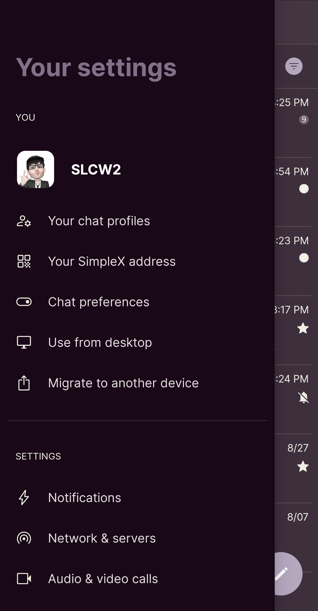
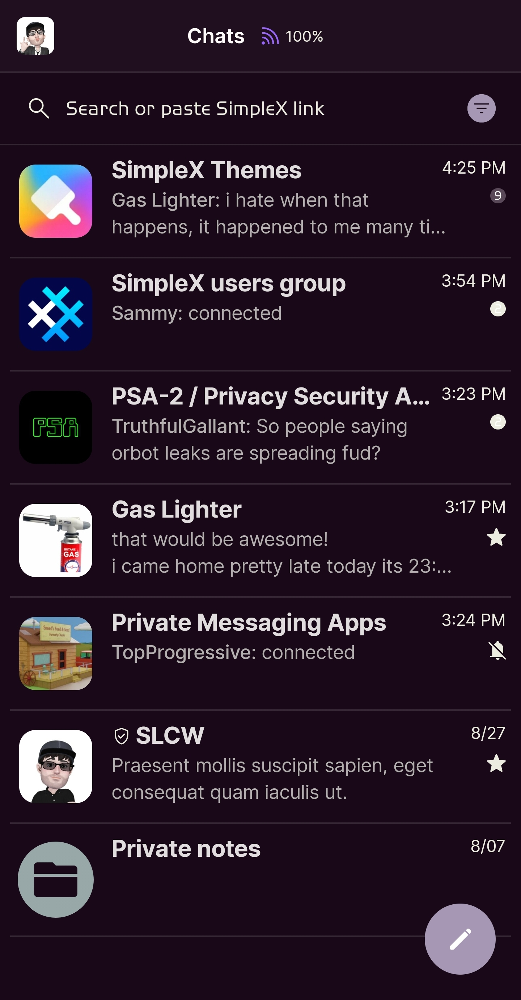
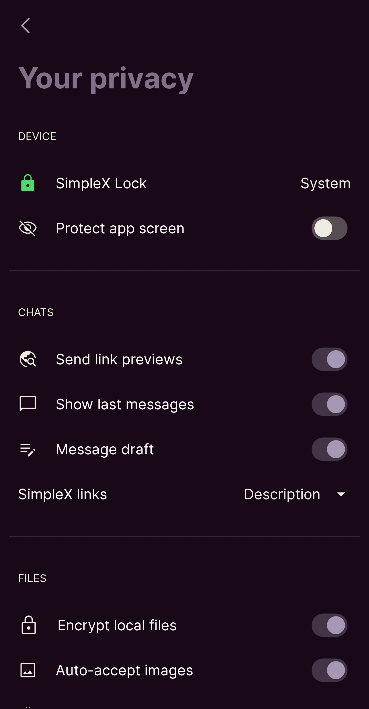

# Cat

* Download [Cat](../themes/SxC_cat.theme)

<a href="../screenshots/SxC_cat01.jpg" target="_blank">
	
</a>&nbsp;&nbsp;&nbsp;
<a href="../screenshots/SxC_cat02.jpg" target="_blank">
	
</a>
<br>
<a href="../screenshots/SxC_cat03.jpg" target="_blank">
	
</a>&nbsp;&nbsp;&nbsp;
<a href="../screenshots/SxC_cat04.jpg" target="_blank">
	
</a>

----
### Theme Properties
```
base: "BLACK"
colors:
  accent: "#ffa698b4"
  accentVariant: "#ff584858"
  secondary: "#ffecece1"
  secondaryVariant: "#ff9c6e9c"
  background: "#ff180818"
  menus: "#ff281028"
  title: "#ff807088"
  accentVariant2: "#ff98a8a8"
  sentMessage: "#e5503858"
  sentReply: "#ff281028"
  receivedMessage: "#e287758b"
  receivedReply: "#ff3e293e"
wallpaper:
  scale: 1.0
  scaleType: "fill"
  background: "#ff070707"
  tint: "#00ffffff"
```

* [Return Home](../)
