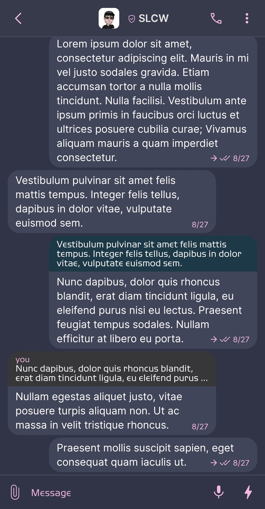
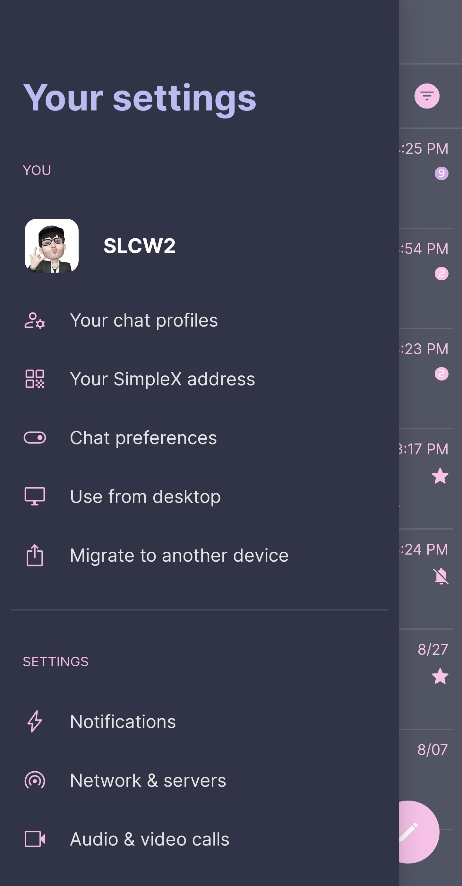
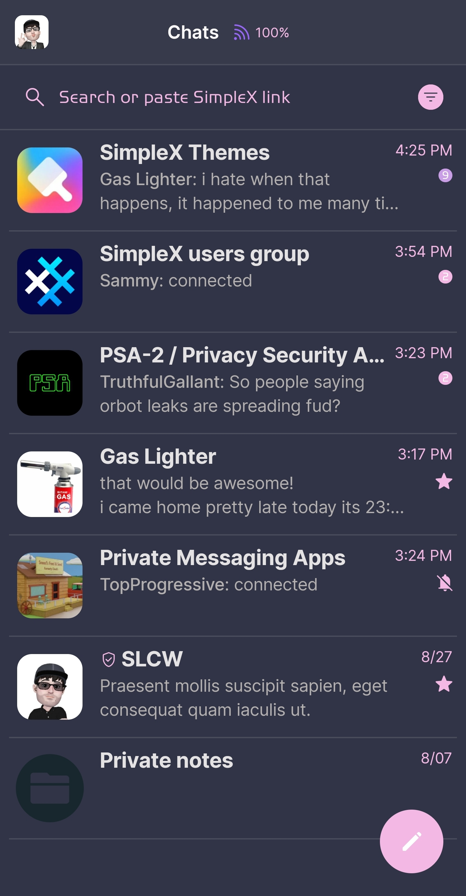
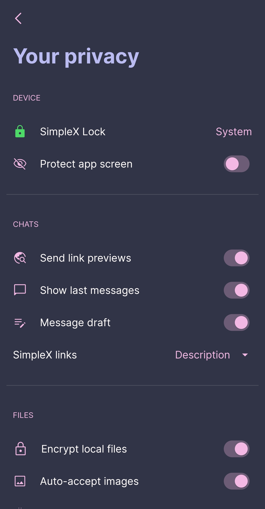

# Catppuccin Frappe

* Download [Catppuccin Frappe](../themes/SxC_catppuccinFrappe.theme)

<a href="../screenshots/SxC_catppuccinFrappe01.jpg" target="_blank">
	
</a>&nbsp;&nbsp;&nbsp;
<a href="../screenshots/SxC_catppuccinFrappe02.jpg" target="_blank">
	
</a>
<br>
<a href="../screenshots/SxC_catppuccinFrappe03.jpg" target="_blank">
	
</a>&nbsp;&nbsp;&nbsp;
<a href="../screenshots/SxC_catppuccinFrappe04.jpg" target="_blank">
	
</a>

----
### Theme Properties
```
base: "DARK"
colors:
  accent: "#fff4b8e4"           # pink
  accentVariant: "#ffca9ee6"    # mauve
  secondary: "#fff4b8e4"        # pink
  secondaryVariant: "#ffca9ee6" # mauve
  background: "#ff303446"       # base
  menus: "#ff414559"            # surface0
  title: "#ffbabbf1"            # lavender
  sentMessage: "#ff414559"      # surface0
  receivedMessage: "#ff414559"  # surface0
```

* [Return Home](../)