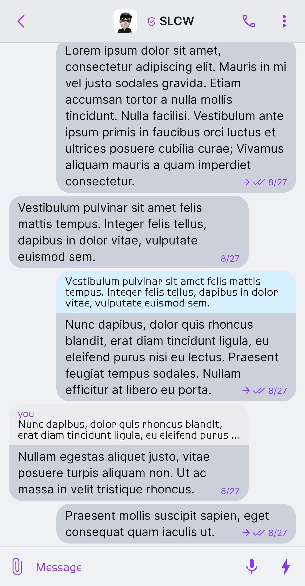
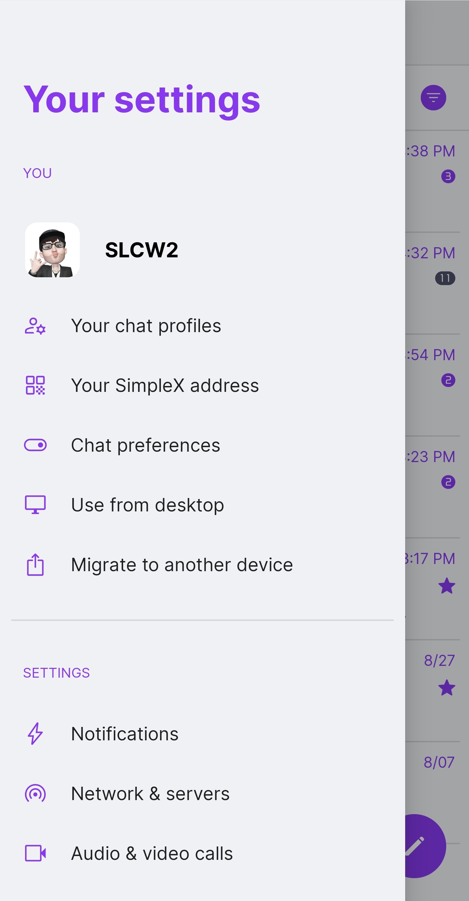
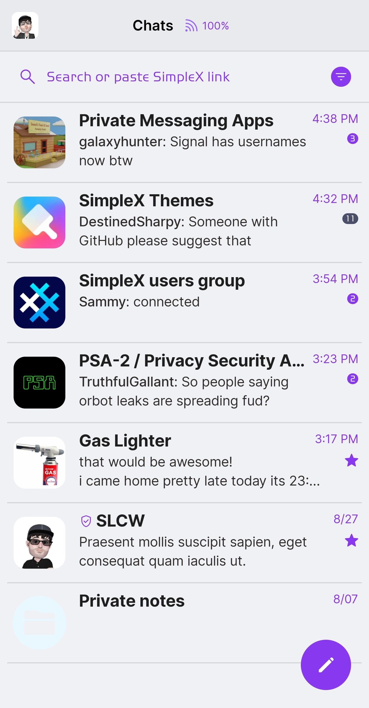
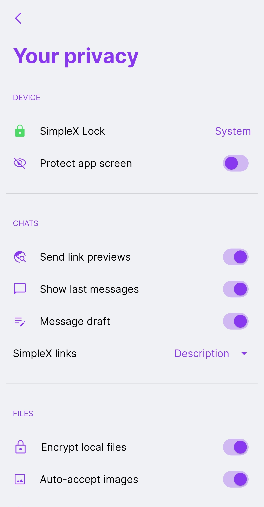

# Catppuccin Latte

* Download [Catppuccin Latte](../themes/SxC_catppuccinLatte.theme)

<a href="../screenshots/SxC_catppuccinLatte01.jpg" target="_blank">
	
</a>&nbsp;&nbsp;&nbsp;
<a href="../screenshots/SxC_catppuccinLatte02.jpg" target="_blank">
	
</a>
<br>
<a href="../screenshots/SxC_catppuccinLatte03.jpg" target="_blank">
	
</a>&nbsp;&nbsp;&nbsp;
<a href="../screenshots/SxC_catppuccinLatte04.jpg" target="_blank">
	
</a>

----
### Theme Properties
```
base: "LIGHT"
colors:
  accent: "#ff8839ef"           # mauve
  accentVariant: "#ff4c4f69"    # text
  secondary: "#ff8839ef"        # mauve
  secondaryVariant: "#ff4c4f69" # text
  background: "#ffeff1f5"       # base
  menus: "#ffccd0da"            # surface0
  title: "#ff8839ef"            # mauve
  sentMessage: "#ffccd0da"      # surface0
  receivedMessage: "#ffccd0da"  # surface0
```

* [Return Home](../)