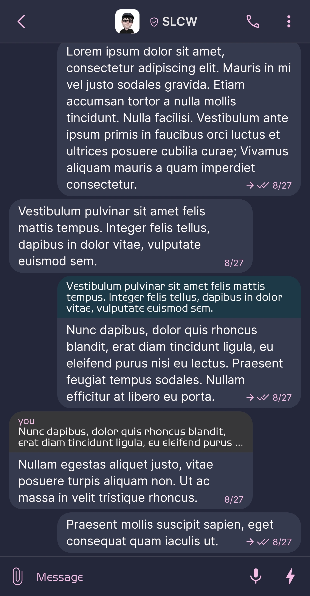
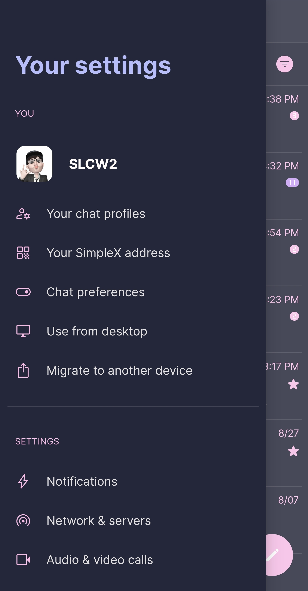
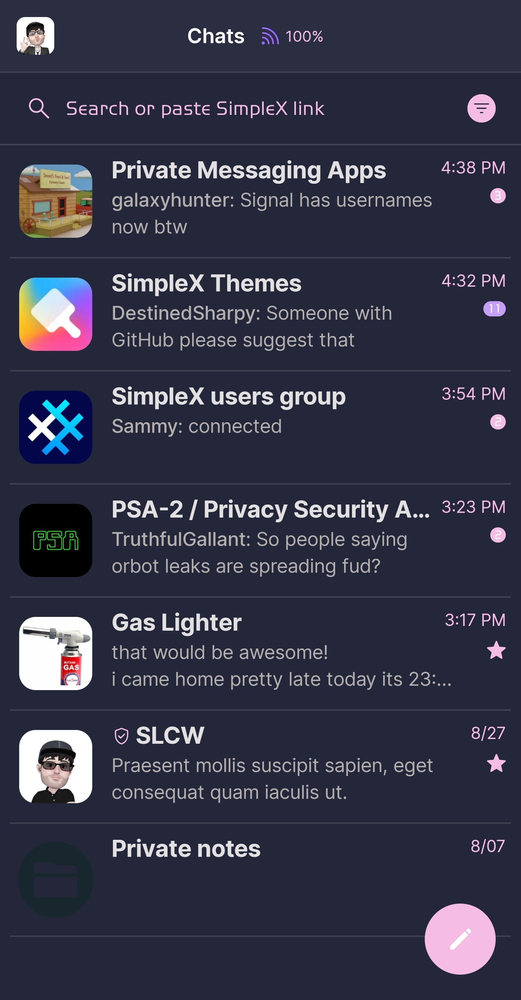
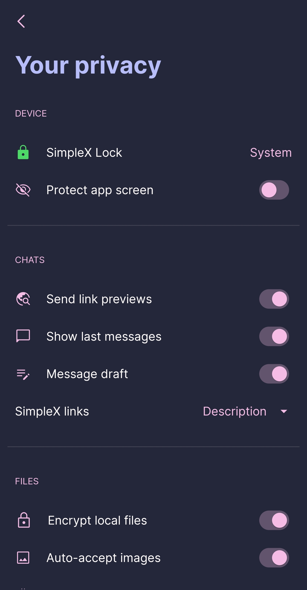

# Catppuccin Macchiato

* Download [Catppuccin Macchiato](../themes/SxC_catppuccinMacchiato.theme)

<a href="../screenshots/SxC_catppuccinMacchiato01.jpg" target="_blank">
	
</a>&nbsp;&nbsp;&nbsp;
<a href="../screenshots/SxC_catppuccinMacchiato02.jpg" target="_blank">
	
</a>
<br>
<a href="../screenshots/SxC_catppuccinMacchiato03.jpg" target="_blank">
	
</a>&nbsp;&nbsp;&nbsp;
<a href="../screenshots/SxC_catppuccinMacchiato04.jpg" target="_blank">
	
</a>

----
### Theme Properties
```
base: "DARK"
colors:
  accent: "#fff5bde6"           # pink
  accentVariant: "#ffc6a0f6"    # mauve
  secondary: "#fff5bde6"        # pink
  secondaryVariant: "#ffc6a0f6" # mauve
  background: "#ff24273a"       # base
  menus: "#ff363a4f"            # surface0
  title: "#ffb7bdf8"            # lavender
  sentMessage: "#ff363a4f"      # surface0
  receivedMessage: "#ff363a4f"  # surface0
```

* [Return Home](../)