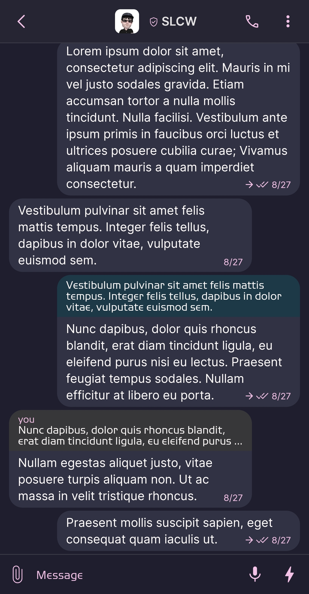
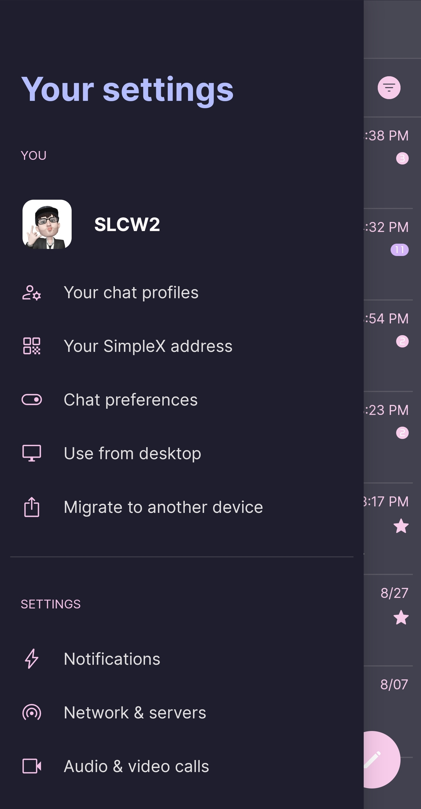
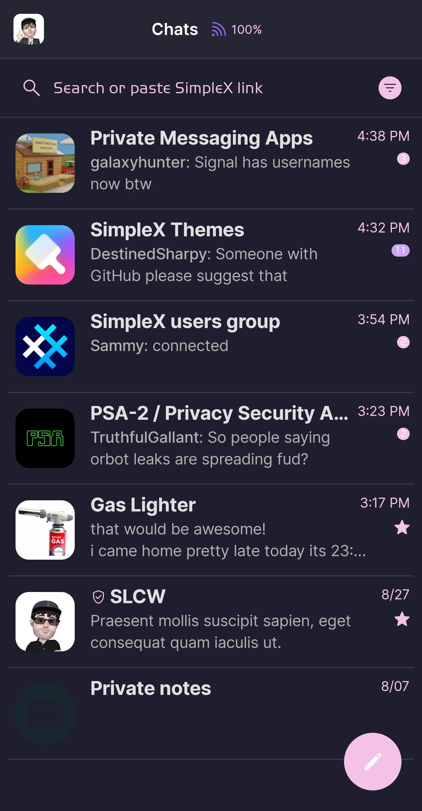
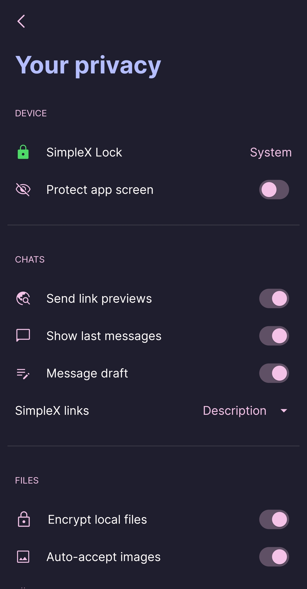

# Catppuccin Mocha v1

* Download [Catppuccin Mocha v1](../themes/SxC_catppuccinMocha-v1.theme)

<a href="../screenshots/SxC_catppuccinMocha-v101.jpg" target="_blank">
	
</a>&nbsp;&nbsp;&nbsp;
<a href="../screenshots/SxC_catppuccinMocha-v102.jpg" target="_blank">
	
</a>
<br>
<a href="../screenshots/SxC_catppuccinMocha-v103.jpg" target="_blank">
	
</a>&nbsp;&nbsp;&nbsp;
<a href="../screenshots/SxC_catppuccinMocha-v104.jpg" target="_blank">
	
</a>

----
### Theme Properties
```
base: "DARK"
colors:
  accent: "#fff5c2e7"           # pink
  accentVariant: "#ffcba6f7"    # mauve
  secondary: "#fff5c2e7"        # pink
  secondaryVariant: "#ffcba6f7" # mauve
  background: "#ff1e1e2e"       # base
  menus: "#ff313244"            # surface0
  title: "#ffb4befe"            # lavender
  sentMessage: "#ff313244"      # surface0
  receivedMessage: "#ff313244"  # surface0
```

* [Return Home](../)