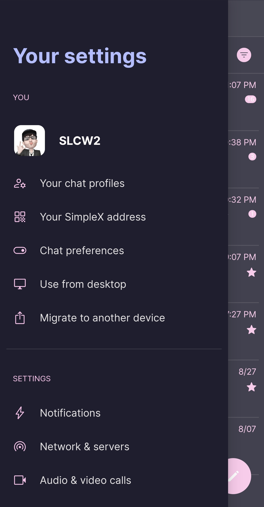
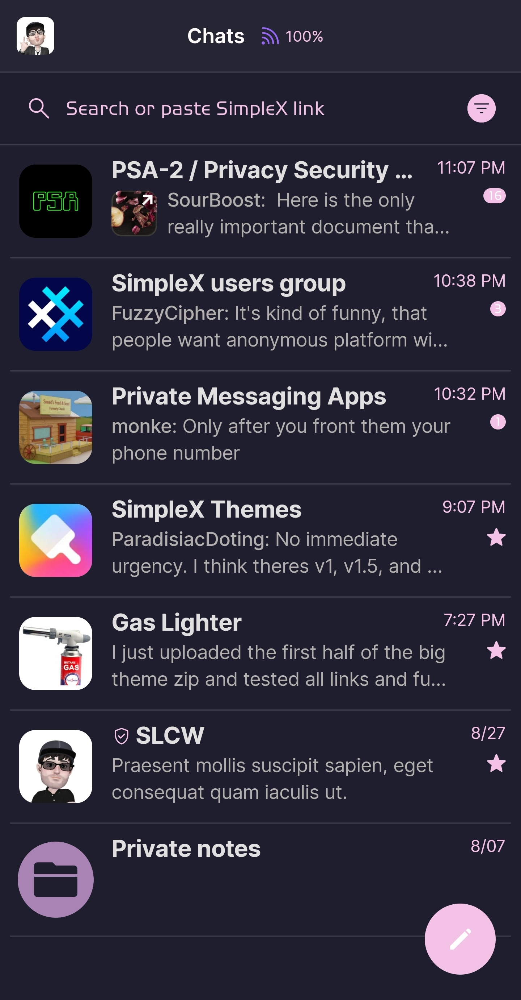
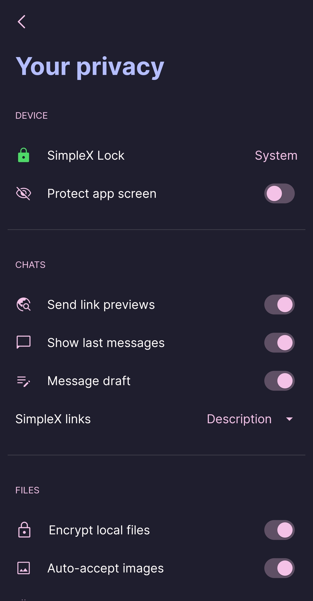

# Catppuccin Mocha v2

* Download [Catppuccin Mocha v2](../themes/SxC_catppuccinMocha-v2.theme)

<a href="../screenshots/SxC_catppuccinMocha-v201.jpg" target="_blank">
	
</a>&nbsp;&nbsp;&nbsp;
<a href="../screenshots/SxC_catppuccinMocha-v202.jpg" target="_blank">
	
</a>
<br>
<a href="../screenshots/SxC_catppuccinMocha-v203.jpg" target="_blank">
	
</a>&nbsp;&nbsp;&nbsp;
<a href="../screenshots/SxC_catppuccinMocha-v204.jpg" target="_blank">
	
</a>

----
### Theme Properties
```
base: "DARK"
colors:
  accent: "#fff5c2e7"
  accentVariant: "#ffcba6f7"
  secondary: "#fff5c2e7"
  secondaryVariant: "#ffcba6f7"
  background: "#ff1e1e2e"
  menus: "#ff313244"
  title: "#ffb4befe"
  accentVariant2: "#ffa983b3"
  sentMessage: "#ff313244"
  sentReply: "#ff2b2d40"
  receivedMessage: "#ff313244"
  receivedReply: "#ff2b2d40"
```

* [Return Home](../)