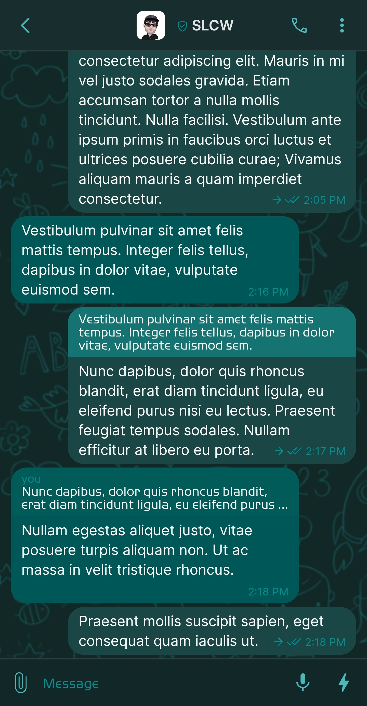
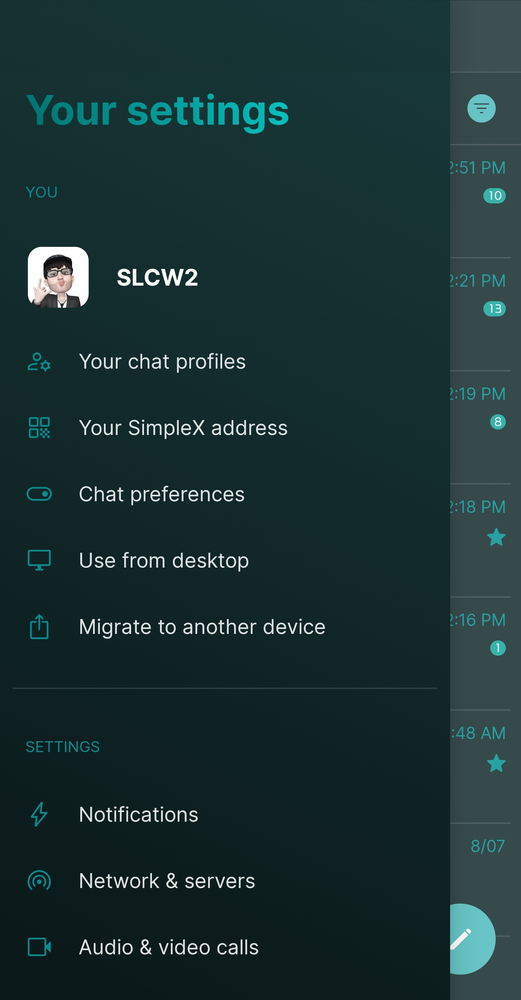
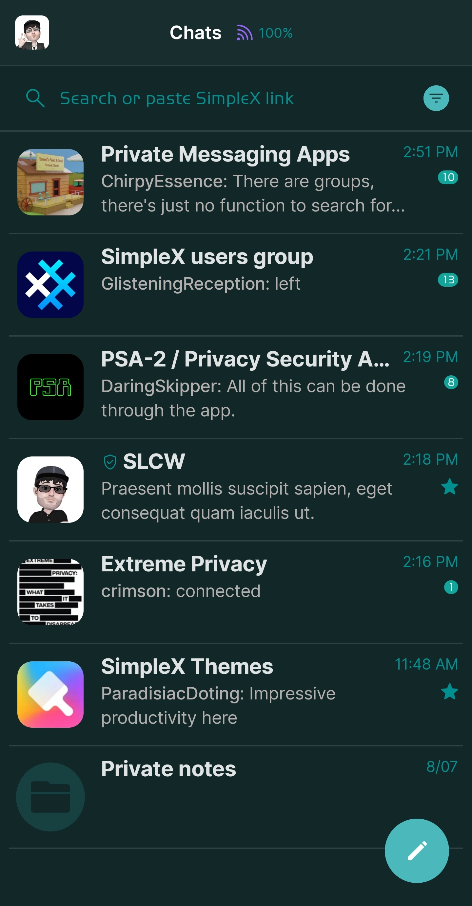
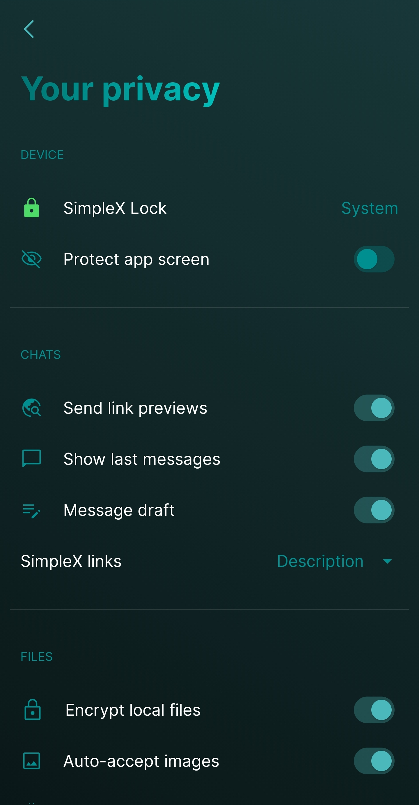

# Cyan

* Download [Cyan](../themes/SxC_cyan.theme)

<a href="../screenshots/SxC_cyan01.jpg" target="_blank">
	
</a>&nbsp;&nbsp;&nbsp;
<a href="../screenshots/SxC_cyan02.jpg" target="_blank">
	
</a>
<br>
<a href="../screenshots/SxC_cyan03.jpg" target="_blank">
	
</a>&nbsp;&nbsp;&nbsp;
<a href="../screenshots/SxC_cyan04.jpg" target="_blank">
	
</a>

----
### Theme Properties
```
base: "SIMPLEX"
colors:
  accent: "#ff4bb9bb"
  accentVariant: "#ff12a59c"
  secondary: "#ff008f90"
  secondaryVariant: "#ff2c4a4d"
  background: "#ff112728"
  menus: "#ff00787d"
  title: "#ff00908d"
  accentVariant2: "#ff174041"
  sentMessage: "#ff1a4745"
  sentReply: "#ff157372"
  receivedMessage: "#ff005757"
  receivedReply: "#ff005b59"
wallpaper:
  preset: "kids"
  scale: 2.0
  background: "#ff112827"
  tint: "#ff185353"
```

* [Return Home](../)