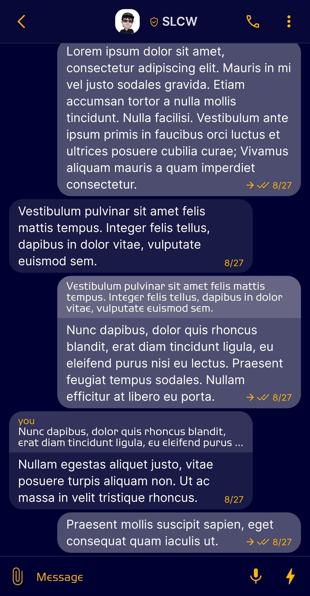
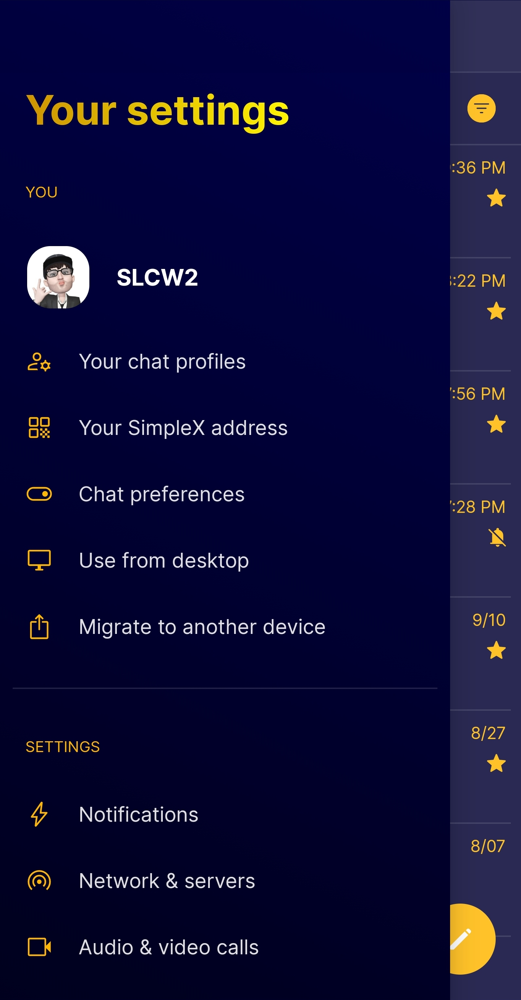
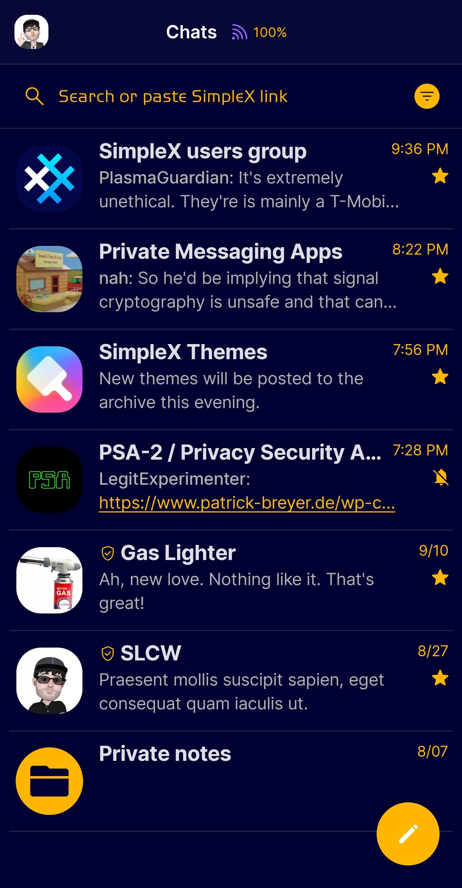
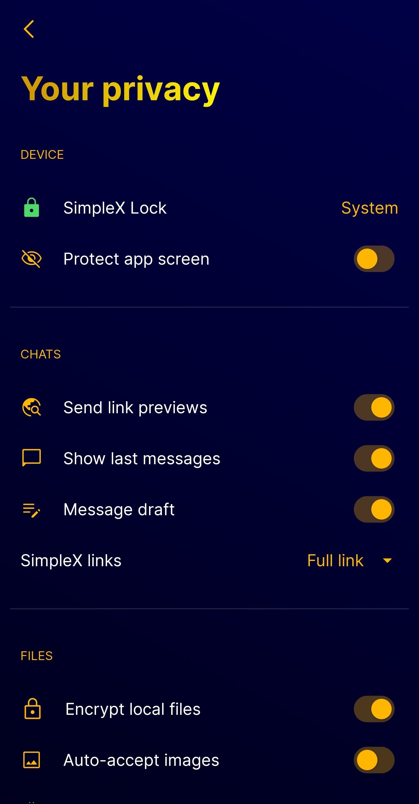

# Dark Blue & Gold

* Download [Dark Blue & Gold](../themes/SxC_darkBlueGold.theme)

<a href="../screenshots/SxC_darkBlueGold01.jpg" target="_blank">
		
</a>&nbsp;&nbsp;&nbsp;
<a href="../screenshots/SxC_darkBlueGold02.jpg" target="_blank">
		
</a>
<br>
<a href="../screenshots/SxC_darkBlueGold03.jpg" target="_blank">
		
</a>&nbsp;&nbsp;&nbsp;
<a href="../screenshots/SxC_darkBlueGold04.jpg" target="_blank">
		
</a>

----
### Theme Properties
```
base: "SIMPLEX"
colors:
  accent: "#ffffb600"
  accentVariant: "#ffffb600"
  secondary: "#ffffb600"
  secondaryVariant: "#ff006bff"
  background: "#ff000032"
  menus: "#ff006bff"
  title: "#ffffb600"
  accentVariant2: "#ffffb600"
  sentMessage: "#ff4d4d70"
  sentReply: "#ff666684"
  receivedMessage: "#ff1a1a47"
  receivedReply: "#ff33335b"
```

* [Return Home](../)