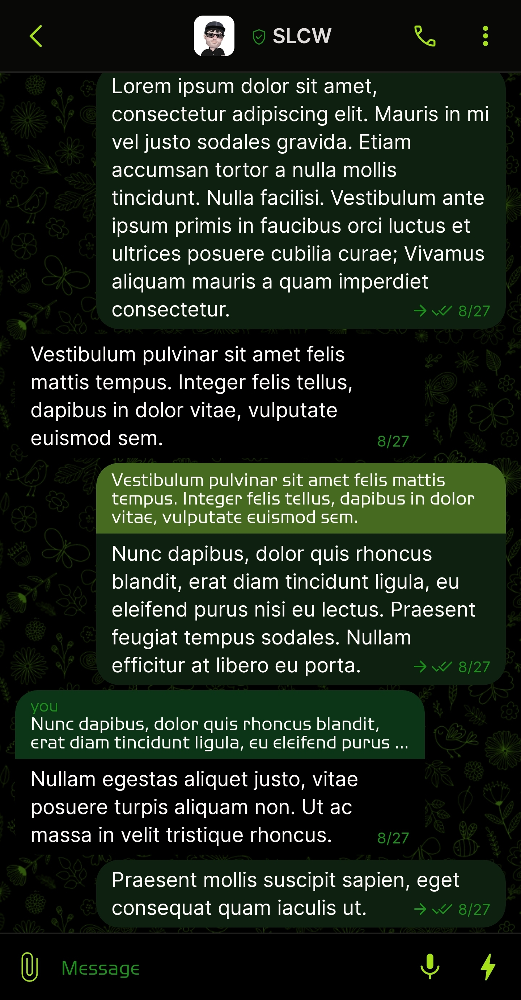
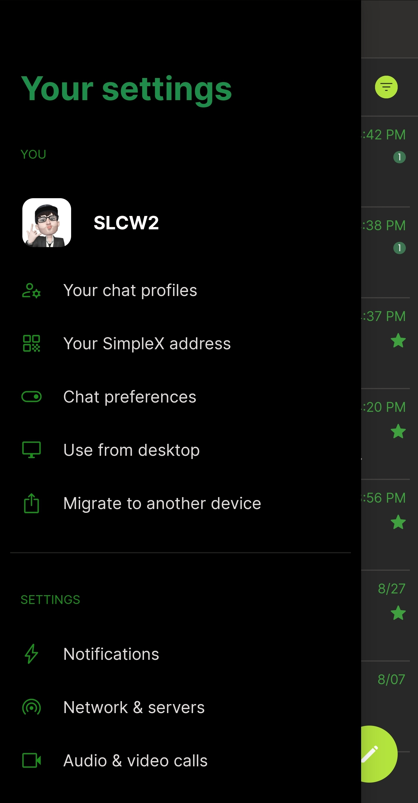
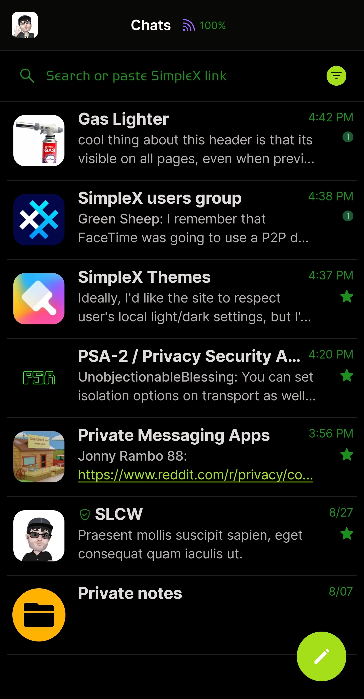
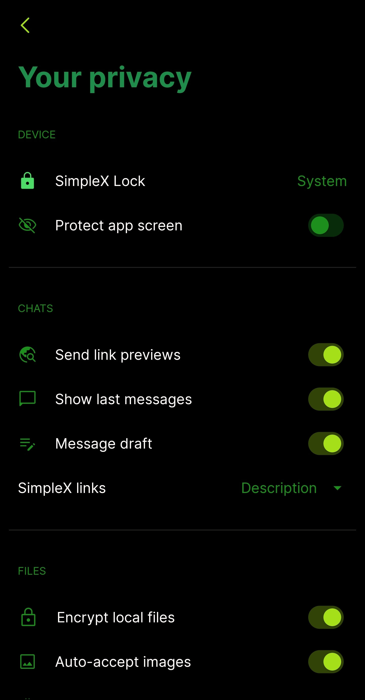

# Dark Green

* Download [Dark Green](../themes/SxC_darkGreen.theme)

<a href="../screenshots/SxC_darkGreen01.jpg" target="_blank">
	
</a>&nbsp;&nbsp;&nbsp;
<a href="../screenshots/SxC_darkGreen02.jpg" target="_blank">
	
</a>
<br>
<a href="../screenshots/SxC_darkGreen03.jpg" target="_blank">
	
</a>&nbsp;&nbsp;&nbsp;
<a href="../screenshots/SxC_darkGreen04.jpg" target="_blank">
	
</a>

----
### Theme Properties
```
base: "BLACK"
colors:
  accent: "#ffa5df19"
  accentVariant: "#ff1a5a32"
  secondary: "#ff1c8f1d"
  secondaryVariant: "#ff184908"
  background: "#ff000000"
  menus: "#ff051e0e"
  title: "#ff1f8c4b"
  accentVariant2: "#ffffb300"
  sentMessage: "#ff0e2010"
  sentReply: "#ff456a20"
  receivedMessage: "#ff000000"
  receivedReply: "#ff0c3517"
wallpaper:
  preset: "flowers"
  scale: 1.0
  background: "#ff000000"
  tint: "#ff31560d"
```

* [Return Home](../)