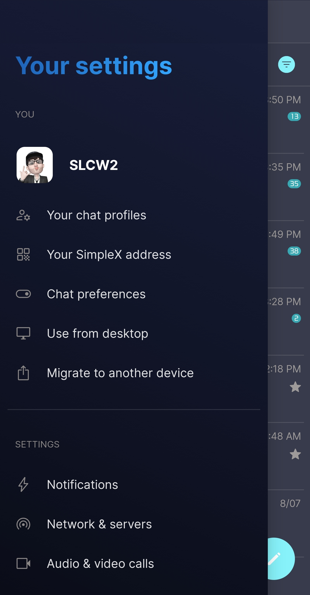
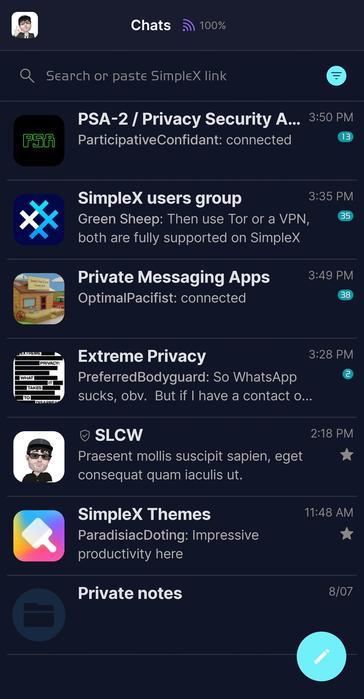
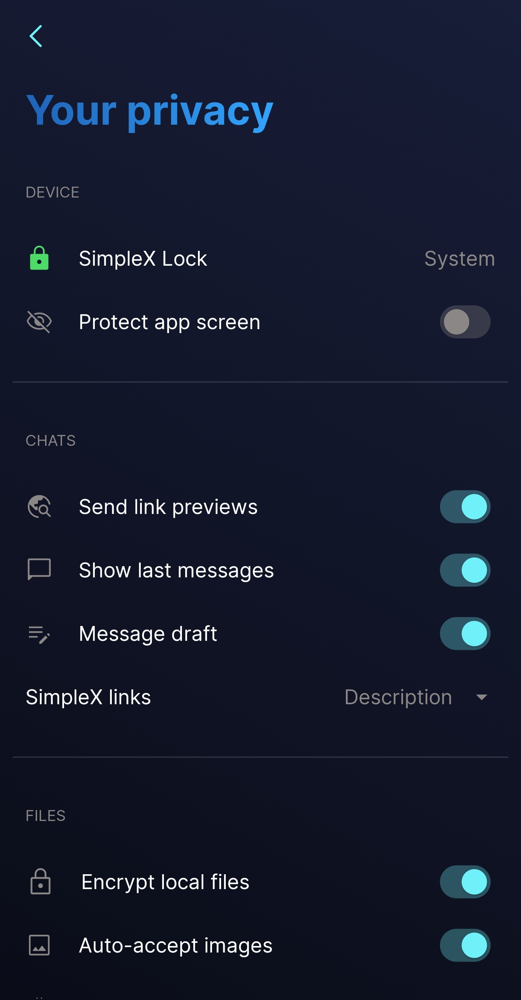

# Dark

* Download [Dark](../themes/SxC_dark.theme)

<a href="../screenshots/SxC_dark01.jpg" target="_blank">
	
</a>&nbsp;&nbsp;&nbsp;
<a href="../screenshots/SxC_dark02.jpg" target="_blank">
	
</a>
<br>
<a href="../screenshots/SxC_dark03.jpg" target="_blank">
	
</a>&nbsp;&nbsp;&nbsp;
<a href="../screenshots/SxC_dark04.jpg" target="_blank">
	
</a>

----
### Theme Properties
```
base: "SIMPLEX"
colors:
  accent: "#ff70f0f9"
  accentVariant: "#ff1298a5"
  secondary: "#ff8b8786"
  secondaryVariant: "#ff2c464d"
  background: "#ff111528"
  menus: "#ff121c37"
  title: "#ff267be5"
  accentVariant2: "#ff172941"
  sentMessage: "#ff59586e"
  sentReply: "#ff113457"
  receivedMessage: "#ff25283a"
  receivedReply: "#ff36394a"
wallpaper:
  scale: 1.0
  scaleType: "fill"
  background: "#ff111528"
  tint: "#00ffffff"
```

* [Return Home](../)