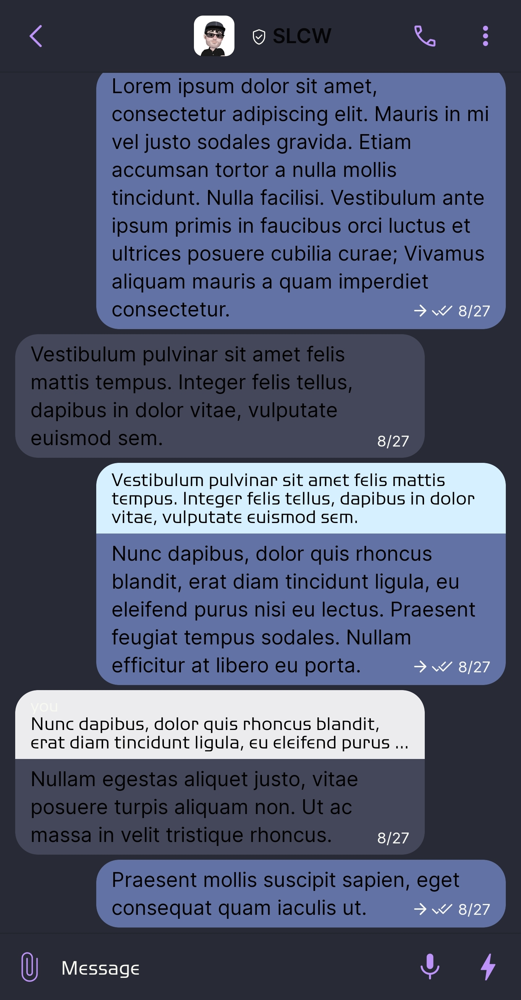
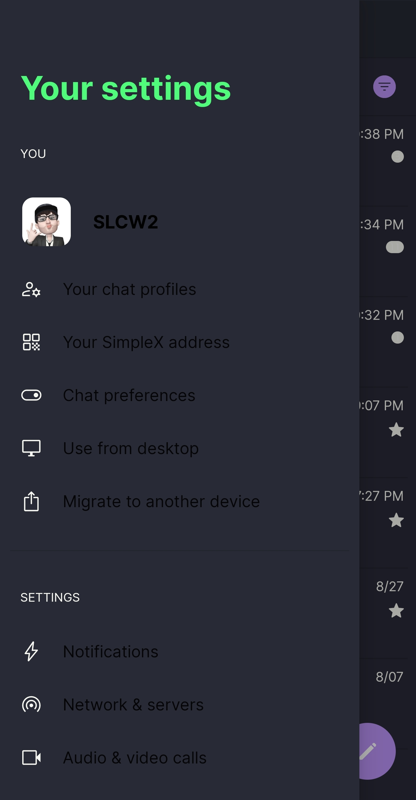
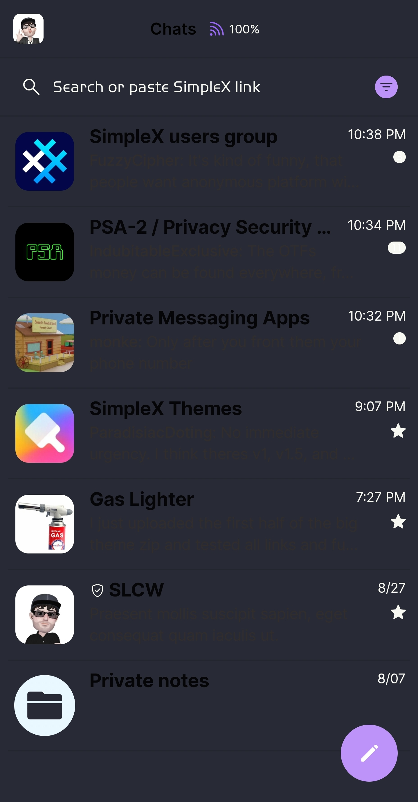
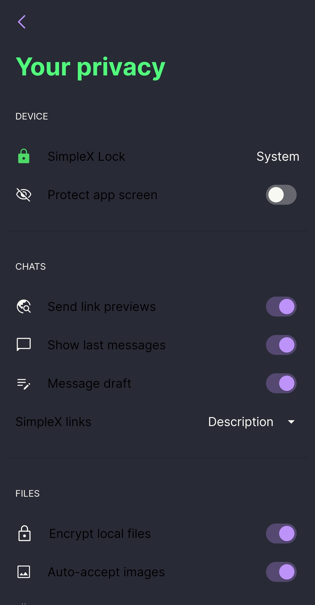

# Dracula

* Download [Dracula](../themes/SxC_dracula.theme)

<a href="../screenshots/SxC_dracula01.jpg" target="_blank">
	
</a>&nbsp;&nbsp;&nbsp;
<a href="../screenshots/SxC_dracula02.jpg" target="_blank">
	
</a>
<br>
<a href="../screenshots/SxC_dracula03.jpg" target="_blank">
	
</a>&nbsp;&nbsp;&nbsp;
<a href="../screenshots/SxC_dracula04.jpg" target="_blank">
	
</a>

----
### Theme Properties
```
base: "LIGHT"
colors:
  accent: "#ffbd93f9"
  accentVariant: "#ffbd93f9"
  secondary: "#fff8f8f2"
  secondaryVariant: "#ff6272a4"
  background: "#ff282a36"
  menus: "#ff44475a"
  title: "#ff50FA7B"
  sentMessage: "#ff6272a4"
  receivedMessage: "#ff44475a"
```

* [Return Home](../)