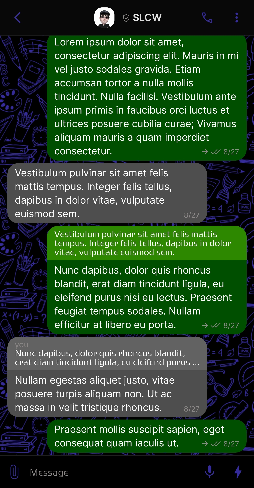
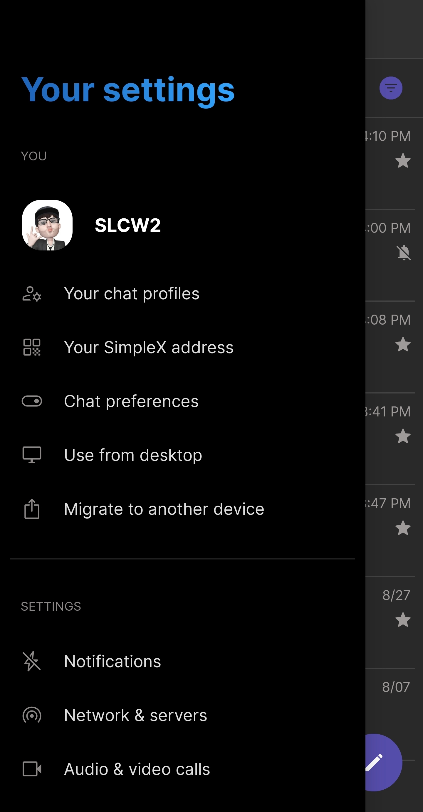
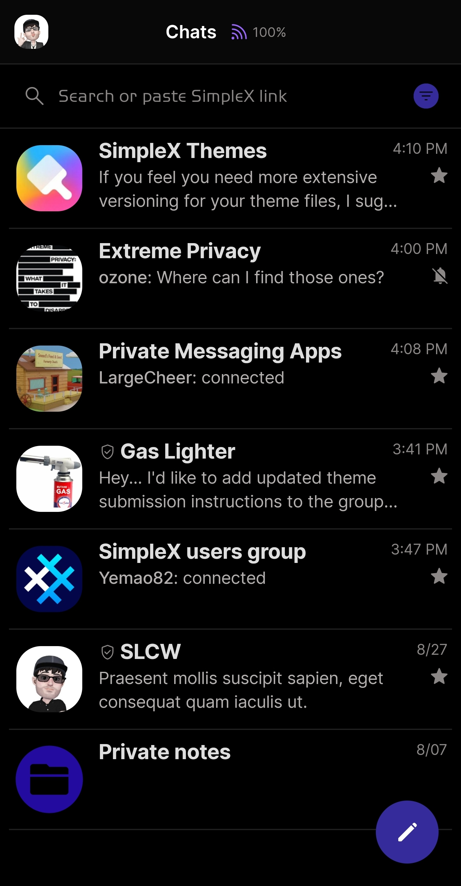

# Dusk

* Download [Dusk](../themes/SxC_dusk.theme)

<a href="../screenshots/SxC_dusk01.jpg" target="_blank">
		
</a>&nbsp;&nbsp;&nbsp;
<a href="../screenshots/SxC_dusk02.jpg" target="_blank">
		
</a>
<br>
<a href="../screenshots/SxC_dusk03.jpg" target="_blank">
		
</a>&nbsp;&nbsp;&nbsp;
<a href="../screenshots/SxC_dusk04.jpg" target="_blank">
		
</a>

----
### Theme Properties
```
base: "SIMPLEX"
colors:
  accent: "#ff352b9a"
  accentVariant: "#ff4d39ff"
  secondary: "#ff8b8786"
  secondaryVariant: "#ff00739d"
  background: "#ff000000"
  menus: "#ff121c37"
  title: "#ff267be5"
  accentVariant2: "#ff240ba0"
  sentMessage: "#ff004f00"
  sentReply: "#ff2d8800"
  receivedMessage: "#ff4e4e4e"
  receivedReply: "#ff626262"
wallpaper:
  preset: "school"
  scale: 1.0
  background: "#ff000000"
  tint: "#ff352b9a"
```

* [Return Home](../)