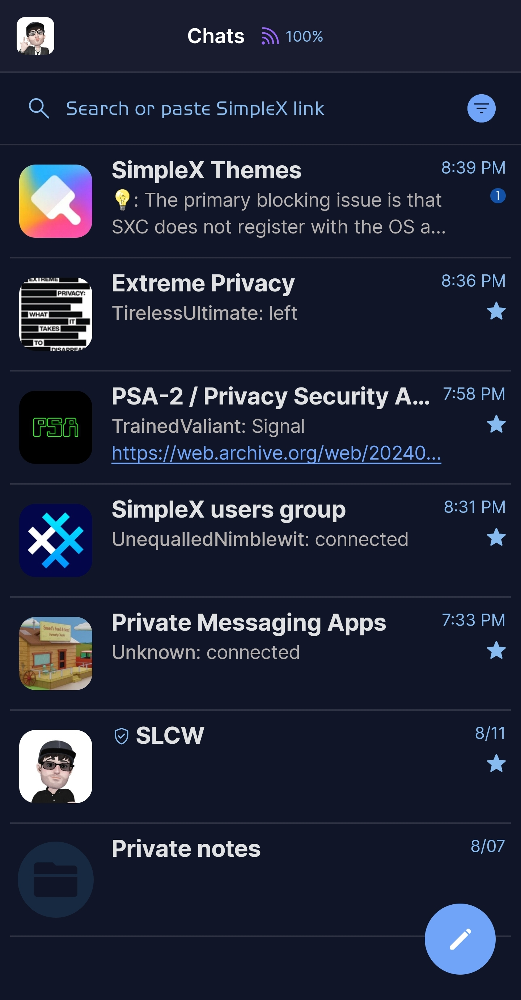
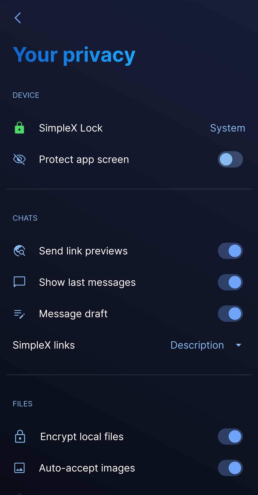
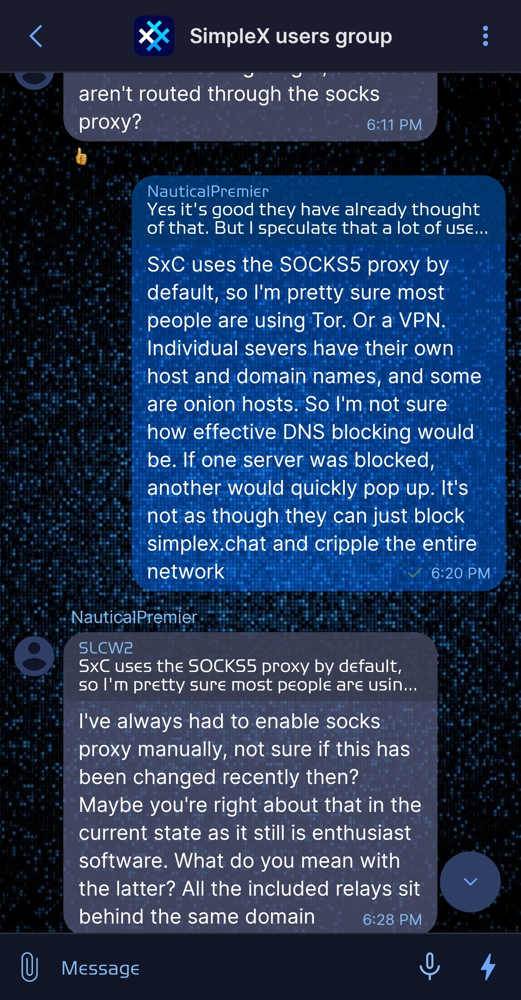
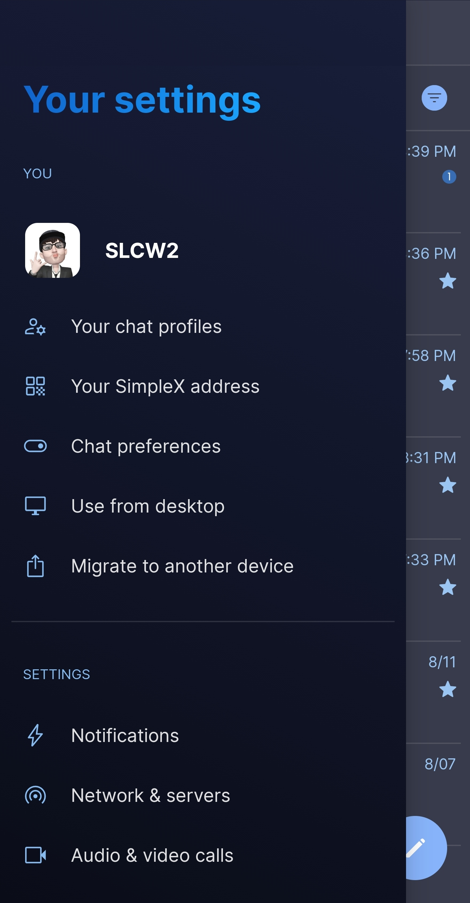

# Electric Blue

* Download [Electric Blue](../themes/SxC_electricBlue.theme)

<a href="../screenshots/SxC_ElectricBlue01.jpg" target="_blank">
	
</a>&nbsp;&nbsp;&nbsp;
<a href="../screenshots/SxC_ElectricBlue02.jpg" target="_blank">
	
</a>
<br>
<a href="../screenshots/SxC_ElectricBlue03.jpg" target="_blank">
	
</a>&nbsp;&nbsp;&nbsp;
<a href="../screenshots/SxC_ElectricBlue04.jpg" target="_blank">
	
</a>

----
### Theme Properties
```
base: "SIMPLEX"
colors:
  accent: "#ff70a4f9"
  accentVariant: "#ff1251a5"
  secondary: "#ff87baef"
  secondaryVariant: "#ff2e3e65"
  background: "#ff111528"
  menus: "#ff20275e"
  title: "#ff147cfe"
  accentVariant2: "#ff172941"
  sentMessage: "#79006dff"
  sentReply: "#a2003567"
  receivedMessage: "#ad5d6387"
  receivedReply: "#b536394a"
wallpaper:
  scale: 1.0
  scaleType: "fill"
  background: "#ff111528"
  tint: "#00ffffff"
```

* [Return Home](../)