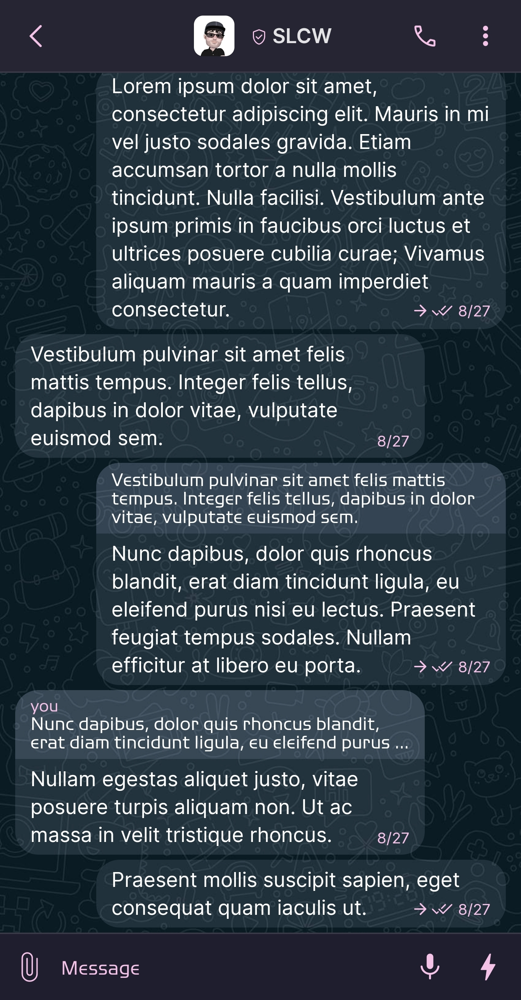
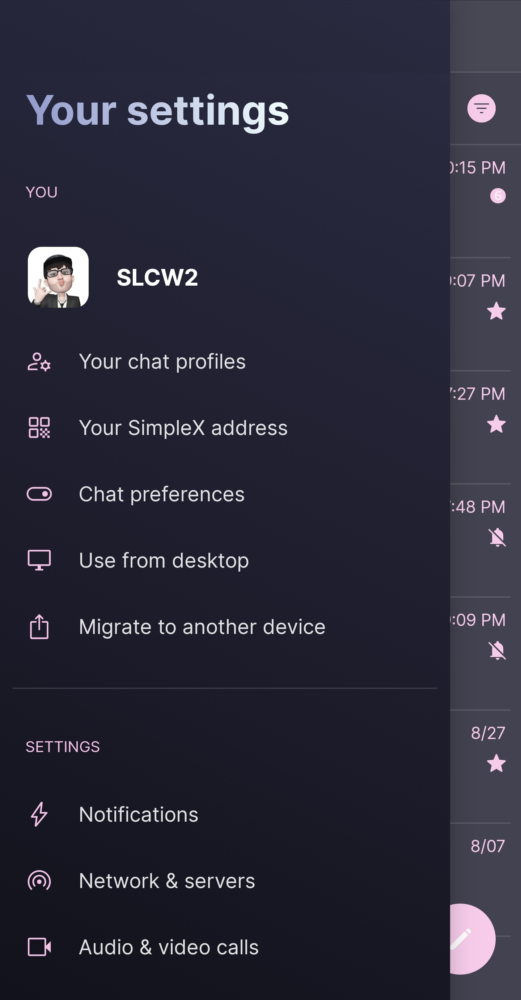
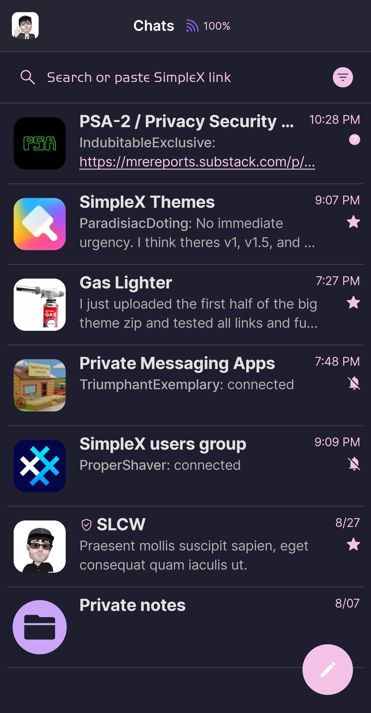
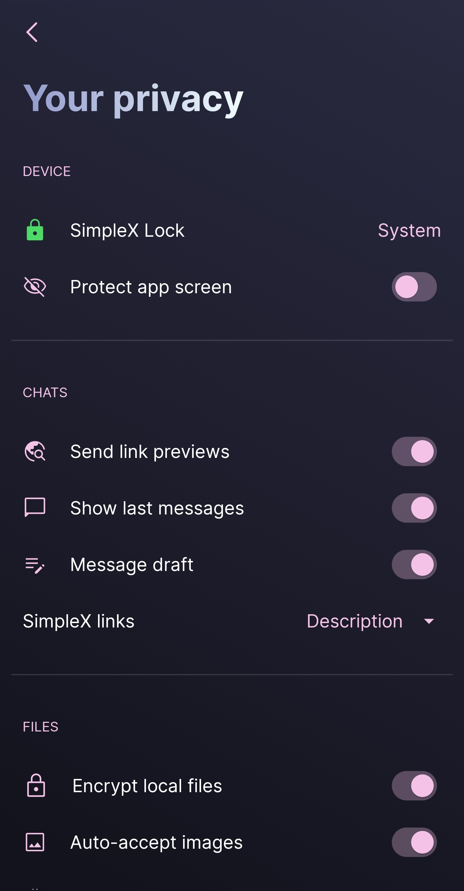

# Good Simplex

* Download [Good Simplex](../themes/SxC_goodSimplex.theme)

<a href="../screenshots/SxC_goodSimplex01.jpg" target="_blank">
	
</a>&nbsp;&nbsp;&nbsp;
<a href="../screenshots/SxC_goodSimplex02.jpg" target="_blank">
	
</a>
<br>
<a href="../screenshots/SxC_goodSimplex03.jpg" target="_blank">
	
</a>&nbsp;&nbsp;&nbsp;
<a href="../screenshots/SxC_goodSimplex04.jpg" target="_blank">
	
</a>

----
### Theme Properties
```
base: "SIMPLEX"
colors:
  accent: "#fff5c2e7"
  accentVariant: "#ff1298a5"
  secondary: "#fff5c2e7"
  secondaryVariant: "#ffcba6f7"
  background: "#ff1e1e2e"
  menus: "#ff313244"
  title: "#ffb4befe"
  accentVariant2: "#ffcba6f7"
  sentMessage: "#1ecdd6f4"
  sentReply: "#1ecdd6f4"
  receivedMessage: "#20cdd6f4"
  receivedReply: "#20cdd6f4"
wallpaper:
  scale: 1.0
  scaleType: "fill"
  background: "#ff1e1e2e"
  tint: "#00ffffff"
```

* [Return Home](../)