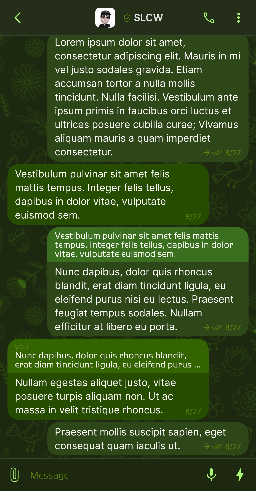
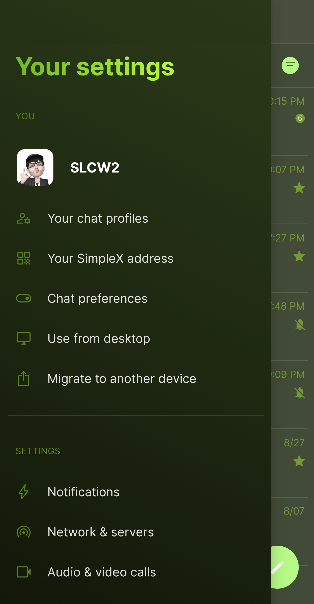
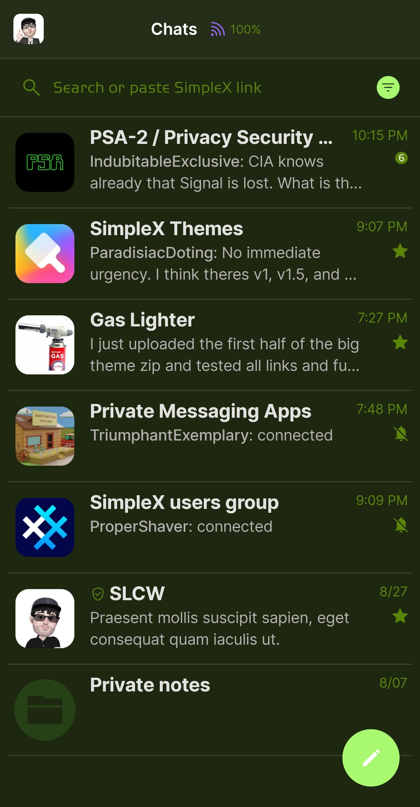
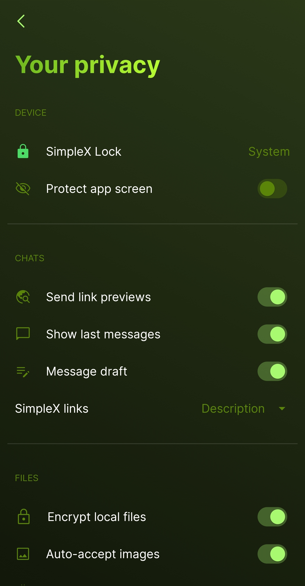

# Green v2

* Download [Green v2](../themes/SxC_green-v2.theme)

<a href="../screenshots/SxC_green-v201.jpg" target="_blank">
	
</a>&nbsp;&nbsp;&nbsp;
<a href="../screenshots/SxC_green-v202.jpg" target="_blank">
	
</a>
<br>
<a href="../screenshots/SxC_green-v203.jpg" target="_blank">
	
</a>&nbsp;&nbsp;&nbsp;
<a href="../screenshots/SxC_green-v204.jpg" target="_blank">
	
</a>

----
### Theme Properties
```
base: "SIMPLEX"
colors:
  accent: "#ffa9f970"
  accentVariant: "#ff55a512"
  secondary: "#ff5b8509"
  secondaryVariant: "#ff224705"
  background: "#ff1e2811"
  menus: "#ff2b3712"
  title: "#ff8ae526"
  accentVariant2: "#ff274117"
  sentMessage: "#ff2e4718"
  sentReply: "#ff396f1f"
  receivedMessage: "#ff264c00"
  receivedReply: "#ff336400"
wallpaper:
  preset: "flowers"
  scale: 2.0
  background: "#ff1d2811"
  tint: "#ff36600f"
```

* [Return Home](../)