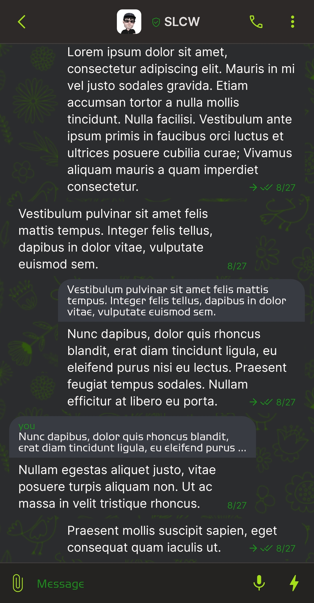
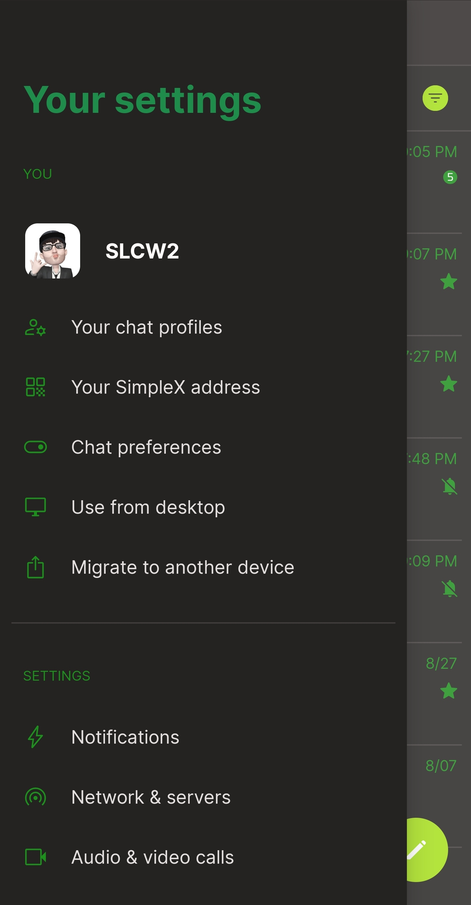
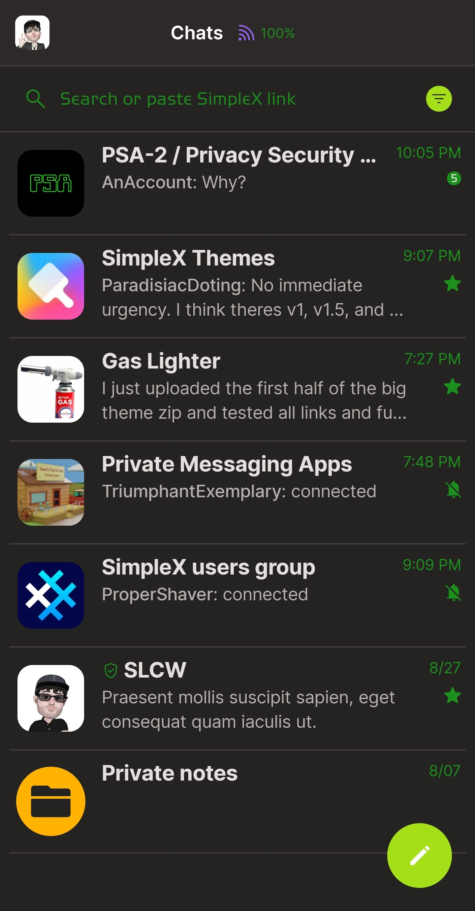
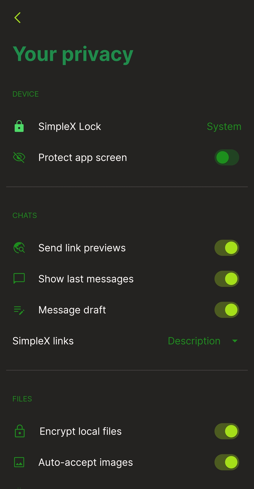

# Green Plus v1.5

* Download [Green Plus v1.5](../themes/SxC_greenPlus-v1_5.theme)

<a href="../screenshots/SxC_greenPlus-v1_501.jpg" target="_blank">
	
</a>&nbsp;&nbsp;&nbsp;
<a href="../screenshots/SxC_greenPlus-v1_502.jpg" target="_blank">
	
</a>
<br>
<a href="../screenshots/SxC_greenPlus-v1_503.jpg" target="_blank">
	
</a>&nbsp;&nbsp;&nbsp;
<a href="../screenshots/SxC_greenPlus-v1_504.jpg" target="_blank">
	
</a>

----
### Theme Properties
```
base: "BLACK"
colors:
  accent: "#ffa5df19"
  accentVariant: "#ff1a5a32"
  secondary: "#ff1c8f1d"
  secondaryVariant: "#ff2b2c2e"
  background: "#ff252222"
  menus: "#ff051e0e"
  title: "#ff1f8c4b"
  accentVariant2: "#ffffb300"
  sentMessage: "#ff2b2c2e"
  sentReply: "#ff383c42"
  receivedMessage: "#ff2b2c2e"
  receivedReply: "#ff383c42"
wallpaper:
  preset: "flowers"
  scale: 2.0
  background: "#ff2b2c2e"
  tint: "#ff31560d"
```

* [Return Home](../)