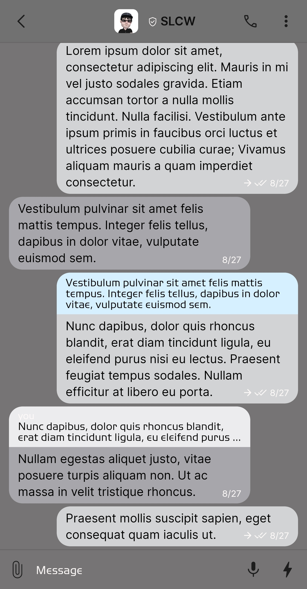
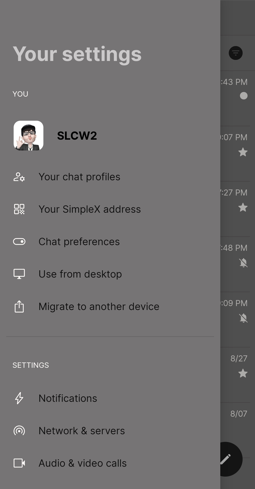
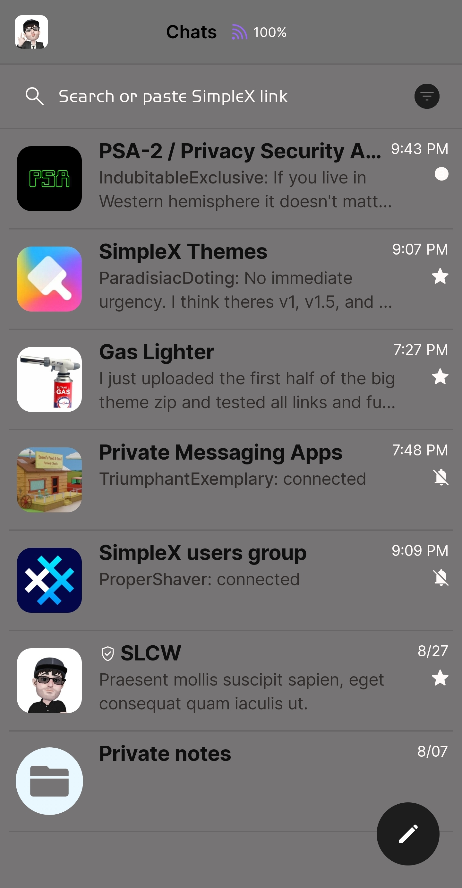
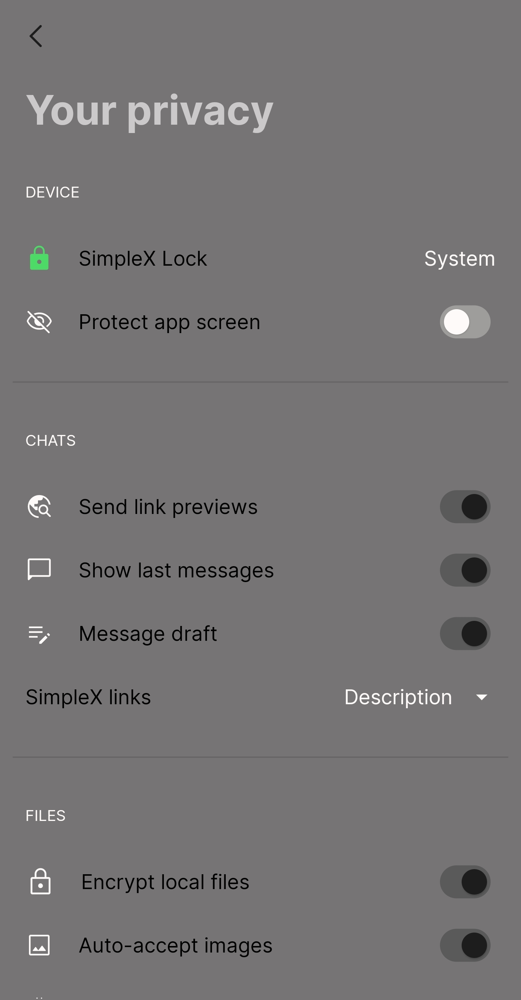

# Greymatters

* Download [Greymatters](../themes/SxC_greymatters.theme)

<a href="../screenshots/SxC_greymatters01.jpg" target="_blank">
	
</a>&nbsp;&nbsp;&nbsp;
<a href="../screenshots/SxC_greymatters02.jpg" target="_blank">
	
</a>
<br>
<a href="../screenshots/SxC_greymatters03.jpg" target="_blank">
	
</a>&nbsp;&nbsp;&nbsp;
<a href="../screenshots/SxC_greymatters04.jpg" target="_blank">
	
</a>

----
### Theme Properties
```
base: "LIGHT"
colors:
  accent: "#ff1d1d1d"
  accentVariant: "#ffc9c6c6"
  secondary: "#fffffafa"
  secondaryVariant: "#fffbfcff"
  background: "#ff767474"
  menus: "#ffffffff"
  title: "#ffcbc9c9"
  sentMessage: "#fad4d5d6"
  receivedMessage: "#f6a9a9ad"
```

* [Return Home](../)