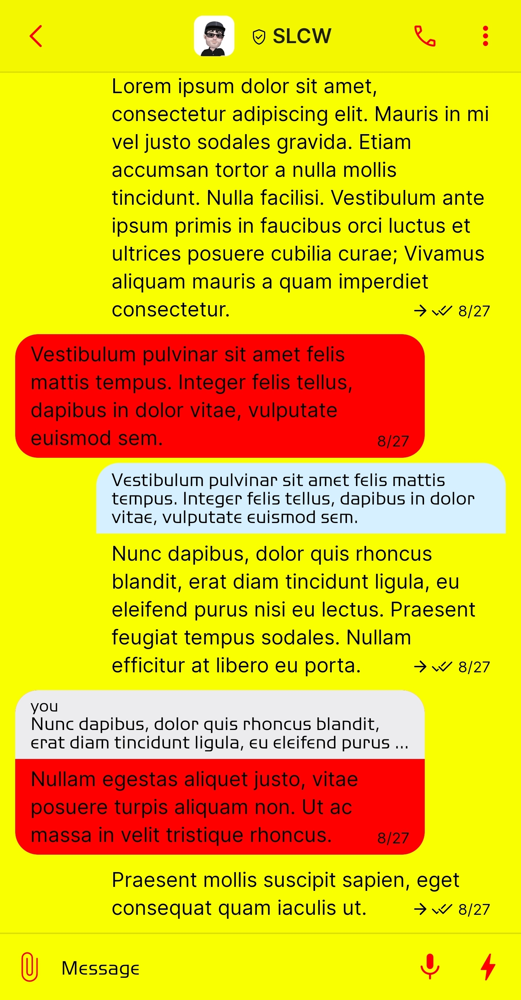
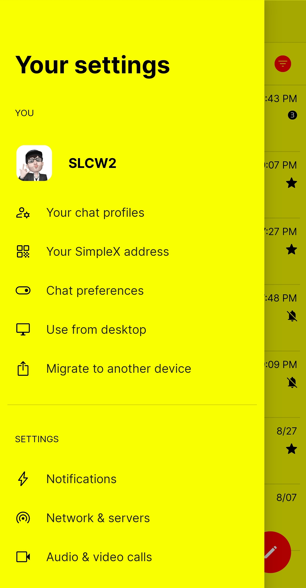
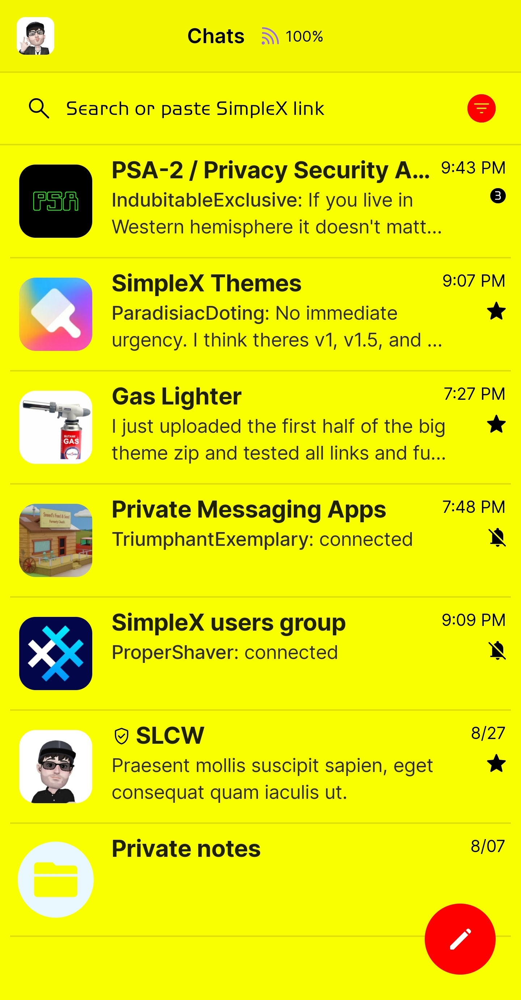
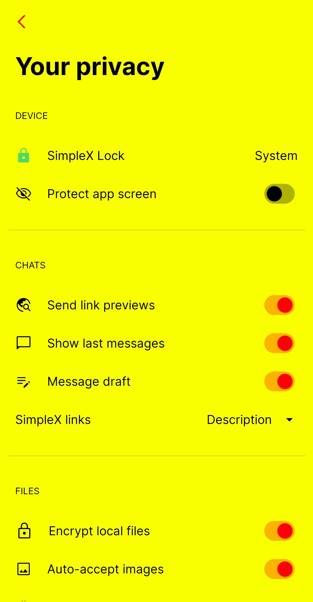

# Hot Dog

* Download [Hot Dog](../themes/SxC_hotdog.theme)

<a href="../screenshots/SxC_hotdog01.jpg" target="_blank">
	
</a>&nbsp;&nbsp;&nbsp;
<a href="../screenshots/SxC_hotdog02.jpg" target="_blank">
	
</a>
<br>
<a href="../screenshots/SxC_hotdog03.jpg" target="_blank">
	
</a>&nbsp;&nbsp;&nbsp;
<a href="../screenshots/SxC_hotdog04.jpg" target="_blank">
	
</a>

----
### Theme Properties
```
base: "LIGHT"
colors:
  accent: "#ffff0000"
  accentVariant: "#ffff0000"
  secondary: "#ff000000"
  secondaryVariant: "#ff000000"
  background: "#fffaff00"
  menus: "#fffdfd00"
  title: "#ff000000"
  sentMessage: "#ff0000"
  receivedMessage: "#ffff0000"
```

* [Return Home](../)