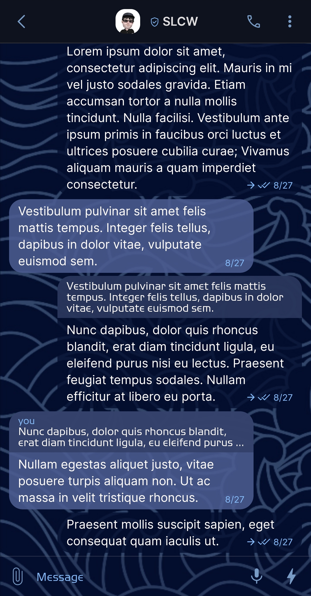
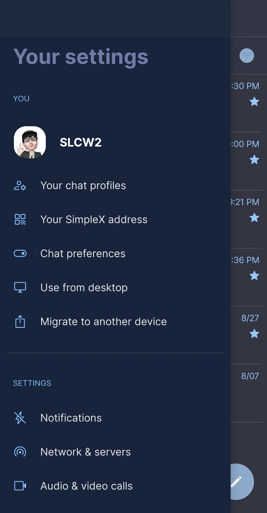
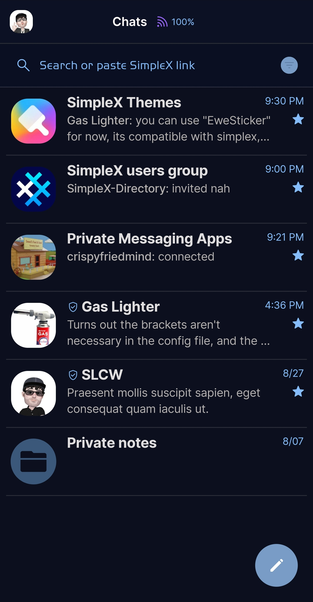
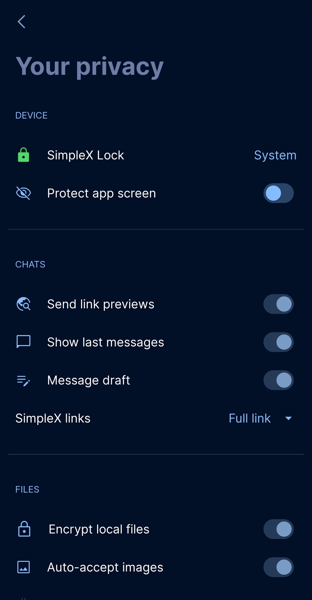

# Japane Sea 

* Download [Japane Sea](../themes/SxC_japaneSea.theme)

<a href="../screenshots/SxC_japaneSea01.jpg" target="_blank">
		
</a>&nbsp;&nbsp;&nbsp;
<a href="../screenshots/SxC_japaneSea02.jpg" target="_blank">
		
</a>
<br>
<a href="../screenshots/SxC_japaneSea03.jpg" target="_blank">
		
</a>&nbsp;&nbsp;&nbsp;
<a href="../screenshots/SxC_japaneSea04.jpg" target="_blank">
		
</a>

----
### Theme Properties
```
base: "BLACK"
colors:
  accent: "#ff789cc5"
  accentVariant: "#ff5f93cd"
  secondary: "#ff85bdfc"
  secondaryVariant: "#ff243350"
  background: "#3d030d2d"
  menus: "#ff001125"
  title: "#ff6f7ca6"
  accentVariant2: "#ff3b587a"
  sentMessage: "#cb030d2d"
  sentReply: "#cd313d64"
  receivedMessage: "#e04b5b8f"
  receivedReply: "#cd313d64"
wallpaper:
  scale: 1.0
  scaleType: "fill"
  background: "#ff070707"
  tint: "#9b030d2d"
```

* [Return Home](../)