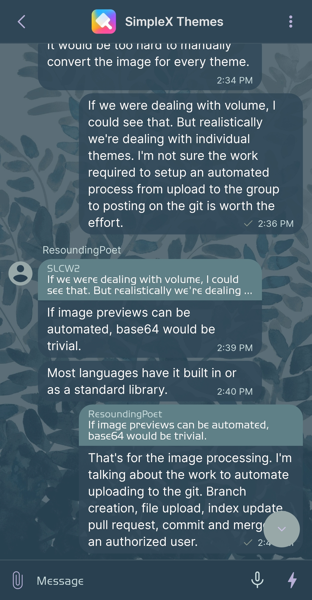
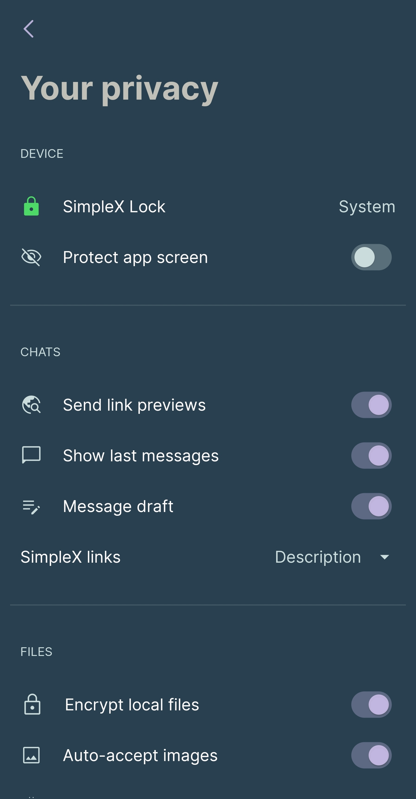
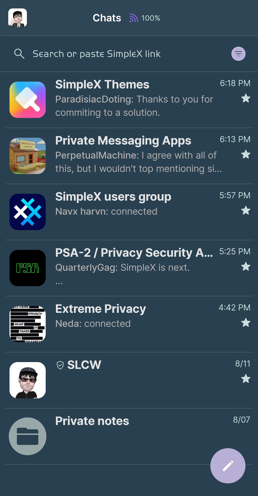
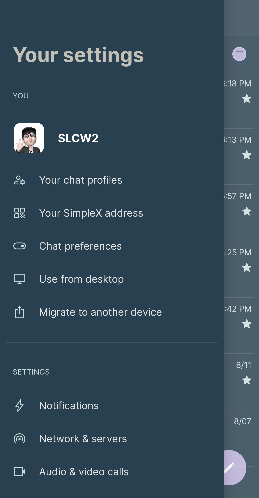

# Lazy Sunday

* Download [Lazy Sunday](../themes/SxC_lazySunday.theme)

<a href="../screenshots/SxC_lazySunday01.jpg" target="_blank">
	
</a>&nbsp;&nbsp;&nbsp;
<a href="../screenshots/SxC_lazySunday02.jpg" target="_blank">
	
</a>
<br>
<a href="../screenshots/SxC_lazySunday03.jpg" target="_blank">
	
</a>&nbsp;&nbsp;&nbsp;
<a href="../screenshots/SxC_lazySunday04.jpg" target="_blank">
	
</a>

----
### Theme Properties
```
base: "BLACK"
colors:
  accent: "#d0d8c8f4"
  accentVariant: "#ff9fceda"
  secondary: "#ffcbdcdc"
  secondaryVariant: "#ff98a8a8"
  background: "#ff284050"
  menus: "#ff284048"
  title: "#ffc0c0b8"
  accentVariant2: "#ff98a8a8"
  sentMessage: "#df304858"
  sentReply: "#ff608088"
  receivedMessage: "#df304858"
  receivedReply: "#ff608088"
wallpaper:
  scale: 1.0
  scaleType: "fill"
  background: "#ff070707"
  tint: "#c2284050"
```

* [Return Home](../)