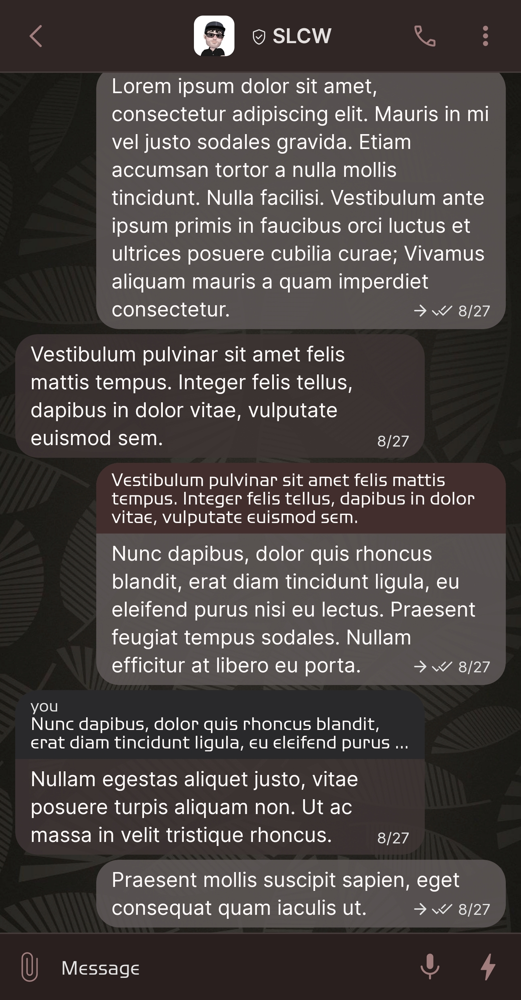
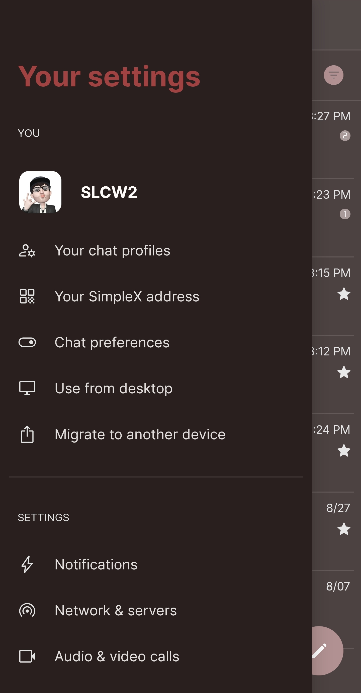
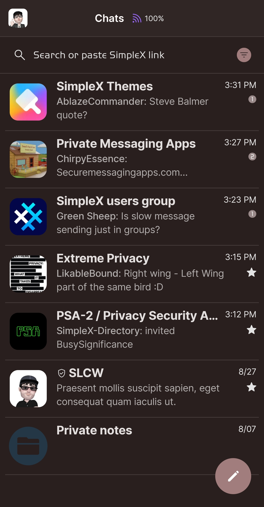
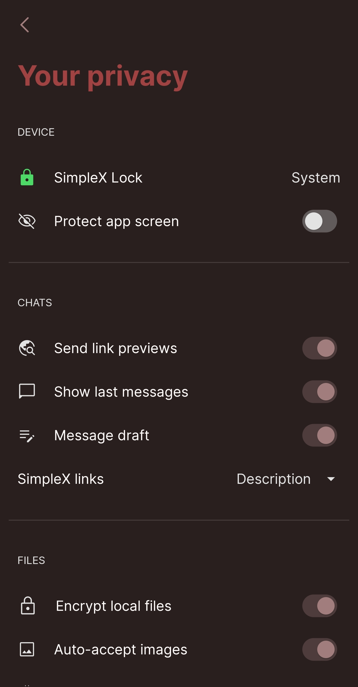

# Leaves

* Download [Leaves](../themes/SxC_leaves.theme)

<a href="../screenshots/SxC_leaves01.jpg" target="_blank">
	
</a>&nbsp;&nbsp;&nbsp;
<a href="../screenshots/SxC_leaves02.jpg" target="_blank">
	
</a>
<br>
<a href="../screenshots/SxC_leaves03.jpg" target="_blank">
	
</a>&nbsp;&nbsp;&nbsp;
<a href="../screenshots/SxC_leaves04.jpg" target="_blank">
	
</a>

----
### Theme Properties
```
base: "BLACK"
colors:
  accent: "#ffa27d7d"
  accentVariant: "#ff9a8989"
  secondary: "#ffe3e3e3"
  secondaryVariant: "#ff2b2c2e"
  background: "#ff2a1f1f"
  menus: "#ff161617"
  title: "#ffa14242"
  accentVariant2: "#ff243747"
  sentMessage: "#e35d5656"
  sentReply: "#ff432e2e"
  receivedMessage: "#e03e3434"
  receivedReply: "#ff29292b"
wallpaper:
  scale: 1.0
  scaleType: "fill"
  background: "#ff070707"
  tint: "#33000000"
```

* [Return Home](../)