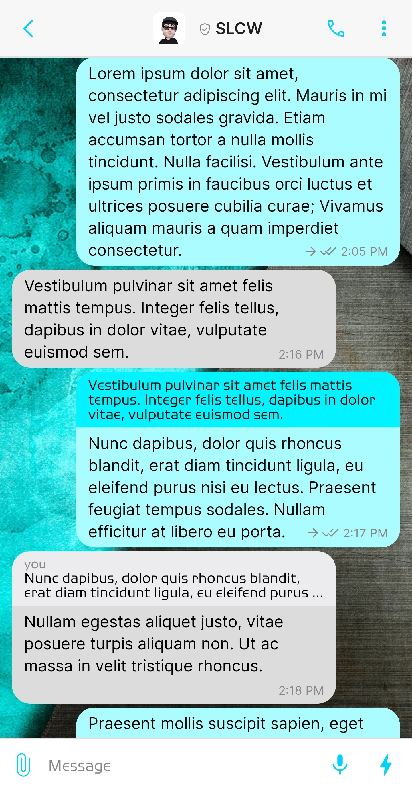
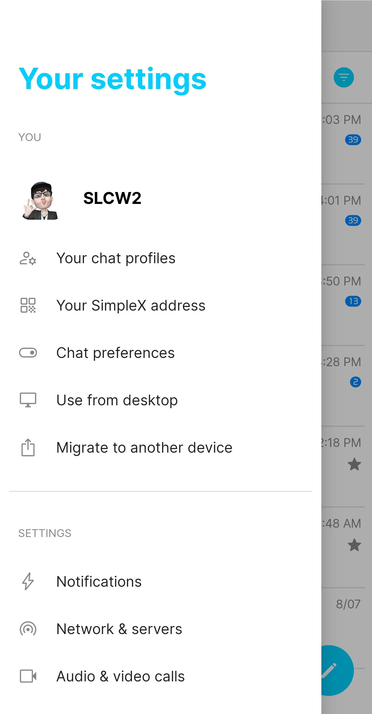
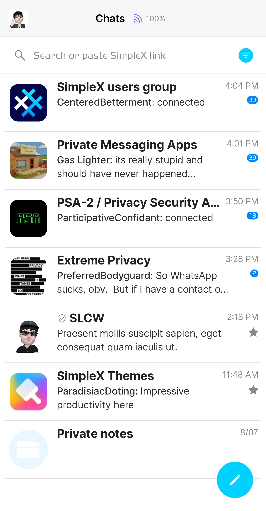
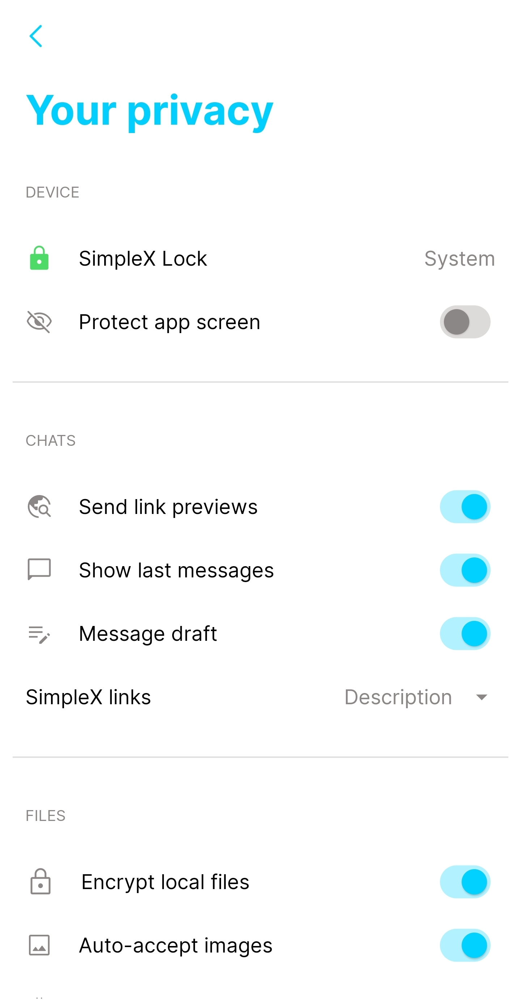

# Light

* Download [Light](../themes/SxC_light.theme)

<a href="../screenshots/SxC_light01.jpg" target="_blank">
	
</a>&nbsp;&nbsp;&nbsp;
<a href="../screenshots/SxC_light02.jpg" target="_blank">
	
</a>
<br>
<a href="../screenshots/SxC_light03.jpg" target="_blank">
	
</a>&nbsp;&nbsp;&nbsp;
<a href="../screenshots/SxC_light04.jpg" target="_blank">
	
</a>

----
### Theme Properties
```
base: "LIGHT"
colors:
  accent: "#ff00d1ff"
  accentVariant: "#ff0088ff"
  secondary: "#ff8b8786"
  secondaryVariant: "#fff1f2f6"
  background: "#ffffffff"
  menus: "#ffffffff"
  title: "#ff00ceff"
  accentVariant2: "#ffe9f7ff"
  sentMessage: "#ffaafcff"
  sentReply: "#ff00f3ff"
  receivedMessage: "#ffdcdcdc"
  receivedReply: "#ffececee"
wallpaper:
  scale: 1.0
  scaleType: "fill"
  background: "#ffffffff"
  tint: "#00ffffff"
```

* [Return Home](../)