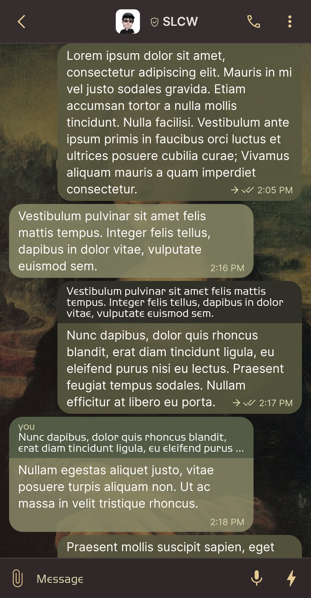
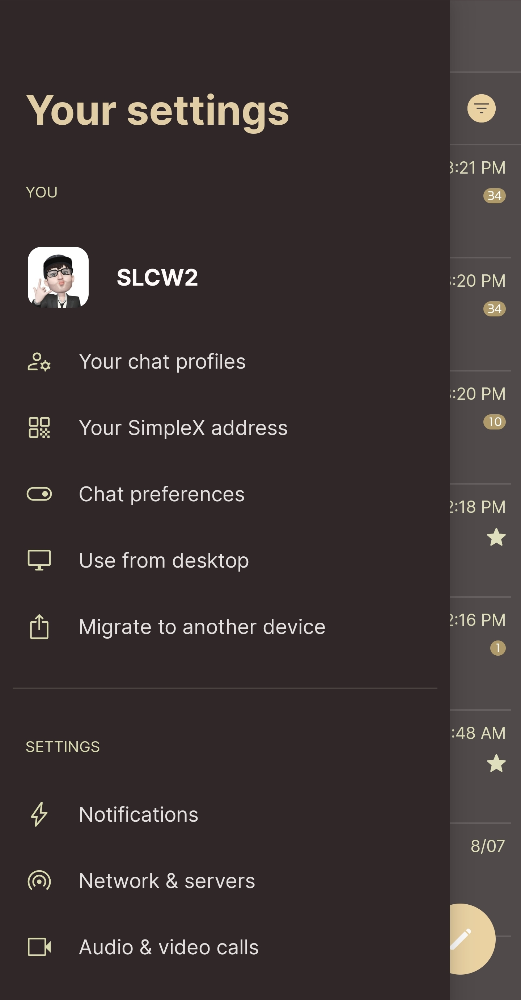
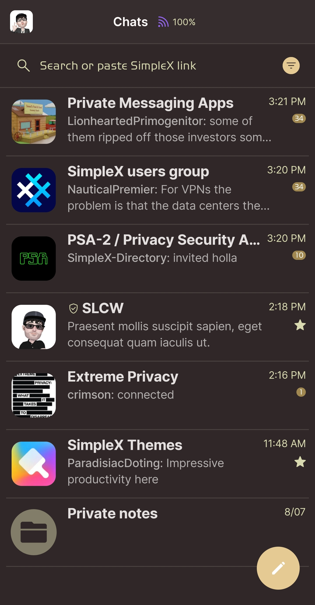
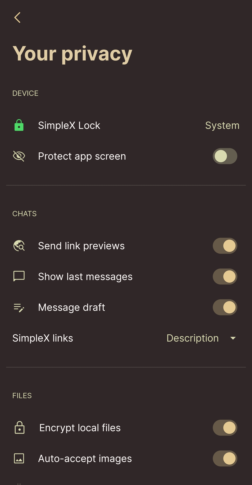

# Mona Lisa

* Download [Mona Lisa](../themes/SxC_monaLisa.theme)

<a href="../screenshots/SxC_monaLisa01.jpg" target="_blank">
	
</a>&nbsp;&nbsp;&nbsp;
<a href="../screenshots/SxC_monaLisa02.jpg" target="_blank">
	
</a>
<br>
<a href="../screenshots/SxC_monaLisa03.jpg" target="_blank">
	
</a>&nbsp;&nbsp;&nbsp;
<a href="../screenshots/SxC_monaLisa04.jpg" target="_blank">
	
</a>

----
### Theme Properties
```
base: "BLACK"
colors:
  accent: "#ffe6ca93"
  accentVariant: "#ffa08850"
  secondary: "#ffdadab1"
  secondaryVariant: "#ff8f8a72"
  background: "#ff302828"
  menus: "#ff302828"
  title: "#ffe1cda5"
  accentVariant2: "#ff817d68"
  sentMessage: "#e8585840"
  sentReply: "#ff303028"
  receivedMessage: "#da888867"
  receivedReply: "#ff535a45"
wallpaper:
  scale: 1.0
  scaleType: "fill"
  background: "#ff070707"
  tint: "#53000000"
```

* [Return Home](../)