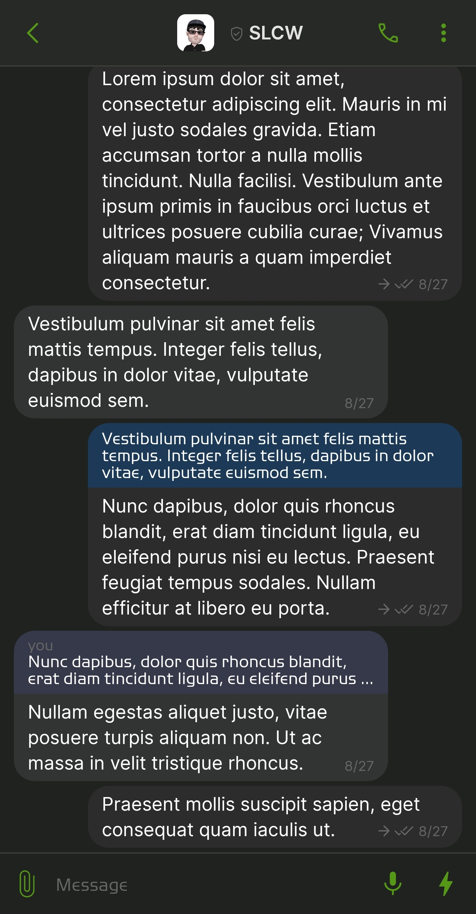
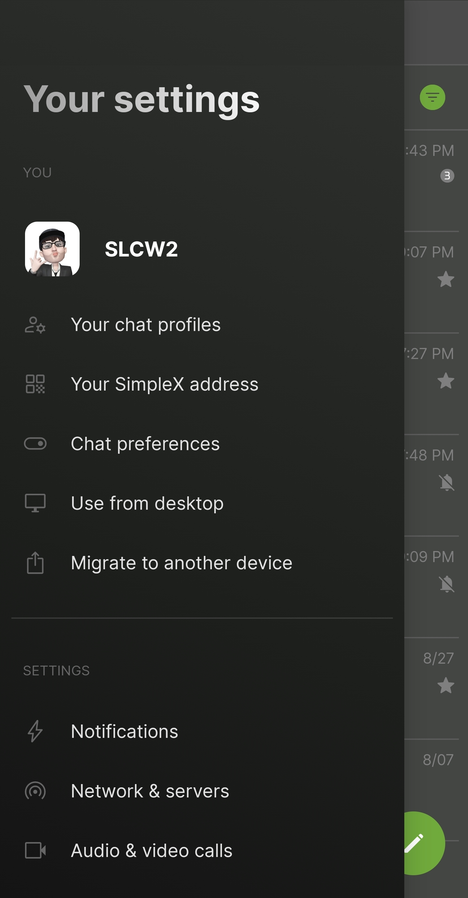
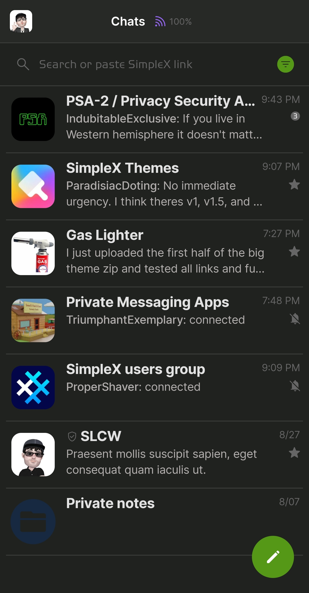
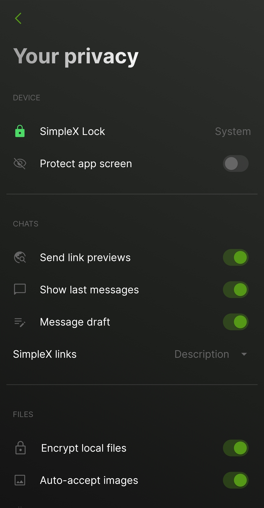

# Moss Noir

* Download [Moss Noir](../themes/SxC_mossNoir.theme)

<a href="../screenshots/SxC_mossNoir01.jpg" target="_blank">
	
</a>&nbsp;&nbsp;&nbsp;
<a href="../screenshots/SxC_mossNoir02.jpg" target="_blank">
	
</a>
<br>
<a href="../screenshots/SxC_mossNoir03.jpg" target="_blank">
	
</a>&nbsp;&nbsp;&nbsp;
<a href="../screenshots/SxC_mossNoir04.jpg" target="_blank">
	
</a>

----
### Theme Properties
```
base: "SIMPLEX"
colors:
  accent: "#ff559817"
  accentVariant: "#ff40a626"
  secondary: "#ff676666"
  secondaryVariant: "#ff595f60"
  background: "#ff202220"
  menus: "#ff3a3b3a"
  title: "#f8c5c7c6"
  sentMessage: "#fa2c2c2c"
  receivedMessage: "#20b1b0b5"
```

* [Return Home](../)