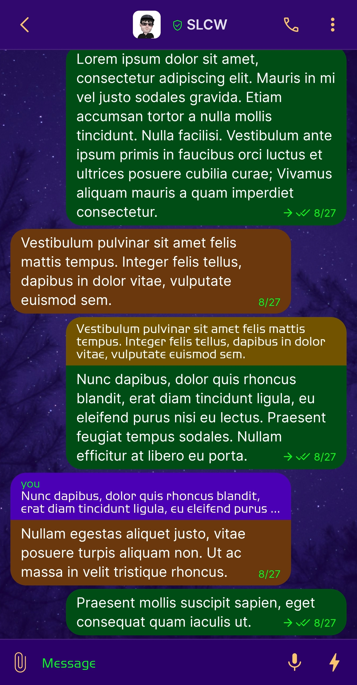
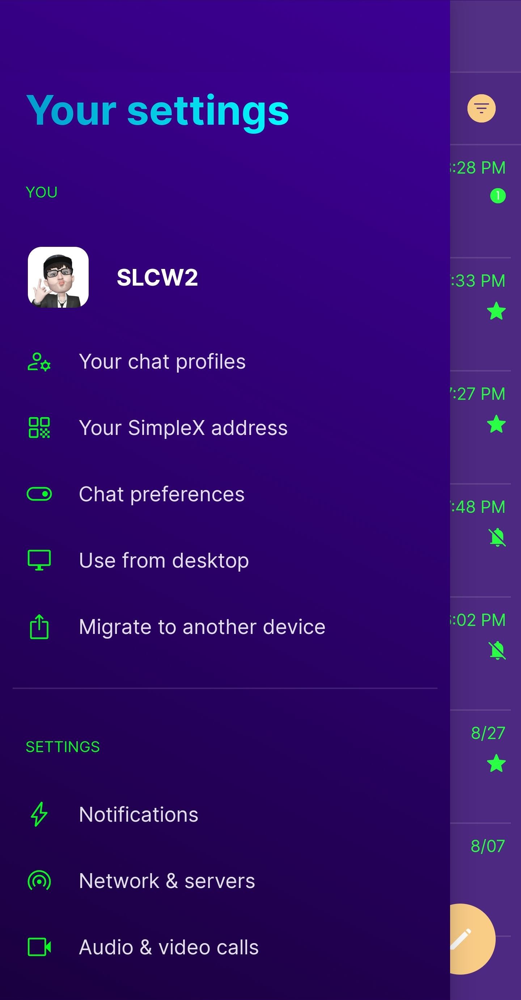
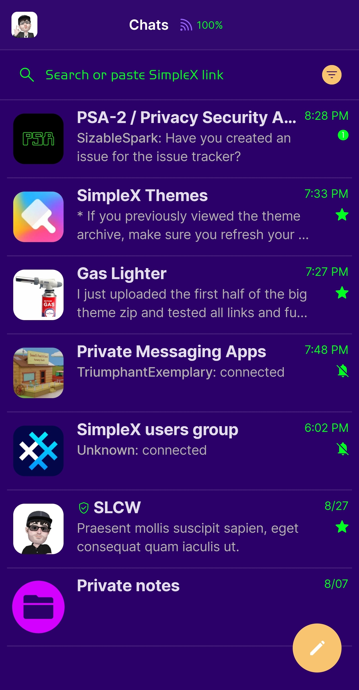
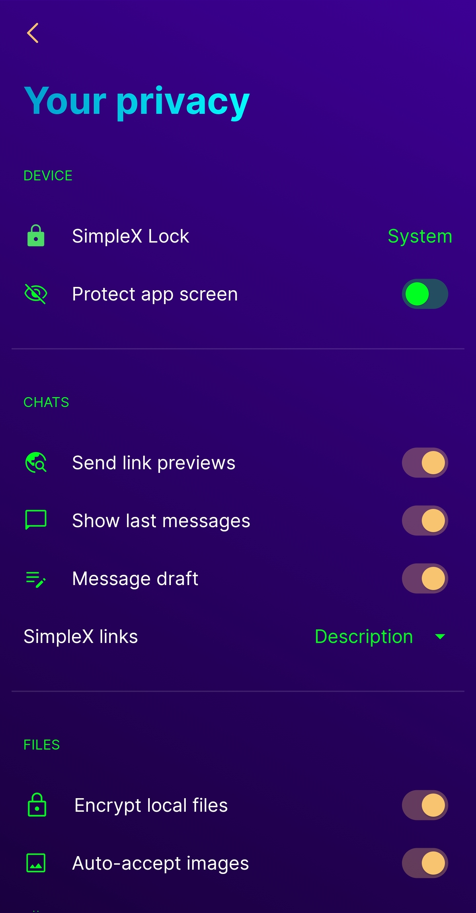

# Nightswatch v2

* Download [Nightswatch v2](../themes/SxC_nightswatch-v2.theme)

<a href="../screenshots/SxC_nightswatch-v201.jpg" target="_blank">
	
</a>&nbsp;&nbsp;&nbsp;
<a href="../screenshots/SxC_nightswatch-v202.jpg" target="_blank">
	
</a>
<br>
<a href="../screenshots/SxC_nightswatch-v203.jpg" target="_blank">
	
</a>&nbsp;&nbsp;&nbsp;
<a href="../screenshots/SxC_nightswatch-v204.jpg" target="_blank">
	
</a>

----
### Theme Properties
```
base: "SIMPLEX"
colors:
  accent: "#fff9c470"
  accentVariant: "#ffff7700"
  secondary: "#ff00ff21"
  secondaryVariant: "#ff5f00ff"
  background: "#ff2b0069"
  menus: "#ff4b00b5"
  title: "#ff00c2ff"
  accentVariant2: "#ffd300ff"
  sentMessage: "#ff004e15"
  sentReply: "#ff725400"
  receivedMessage: "#ff6a380c"
  receivedReply: "#ff4b00b5"
wallpaper:
  scale: 1.0
  scaleType: "fill"
  background: "#ff2b0069"
  tint: "#3b5f00ff"
```

* [Return Home](../)